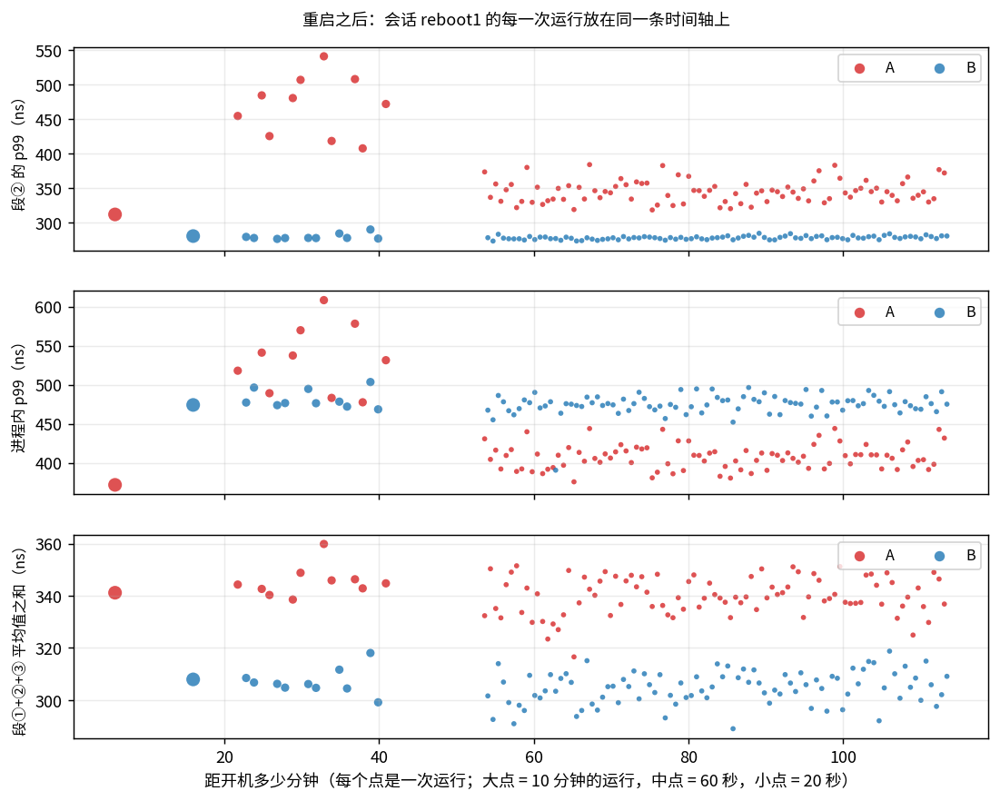
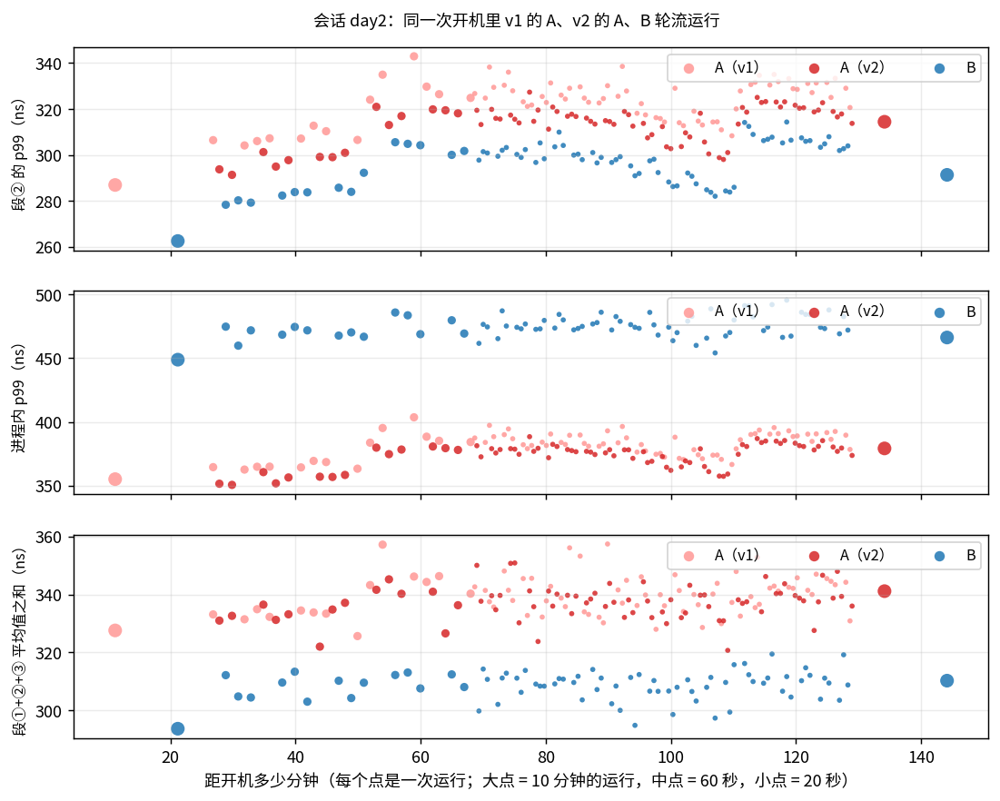
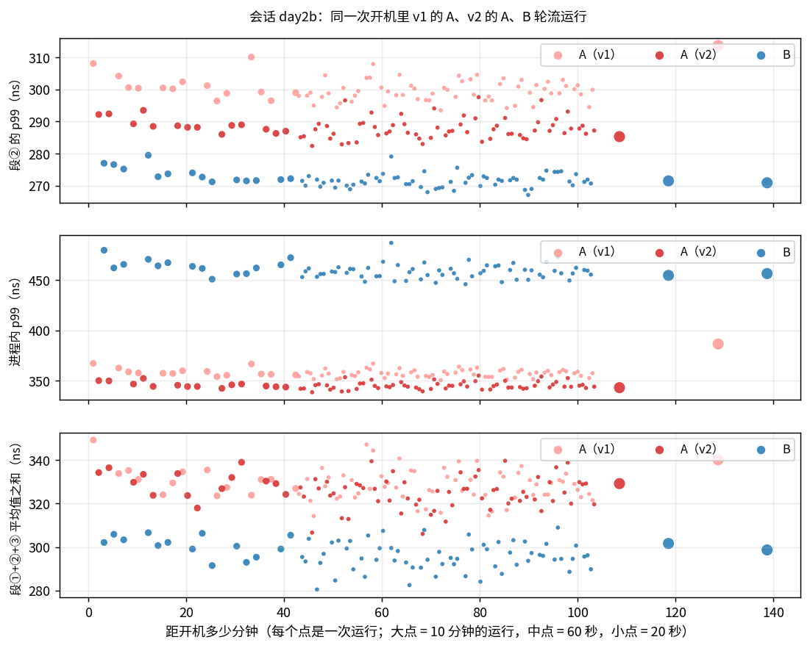

# 此前各版本的测量与结论（历史摘要）

> **这份文档是冻结的历史记录，不是当前的延迟报告。** 当前代码（v4）的运行日志在 `logs/`，延迟报告是 [`REPORT.md`](REPORT.md)。
>
> 这里记录的是 v1 ~ v3 三个旧版本上做过的测量和由此得到的结论：跨重启 / 跨日期的复测、一次"A 的尾部变重"的现象、
> 两次由数据引出的纠正（v1 → v2、v2 → v3），以及测量期间碰上的两次云平台侧事件。它们解释了当前的代码和测量方法为什么是现在这个样子。
>
> - **数据不在仓库里。** 仓库只保留当前版本最新的一套运行日志和报告；这里引用的全部原始日志（约 2700 次运行的 JSON 与输出）保存在考察机本地的
>   `~/bq-archive/`（`logs-v1-v3/` 与当时的报告 `docs-before-v4/`），下面的表格是当时由脚本从那些日志生成后冻结下来的。
> - **数字不能与当前报告直接相比。** 这些都是旧代码、旧环境下的读数：v4 在接收路径里多了一次身份核对（`REPORT.md` §3.4），
>   而且 2026-10-02 10:05 UTC 的第二次云平台事件之后，往返时间从约 160 µs 变成了约 53 µs（本文第 4 节）。能沿用的是结论和方法，不是具体的纳秒数。
> - 文中未特别说明的"§x"指 `REPORT.md` 的章节；"正式数据"指当时那个版本的正式数据。
> - **v4 上的跨重启复测在 `REPORT.md` §3.5**（两次重启、各 200 次运行）：本文第 1 节那次"A 的尾部变重"没有再出现。
>   复测里发现了另一件事：内容逐字节相同的二进制，只因为文件被重新写了一遍，A 的发送段就整体慢 5 ns，持续一百多次运行，再重写一遍又恢复。
>   回头看第 1 节的那次尾部变重，它也是从同一个位置（主考核之后、交替 10 对开始时，当时 cargo 可能同样重新编译过）开始，那一段里 A 的每一次运行无一例外，之后消失——
>   时间点和形态都吻合。但当时的二进制文件没有留下来，无法验证，只能算一条线索。

版本一览：

| 版本 | 相对上一版的改动 | 为什么改 |
|---|---|---|
| v1 | 第一套完整实现 | |
| v2 | `Sleep` 第一次被 poll 时不再读时钟 | 按批内位置拆开段②，发现 A 处理一个包的周期比 B 长约 20 ns（本文第 3 节） |
| v3 | 导出原始样本时预取下一条缓存行 | 样本导出让 A 的慢发送占比从约 0.5% 升到约 3%（本文第 2 节） |
| v4（当前） | 回复的身份在请求完成之前核对；发送重试响应停止；DPDK 封装补齐约束；等等 | 外部代码审查的六条意见（`REVIEW.md`） |

## 1. 换一次开机、换一天、换一个版本：9 个会话（v1 ~ v3）

§3.2、§3.3 回答的是"这一次"有多确定。还要问：换一次开机、换一天、换一个时段，结论还成不成立？到目前为止一共有 9 组"主考核 + 交替多对"的数据，
跨三个代码版本、四次开机、两个日期、一次云平台侧的环境变化（由 `scripts/campaign.sh`、`scripts/session.sh`、`scripts/day.sh` 产生，互不覆盖）：

| 会话 | 代码版本 | 这次开机的时间 | 测量开始（UTC） | 进程内 p50：A / B | 主考核 A − B：p50 [95% 区间] | p99 [95% 区间] | 每请求总账 | 交替多对的逐对差值：p50 | p99 | 每请求总账 | 对数 | 丢包 / 泄漏（全部轮次合计） |
|---|---|---|---|---|---|---|---|---|---|---|---|---|
| **正式数据** | v1 | 2026-09-30 10:34:16 | 2026-10-01 08:12 | 189.8 / 178.8 | **+11.0** [+8.8, +13.4] | **-112.6** [-125.1, -99.3] | **+37.4** | **+13.5** [+10.1, +16.9] | **-107.2** [-117.2, -97.1] | **+39.5** [+31.9, +47.1] | 10 对 | 0 / 0 |
| **reboot1** | v1 | 2026-10-01 11:43:39 | 2026-10-01 11:44 | 190.2 / 176.2 | **+14.0** [+13.7, +14.4] | **-102.3** [-104.7, -100.0] | **+33.2** | **+19.5** [+16.2, +22.7] | **+51.6** [+18.0, +85.2] | **+38.4** [+32.5, +44.3] | 10 对 | 0 / 0 |
| **v2（网络事件之前）** | v2 | 2026-10-01 11:43:39 | 2026-10-01 14:12 | 186.7 / 177.6 | **+9.1** [+8.8, +9.4] | **-120.9** [-123.9, -117.3] | **+24.6** | **+9.9** [+6.3, +13.5] | **-127.9** [-139.2, -116.5] | **+30.7** [+24.5, +37.0] | 10 对 | 64 / 0 |
| **正式数据** | v2 | 2026-10-01 11:43:39 | 2026-10-01 16:35 | 177.0 / 165.6 | **+11.4** [+11.0, +11.9] | **-117.8** [-119.3, -116.2] | **+23.5** | **+10.6** [+9.3, +11.9] | **-117.5** [-122.0, -112.9] | **+26.8** [+20.2, +33.5] | 10 对 | 0 / 0 |
| **day2-v1** | v1 | 2026-10-02 00:09:18 | 2026-10-02 00:15 | 179.6 / 167.6 | **+12.0** [+10.5, +13.2] | **-93.7** [-95.5, -91.4] | **+33.9** | **+11.6** [+10.7, +12.4] | **-96.5** [-102.8, -90.1] | **+29.4** [+25.3, +33.5] | 14 对 | 0 / 0 |
| **day2-v2** | v2 | 2026-10-02 00:09:18 | 2026-10-02 02:18 | 195.2 / 183.5 | **+11.7** [+11.4, +12.0] | **-86.9** [-89.1, -84.9] | **+30.9** | **+10.2** [+8.9, +11.4] | **-107.1** [-113.6, -100.5] | **+26.0** [+22.3, +29.7] | 14 对 | 0 / 0 |
| **day2b-v1** | v1 | 2026-10-02 03:02:32 | 2026-10-02 03:03 | 189.9 / 173.5 | **+16.4** [+16.1, +16.8] | **-70.1** [-72.9, -67.4] | **+41.5** | **+10.7** [+9.5, +11.8] | **-105.3** [-109.4, -101.2] | **+30.4** [+26.7, +34.1] | 14 对 | 0 / 0 |
| **day2b-v2** | v2 | 2026-10-02 03:02:32 | 2026-10-02 04:46 | 185.0 / 176.7 | **+8.2** [+7.8, +8.7] | **-111.7** [-115.1, -108.7] | **+27.5** | **+9.3** [+8.3, +10.3] | **-118.2** [-121.9, -114.5] | **+28.9** [+24.1, +33.6] | 14 对 | 0 / 0 |
| **v3** | v3 | 2026-10-02 03:02:32 | 2026-10-02 08:12 | 184.9 / 171.2 | **+13.7** [+12.8, +14.6] | **-104.8** [-106.9, -102.7] | **+34.5** | **+11.1** [+9.6, +12.5] | **-110.6** [-115.9, -105.3] | **+25.5** [+20.7, +30.3] | 10 对 | 0 / 0 |
共 9 个会话，分属 4 次不同的开机（由内核的 boot_id 区分），代码版本 v1 / v2 / v3（v2 = v1 + `Sleep` 第一次被 poll 时不再读时钟，本文第 3 节；v3 = v2 + 导出样本时预取下一条缓存行，只在开 `--samples` 时执行，本文第 2 节）。

各会话主考核那一对的抽象税拆分（每请求的 A − B，ns；三项的含义见 §5）：

| 会话 | 代码版本 | ① 接收路径本身 | ② 批内排队 | ③ 发送侧调度 | 每请求总账 | 进程内 p50 的 A − B | 进程内 p99 的 A − B |
|---|---|---|---|---|---|---|---|
| 正式数据 | v1 | +7.5 | +5.5 | +23.8 | **+37.4** | +11.0 | -112.6 |
| reboot1 | v1 | +11.7 | +5.7 | +15.8 | **+33.2** | +14.0 | -102.3 |
| v2（网络事件之前） | v2 | +9.9 | +2.3 | +12.6 | **+24.6** | +9.1 | -120.9 |
| 正式数据 | v2 | +9.8 | +2.2 | +11.8 | **+23.5** | +11.4 | -117.8 |
| day2-v1 | v1 | +7.8 | +5.9 | +20.2 | **+33.9** | +12.0 | -93.7 |
| day2-v2 | v2 | +11.6 | +2.5 | +16.7 | **+30.9** | +11.7 | -86.9 |
| day2b-v1 | v1 | +12.6 | +6.3 | +22.5 | **+41.5** | +16.4 | -70.1 |
| day2b-v2 | v2 | +9.5 | +2.1 | +15.8 | **+27.5** | +8.2 | -111.7 |
| v3 | v3 | +13.2 | +1.1 | +19.9 | **+34.5** | +13.7 | -104.8 |

同一个版本的各个会话之间差多少（最小 ~ 最大；括号里是平均值）：

| 代码版本 | 会话数 | ① 接收路径本身 | ② 批内排队 | ③ 发送侧调度 | 每请求总账 | 进程内 p50 的 A − B |
|---|---|---|---|---|---|---|
| v1 | 4 | +7.5 ~ +12.6（+9.9） | +5.5 ~ +6.3（+5.8） | +15.8 ~ +23.8（+20.6） | +33.2 ~ +41.5（+36.5） | +11.0 ~ +16.4（+13.4） |
| v2 | 4 | +9.5 ~ +11.6（+10.2） | +2.1 ~ +2.5（+2.2） | +11.8 ~ +16.7（+14.2） | +23.5 ~ +30.9（+26.6） | +8.2 ~ +11.7（+10.1） |
| v3 | 1 | +13.2 | +1.1 | +19.9 | +34.5 | +13.7 |

**九组数据放在一起看：**

- **p50 的 A − B 始终为正**：主考核 +8 ~ +16，交替多对 +9 ~ +20。
- **每请求总账始终为正**：v1 +29 ~ +42，v2 / v3 +24 ~ +35。
- **主考核的 p99 差值都在 −70 ~ −121**，但 v1 重启后那一组的交替 10 对是 **+52**——符号翻了。下面专门说这一组。
- **绝对值会漂，差值不跟着漂**：第三次开机里，前后相隔两小时的两组主考核，A / B 的 p50 从 179.6 / 167.6 变成 195.2 / 183.5（两边都慢了约 16 ns），
  差值是 +12.0 和 +11.7。
- **三项税里，谁稳谁不稳**（上面第二、三张表）：
  - 批内排队最稳：v1 的四个会话是 +5.5 ~ +6.3，v2 的四个会话是 +2.1 ~ +2.5。它只由代码决定，换开机、换日期都不动。
  - 接收路径本身在 +7.5 ~ +13.2 之间，与版本无关（这段代码各版本相同），波动幅度约为时钟的半格。
  - **发送侧调度最不稳**：+11.8 ~ +23.8，同一版本的会话之间能差 5 ~ 8 ns。每请求总账的波动几乎全部来自它。

**跨会话的波动有多大。** 单次运行的 95% 区间（§3.2）给 p50 的差值是 ±0.3 ~ ±2.3 ns，而 9 个会话主考核的 p50 差值分布在 +8.2 ~ +16.4（标准差约 2.5 ns）；
每请求总账在同一版本的会话之间能差 7 ~ 8 ns。也就是说，**单次运行的区间只描述"那一次"，会话之间的波动比它大几倍**。
这 9 个会话之间不只差一次开机，还差着日期、时段和一次环境变化，所以这里给的是"实际见到的范围"，不是严格意义上的"开机之间的方差"；
而且主考核那一对都带样本导出，它自己也贡献了一部分波动（本文第 2 节）——交替多对那几列不带，范围更窄（p50 +9 ~ +14，除去 v1 重启后那一组）。
要比较两个版本，应当用同一次开机里轮流跑的配对数据（下面"第二天"一节与 本文第 3 节），不能拿两个会话直接相减。

### v1 重启后的那 20 分钟

v1 重启后的会话（`logs/v1/sessions/reboot1/`）里，10 分钟主考核几乎原样复现了重启前的结果，但 20 分钟后的交替 10 对里 p99 的差值翻成了正的。
为了弄清发生了什么，接着用 `scripts/drift.sh` 让 A、B 每 20 秒交替一次连续跑了 1 小时（89 对），把那次开机之后的 200 次运行放到一条时间轴上：

会话 `reboot1`（代码版本 v1，开机时间 2026-10-01 11:43:39 UTC）共 200 次运行，按开始时刻距开机多久分窗，每个窗口取各次运行的中位数（ns）：

| 距开机 | 运行次数 A / B | A 段② p99 | B 段② p99 | A 段① ≥ 125 ns 占比 | A 段③ 平均 | 进程内 p50：A − B | 进程内 p99：A − B | 每请求总账：A − B | 丢包 / 泄漏 |
|---|---|---|---|---|---|---|---|---|---|
| 0 ~ 10 分钟 | 1 / 0 | 312 | — | 0.91% | 138 | — | — | — | 0 / 0 |
| 10 ~ 20 分钟 | 0 / 1 | — | 280 | — | — | — | — | — | 0 / 0 |
| 20 ~ 30 分钟 | 5 / 4 | 481 | 278 | 2.11% | 121 | +18.6 | **+60** | **+36.1** | 0 / 0 |
| 30 ~ 40 分钟 | 4 / 6 | 463 | 278 | 3.46% | 124 | +21.8 | **+53** | **+40.7** | 0 / 0 |
| 40 ~ 50 分钟 | 1 / 0 | 472 | — | 2.60% | 123 | — | — | — | 0 / 0 |
| 50 ~ 60 分钟 | 10 / 10 | 342 | 277 | 1.06% | 132 | +13.3 | **-66** | **+38.7** | 0 / 0 |
| 60 ~ 70 分钟 | 15 / 14 | 343 | 277 | 1.20% | 133 | +12.4 | **-69** | **+33.8** | 0 / 0 |
| 70 ~ 80 分钟 | 15 / 15 | 355 | 278 | 1.27% | 134 | +14.0 | **-57** | **+36.2** | 0 / 0 |
| 80 ~ 90 分钟 | 15 / 15 | 342 | 278 | 1.44% | 134 | +11.2 | **-78** | **+32.4** | 0 / 0 |
| 90 ~ 100 分钟 | 14 / 15 | 346 | 278 | 1.64% | 135 | +12.8 | **-67** | **+37.8** | 0 / 0 |
| 100 ~ 110 分钟 | 15 / 15 | 345 | 279 | 1.37% | 133 | +13.5 | **-66** | **+29.1** | 0 / 0 |
| 110 ~ 120 分钟 | 5 / 5 | 345 | 281 | 1.40% | 130 | +13.1 | **-72** | **+31.0** | 0 / 0 |

上图：每个点是一次运行，横轴是距开机多少分钟。上：段② 的 p99；中：进程内耗时的 p99；下：三段平均值之和。

**看到了什么**

- 开机后 20 ~ 40 分钟的那段时间里，**A 的尾部变重了**：段② p99 从 310 变成 410 ~ 540，段① ≥ 125 ns 的占比从不到 1% 变成 2% ~ 5%；
  进程内 p99 因此从 370 升到 480 ~ 610，越过了 B（上图中间一栏，红点跑到了蓝点上面）。那 10 轮 A 无一例外。
- **同一时段穿插着跑的 B 纹丝不动**：段② p99 一直是 278 ~ 290，间隔足够的发送 p99 仍是 70 ~ 80。
- **A 的三段总和没有变**（上图最下一栏）：段①、段②多出来的时间，正好等于段③少掉的时间。所以每请求总账的 A − B 在整条时间轴上都稳定在 +29 ~ +41 ns。
- 之后的一小时里这个状态没有再出现（89 轮 A 的段② p99 全部在 318 ~ 384）。

**排除了什么**

| 怀疑 | 结论 | 依据 |
|---|---|---|
| 代码不同 | 不是 | 与重启前是同一份代码 |
| 是否导出原始样本 | 不是 | 带和不带 `--samples` 的 A 交替测，没有差别；重启前也一样 |
| 本机别的核在忙 | 不是 | 系统的 CPU 记录（sar）：那 20 分钟里核 0 ~ 2 的占用只有 0.3% |
| 网卡或发送函数整体变慢 | 不是 | B 调用的是同一个发送函数，同一时段不受影响 |
| 被宿主机打断得更多 | 不是 | 停顿检测：A、B 都是每秒 213 ~ 219 次，与平时相同 |
| 刚跑完分析脚本（大量内存活动）留下的状态 | 不充分 | 故意先跑一遍分析脚本再立刻测 A，只有轻微升高（段② p99 350），没有回到 450 以上 |

**能确定的和不能确定的**

- 能确定：这是 A 独有的、随时间变化的状态；它**不增加总耗时，只是把时间从段③挪到了段①和段②**。
  这与 §4 的"p99 为负"是同一类现象——时间在三段之间挪动——所以按平均值算的总账不受影响，而只看其中两段的排名指标会被它左右，尾部分位数尤其明显。
- 不能确定：它的触发条件。没能按需复现，机制没有查明。它也未必是重启造成的：重启前见过它较轻的形态（某些运行里 A 的慢发送占比到过 3.8%），
  当时归结为"p99 落在悬崖边上"（§7）。
- 到目前为止它只在 v1 上被观察到，但**不能据此说 v2 消除了它**：第二天换了一次开机，把 v1 和 v2 放在一起轮流跑了两个多小时，
  v1 自己也没有再出现这个状态（见下一小节）。它不随"重启"必然出现，也没有证据表明它与代码版本有关。
  `scripts/drift.sh` 和 `scripts/day.sh` 会在这种状态出现时自动补测一组 `mfence` 口径，至今没有被触发过。

### 第二天：再重启两次，两个版本在同一条时间轴上轮流跑

前面的比较有两个缺口：所有数据都是同一天测的；v1 和 v2 没有在同一次开机里长时间同场比较过（"尾部变重"只在 v1 上见过，但 v2 没有在同样的条件下跑过）。
第二天（2026-10-02）又重启了两次，用 `scripts/day.sh` 把 v1 的 A（A1）、v2 的 A（A2）、B 放在同一条时间轴上。v1 的可执行文件由 `scripts/build-version.sh v1` 从标签 `v1` 在仓库之外构建，B 的代码两个版本相同。

- **会话 `day2`**（第三次开机）：v1 的主考核一对 → 三者轮流各 60 秒 × 14 轮 → 三者轮流各 20 秒连续 1 小时 → v2 的主考核一对。
- **会话 `day2b`**（第四次开机）：顺序反过来，**开机后 31 秒就开始三者轮流**（60 秒 × 14 轮 → 20 秒 × 1 小时），两对主考核放在最后且先 v2 后 v1。
  目的是看开机后头半小时里两个版本各是什么样——上一次"尾部变重"就出现在开机后 20 ~ 40 分钟。

**会话 `day2`**（开机时间 2026-10-02 00:09:18 UTC；共 226 次运行，丢包合计 0，泄漏合计 0）。A1 = v1 的 A，A2 = v2 的 A；B 的代码在两个版本里相同。

三者轮流各 60 秒，共 14 轮（开机后 28 ~ 66 分钟）。逐轮配对后的平均值与 95% 区间（ns）：

| 指标 | v1：A1 − B | v2：A2 − B | **v2 − v1（A2 − A1）** | v2 更低的轮数 |
|---|---|---|---|---|
| 进程内 p50 | +11.6 [+10.7, +12.4] | +10.2 [+8.9, +11.4] | **-1.4 [-2.6, -0.2]** | 11 / 14 |
| 进程内 p99 | -96.5 [-102.8, -90.1] | -107.1 [-113.6, -100.5] | **-10.6 [-14.2, -7.0]** | 14 / 14 |
| 段② 平均 | +15.6 [+15.0, +16.1] | +12.7 [+11.7, +13.7] | **-2.9 [-4.0, -1.8]** | 13 / 14 |
| 段② p99 | +27.0 [+24.5, +29.4] | +15.7 [+12.8, +18.7] | **-11.2 [-14.9, -7.5]** | 14 / 14 |
| ① + ③ 平均（发送侧） | +13.8 [+9.9, +17.8] | +13.3 [+9.6, +17.1] | **-0.5 [-4.2, +3.2]** | 6 / 14 |
| ① + ② + ③ 平均（总账） | +29.4 [+25.3, +33.5] | +26.0 [+22.3, +29.7] | **-3.4 [-7.7, +0.9]** | 10 / 14 |

段① ≥ 125 ns 的占比：A1 0.33% ~ 0.70%，A2 0.43% ~ 0.76%，B 4.65% ~ 13.44%。

全部运行按开始时刻距开机多久分窗，每个窗口取各次运行的中位数（ns）：

| 距开机 | 运行次数 A1 / A2 / B | 段② p99：A1 / A2 / B | 段① ≥ 125 ns 占比：A1 / A2 | 进程内 p99 的 A − B：v1 / v2 | 每请求总账的 A − B：v1 / v2 |
|---|---|---|---|---|---|
| 0 ~ 10 分钟 | 1 / 0 / 0 | 287 / — / — | 4.15% / — | — / — | — / — |
| 10 ~ 20 分钟 | 0 / 0 / 1 | — / — / 262 | — / — | — / — | — / — |
| 20 ~ 30 分钟 | 1 / 2 / 1 | 306 / 292 / 278 | 0.58% / 0.61% | -110 / -124 | +21.0 / +19.7 |
| 30 ~ 40 分钟 | 3 / 3 / 4 | 306 / 298 / 281 | 0.53% / 0.72% | -105 / -114 | +25.1 / +26.0 |
| 40 ~ 50 分钟 | 4 / 3 / 3 | 309 / 299 / 284 | 0.43% / 0.53% | -104 / -113 | +29.3 / +30.6 |
| 50 ~ 60 分钟 | 3 / 3 / 4 | 335 / 317 / 304 | 0.57% / 0.67% | -81 / -98 | +35.3 / +30.7 |
| 60 ~ 70 分钟 | 4 / 5 / 4 | 327 / 319 / 301 | 0.56% / 0.60% | -87 / -94 | +33.2 / +27.4 |
| 70 ~ 80 分钟 | 11 / 9 / 10 | 325 / 316 / 300 | 0.56% / 0.82% | -90 / -96 | +28.0 / +29.7 |
| 80 ~ 90 分钟 | 10 / 10 / 9 | 325 / 316 / 300 | 0.52% / 0.72% | -93 / -100 | +26.5 / +28.1 |
| 90 ~ 100 分钟 | 9 / 11 / 10 | 318 / 312 / 296 | 0.53% / 0.70% | -98 / -102 | +33.2 / +30.7 |
| 100 ~ 110 分钟 | 10 / 9 / 11 | 314 / 304 / 286 | 0.60% / 0.66% | -97 / -105 | +30.7 / +25.7 |
| 110 ~ 120 分钟 | 10 / 10 / 9 | 331 / 322 / 308 | 0.59% / 0.81% | -92 / -99 | +30.5 / +28.8 |
| 120 ~ 130 分钟 | 9 / 10 / 9 | 329 / 319 / 305 | 0.63% / 0.70% | -93 / -103 | +34.0 / +28.5 |
| 130 ~ 140 分钟 | 0 / 0 / 1 | — / — / 291 | — / — | — / — | — / — |

"尾部变重"（段② p99 超过 400 ns）的运行：A1 0 次，A2 0 次；因此自动补测的 `mfence` 口径共 0 组。

**会话 `day2b`**（开机时间 2026-10-02 03:02:32 UTC；共 226 次运行，丢包合计 0，泄漏合计 0）。A1 = v1 的 A，A2 = v2 的 A；B 的代码在两个版本里相同。

三者轮流各 60 秒，共 14 轮（开机后 3 ~ 41 分钟）。逐轮配对后的平均值与 95% 区间（ns）：

| 指标 | v1：A1 − B | v2：A2 − B | **v2 − v1（A2 − A1）** | v2 更低的轮数 |
|---|---|---|---|---|
| 进程内 p50 | +10.7 [+9.5, +11.8] | +9.3 [+8.3, +10.3] | **-1.3 [-2.5, -0.1]** | 9 / 14 |
| 进程内 p99 | -105.3 [-109.4, -101.2] | -118.2 [-121.9, -114.5] | **-12.9 [-14.9, -10.9]** | 14 / 14 |
| 段② 平均 | +15.8 [+15.2, +16.5] | +12.7 [+12.1, +13.3] | **-3.1 [-4.0, -2.2]** | 14 / 14 |
| 段② p99 | +27.6 [+25.3, +29.8] | +15.3 [+14.7, +15.9] | **-12.3 [-14.2, -10.4]** | 14 / 14 |
| ① + ③ 平均（发送侧） | +14.6 [+11.1, +18.1] | +16.1 [+11.3, +21.0] | **+1.5 [-3.1, +6.2]** | 5 / 14 |
| ① + ② + ③ 平均（总账） | +30.4 [+26.7, +34.1] | +28.9 [+24.1, +33.6] | **-1.6 [-6.5, +3.4]** | 8 / 14 |

段① ≥ 125 ns 的占比：A1 0.41% ~ 0.75%，A2 0.37% ~ 0.67%，B 4.94% ~ 13.80%。

全部运行按开始时刻距开机多久分窗，每个窗口取各次运行的中位数（ns）：

| 距开机 | 运行次数 A1 / A2 / B | 段② p99：A1 / A2 / B | 段① ≥ 125 ns 占比：A1 / A2 | 进程内 p99 的 A − B：v1 / v2 | 每请求总账的 A − B：v1 / v2 |
|---|---|---|---|---|---|
| 0 ~ 10 分钟 | 4 / 3 / 3 | 302 / 292 / 277 | 0.54% / 0.53% | -105 / -116 | +31.2 / +30.9 |
| 10 ~ 20 分钟 | 3 / 4 / 3 | 300 / 289 / 274 | 0.51% / 0.49% | -110 / -122 | +27.4 / +26.5 |
| 20 ~ 30 分钟 | 3 / 3 / 4 | 299 / 288 / 272 | 0.57% / 0.43% | -104 / -115 | +27.7 / +27.1 |
| 30 ~ 40 分钟 | 3 / 4 / 3 | 299 / 287 / 272 | 0.58% / 0.61% | -106 / -118 | +35.7 / +34.4 |
| 40 ~ 50 分钟 | 8 / 8 / 8 | 298 / 286 / 272 | 0.54% / 0.46% | -101 / -115 | +31.3 / +29.7 |
| 50 ~ 60 分钟 | 10 / 9 / 10 | 300 / 288 / 271 | 0.56% / 0.50% | -100 / -113 | +31.7 / +30.1 |
| 60 ~ 70 分钟 | 10 / 10 / 10 | 298 / 286 / 272 | 0.55% / 0.47% | -104 / -116 | +33.5 / +27.6 |
| 70 ~ 80 分钟 | 10 / 10 / 10 | 300 / 289 / 270 | 0.57% / 0.60% | -98 / -110 | +37.4 / +32.9 |
| 80 ~ 90 分钟 | 9 / 10 / 10 | 298 / 286 / 272 | 0.58% / 0.55% | -106 / -117 | +25.7 / +24.5 |
| 90 ~ 100 分钟 | 11 / 9 / 10 | 300 / 289 / 273 | 0.57% / 0.63% | -100 / -112 | +32.9 / +28.9 |
| 100 ~ 110 分钟 | 3 / 5 / 3 | 298 / 287 / 271 | 0.56% / 0.59% | -105 / -115 | +27.3 / +33.6 |
| 110 ~ 120 分钟 | 0 / 0 / 1 | — / — / 272 | — / — | — / — | — / — |
| 120 ~ 130 分钟 | 1 / 0 / 0 | 314 / — / — | 4.57% / — | — / — | — / — |
| 130 ~ 140 分钟 | 0 / 0 / 1 | — / — / 271 | — / — | — / — | — / — |

"尾部变重"（段② p99 超过 400 ns）的运行：A1 0 次，A2 0 次；因此自动补测的 `mfence` 口径共 0 组。

**所有同场轮流的轮次合并**（共 36 轮 = 2 + 6 + 14 + 14，各 60 秒，全部不带样本导出；逐轮配对后的平均值与 95% 区间，ns）：

| 指标 | v1：A1 − B | v2：A2 − B | **v2 − v1（A2 − A1）** | v2 更低的轮数 |
|---|---|---|---|---|
| 进程内 p50 | +12.0 [+10.9, +13.0] | +10.1 [+9.4, +10.7] | **-1.9 [-2.9, -0.9]** | 28 / 36 |
| 进程内 p99 | -98.1 [-101.9, -94.4] | -111.4 [-114.9, -107.9] | **-13.2 [-15.6, -10.9]** | 36 / 36 |
| 段② 平均 | +16.0 [+15.4, +16.5] | +12.8 [+12.3, +13.2] | **-3.2 [-3.8, -2.5]** | 35 / 36 |
| 段② p99 | +28.1 [+26.6, +29.5] | +16.1 [+14.8, +17.4] | **-12.0 [-13.7, -10.3]** | 36 / 36 |
| ① + ③ 平均（发送侧） | +15.6 [+13.2, +18.0] | +15.8 [+13.4, +18.3] | **+0.3 [-2.4, +3.0]** | 15 / 36 |
| ① + ② + ③ 平均（总账） | +31.5 [+28.9, +34.2] | +28.6 [+26.1, +31.1] | **-2.9 [-5.9, +0.1]** | 22 / 36 |

这 108 次运行丢包合计 0。

上两图：每个点是一次运行，横轴是距开机多少分钟；浅红是 v1 的 A，深红是 v2 的 A，蓝是 B。上：段② 的 p99；中：进程内耗时的 p99；下：三段平均值之和。

**看到了什么**

- **硬门槛**：两个会话共 452 次运行（其中 8 次是 10 分钟），丢包合计 0，泄漏合计 0。
- **"尾部变重"没有再出现**，两次开机、两个版本都没有：300 次 A 的运行里（v1、v2 各 150 次），段② p99 没有一次超过 400 ns（最高 343）。
  第四次开机是从开机后 31 秒开始连续观察的，头 40 分钟里两个版本的段② p99 一直在 300 和 290 上下，慢发送占比一直在 0.37% ~ 0.75%。
  所以它不是"重启后 20 ~ 40 分钟必然出现"的现象，也没有证据表明它与代码版本有关；上一次的触发条件仍然不明。
- **v2 相对 v1 的差别在每一次开机里都重现**。把三次同场轮流合在一起（上面最后一张表：36 轮，分属三次开机、两天）：
  段② p99 的 A − B 低 12.0 ns（36 轮全部更低），段② 平均低 3.2 ns（35 / 36），进程内 p99 的 A − B 低 13.2 ns（36 / 36），进程内 p50 的 A − B 低 1.9 ns（28 / 36）。
- **发送侧调度没有版本差别**：配对之后 v2 − v1 是 +0.3 ns（区间 −2.3 ~ +2.9，36 轮里 15 轮更低、21 轮更高）。
  所以**每请求总账的版本差别只有约 3 ns**（−2.9，区间 −5.8 ~ +0.0），而不是两组正式数据直接相减得到的 14 ns——那 14 ns 里大部分是会话之间的波动（本文第 3 节 已据此更正）。
- **这 36 轮也是目前对"A − B 是多少"最好的估计**：轮流跑、逐轮配对、跨三次开机，而且都没有开样本导出（本文第 2 节 说明为什么这一点重要）。
  v2：**进程内 p50 +10.1 ns（区间 +9.4 ~ +10.7），p99 −111.4 ns（−114.8 ~ −108.0），每请求总账 +28.6 ns（+26.2 ~ +31.0）**。
- **环境在一次开机之内会变，也可能不变**：第三次开机后约 51 分钟，v1 的 A、v2 的 A、B 的段② p99 同时升高了 15 ~ 20 ns，100 ~ 110 分钟回落，之后又升高，
  往返时间没有跟着变；三者同步，所以不是 runtime 的问题，A − B 在整个过程中保持稳定。第四次开机则整整两个小时都很平（B 的段② p99 一直在 270 ~ 277）。
  这类变化正是"主考核各跑一次再相减"不可靠、必须交替或轮流的原因。
- **一处更正**：这一节的上一版写过"第三次开机后的第一次运行里，A 的慢发送占比是 4.15%，可能与开机有关"。这个读法是错的。
  第四次开机里同样的运行（v1 的 A、10 分钟、带样本导出）放在了最后，开机后 123 分钟，占比是 4.57%；而同一个二进制不带样本导出的 148 次运行全部在 0.33% ~ 1.10%。
  它与离开机多久无关，是样本导出造成的——见 本文第 2 节。

**结论要怎么读**

- 排名口径的 **p99 的 A − B 不是一个稳定的数**。§1 里的数是"那一次 10 分钟运行"的如实读数，不应当被理解成这个 runtime 的固有属性。
- 稳定的是：**p50 的 A − B 为正**；**每请求总账为正**；以及 `mfence` 口径下各分位数一致为正（§4.4）。回答"抽象税是多少"应当用它们。

## 2. 测量工具自己的干扰：样本导出（v2 → v3 的纠正）

**发现。** 整理第二天的数据时注意到：两次开机里"v1 的 A、10 分钟、带 `--samples`"的那两次运行，段① ≥ 125 ns 的占比是 4.15% 和 4.57%，
而同一个二进制不带 `--samples` 的 148 次运行全部在 0.33% ~ 1.10%。差别不在离开机多久，而在开没开样本导出。
`--samples` 是给置信区间用的（§3.2）：每个样本在 sleep 之后的 `record()` 里顺序写 8 字节，不在段①、段②之内，缓冲区也预先分配、预先写过——
当初据此认为它不会干扰测量，并且只用平均值核对过（§3.3）。

**对照实验**（`logs/exp/samples-slow/`，机器空闲时做，各 60 秒轮流）：

各 60 秒，同一时段轮流跑；除占比给出最小 ~ 最大之外，其余各列是各次运行的中位数（ns）：

| 组合 | 次数 | 段① ≥ 125 ns 的占比 | 段① 平均 / p99 | 段③ 平均 | ① + ② + ③ | 进程内 p50 / p99 / 平均 |
|---|---|---|---|---|---|---|
| A（v2），不导出样本 | 10 | 0.37% ~ 0.59% | 53.9 / 70 | 132.5 | 326.7 | 183.9 / 342.7 / 193.8 |
| **A（v2），导出样本** | 10 | 2.61% ~ 3.57% | 56.6 / 150 | 130.4 | 329.0 | 185.5 / 353.0 / 197.3 |
| A（v2），不导出样本，T0 前加 `mfence` | 3 | 0.29% ~ 0.48% | 53.7 / 70 | 144.4 | 335.4 | 181.4 / 343.0 / 192.2 |
| A（v2），导出样本，T0 前加 `mfence` | 3 | 0.49% ~ 0.77% | 53.9 / 70 | 156.9 | 349.0 | 182.4 / 341.0 / 192.4 |
| **A（实验版：写样本时预取下一条缓存行），导出样本** | 4 | 0.46% ~ 0.55% | 54.1 / 70 | 137.7 | 333.5 | 186.2 / 344.8 / 195.8 |
| A（v1），不导出样本 | 6 | 0.50% ~ 0.84% | 54.2 / 75 | 128.3 | 325.6 | 183.4 / 355.8 / 196.0 |
| A（v1），导出样本 | 6 | 0.58% ~ 1.77% | 54.7 / 145 | 131.1 | 328.3 | 184.3 / 361.2 / 197.2 |
| B，不导出样本 | 4 | 5.23% ~ 13.16% | 71.7 / 310 | 99.5 | 302.3 | 179.8 / 457.9 / 203.4 |
| B，导出样本 | 4 | 4.58% ~ 5.67% | 65.7 / 310 | 108.2 | 304.4 | 177.1 / 455.2 / 196.2 |

共 50 次运行，丢包合计 1，泄漏合计 0。

各会话的 10 分钟主考核（全部带样本导出）里，段① ≥ 125 ns 的占比：

| 会话 | 代码版本 | A | B |
|---|---|---|---|
| 正式数据 | v1 | 1.03% | 5.77% |
| reboot1 | v1 | 0.91% | 6.55% |
| v2（网络事件之前） | v2 | 0.69% | 6.83% |
| 正式数据 | v2 | 0.81% | 5.45% |
| day2-v1 | v1 | 4.15% | 5.26% |
| day2-v2 | v2 | 1.25% | 4.62% |
| day2b-v1 | v1 | 4.57% | 5.08% |
| day2b-v2 | v2 | 0.72% | 4.98% |
| v3 | v3 | 0.47% | 4.84% |

（丢的那 1 个包出在一次不导出样本的 B 运行里，与本节的现象无关；它是 B 第 3 次单独丢 1 个包，见 README 本文第 3 节 第 11 项。）

**看到了什么**

- **v2 的 A 开了样本导出之后，慢发送占比从约 0.5% 升到约 3%，10 次运行无一例外**；段① 的 p99 从 70 变成 150，进程内 p99 高约 10 ns、平均值高约 3.5 ns、p50 高约 1.6 ns。
  三段的总和没有明显变化——又是"时间在三段之间挪动"。
- **T0 之前加 `mfence`，多出来的慢发送就消失了**（0.49% ~ 0.77%），同时段③的平均值比不导出时多了约 12 ns。
  这和 §4 是同一个机制：样本缓冲区有几十到几百 MB，不在缓存里；每 8 个样本要写到一条新的缓存行，这次写入得等内存（约 100 ns），在等的时候它挂在 CPU 的写入队列里，
  紧随其后的 `send()` 里的写入排在它后面，队列满了发送就慢下来。8 个样本一次、每次约 100 ns，平摊正好是每个样本十几纳秒，与 `mfence` 口径下段③多出来的 12 ns 对得上。
  （机制仍是推断：没有硬件计数器；但下一条给出了直接的检验。）
- **检验：写样本时顺手把下一条缓存行预取进来**（8 个样本之后才会写到它）。实验版带样本导出的 4 次运行，慢发送占比 0.46% ~ 0.55%，
  段① p99、进程内 p50 / p99 / 平均值都与不导出时相同。
- **v1 的 A 受的影响时大时小**：这组 60 秒的实验里是 0.58% ~ 1.77%，而两次 10 分钟运行里是 4.15% 和 4.57%；v2 则相反（60 秒的 10 次约 3%，10 分钟的 4 次是 0.69% ~ 1.25%）。
  为什么同一种干扰在不同的二进制、不同的缓冲区大小下轻重不同，**没有查明**。
- **B 也受影响，方向相反**：不导出样本的 B，慢发送占比在 4% ~ 16% 之间成两团分布（保存下来的 281 次运行里有 54% 在 9% 以上）；
  带样本导出的 13 次运行（9 次 10 分钟主考核 + 这里的 4 次）全部在 4.6% ~ 6.8%。如果导出对 B 没有影响，13 次全落在低的那一团的概率不到万分之一。
  B 的进程内平均值因此低几纳秒，p50、p99 变化不大。

**对已有结论的影响**

- **交替 / 轮流跑的数据都不受影响**：§3.3 的交替 10 对、本文第 1 节 的全部轮流（36 轮）、连续监测、30 分钟运行、故障注入，都没有开样本导出。
  "A − B 是多少"应当以它们为准：v2 的 36 轮配对是 p50 +10.1、p99 −111.4、总账 +28.6（本文第 1 节）。
- **受影响的是各会话的"主考核那一对"**（都带样本导出，为了算置信区间和按批内位置拆分）。上面第二张表列出了每一次主考核里 A 的慢发送占比：
  v2 的正式数据是 0.81%，在"不受影响"的范围里；受影响明显的是 `day2-v1` 和 `day2b-v1` 两次（4.15%、4.57%），
  它们的 p99 差值（−93.7、−70.1）和总账（+33.9、+41.5）因此比同一次开机里轮流跑的结果（−96.5 / −105.3、+29.4 / +30.4）偏高。
  本文第 1 节 表里"主考核"那几列在会话之间的波动，有一部分来自这里。
- **§5 的按批内位置拆分用的是段②**，样本导出不改变段②（上表里段② 的数没有列出，带与不带相差不到 2 ns），批内排队那一项在各会话之间极稳（本文第 1 节）也印证了这一点。

**纠正（v3）。** 并入的做法与实验版相同：`SampleLog::push` 每写一个样本，预取 8 个样本之后的那条缓存行（`crates/pingkit/src/samples.rs`，预取指令封装在 `dpdk::tsc::prefetch_write`）。
不开 `--samples` 时这段代码不执行，热路径与 v2 相同。

**并入之后的复测**（会话 `v3`，`logs/sessions/v3/`：主考核一对 + 交替 10 对 + 20 分钟每 20 秒轮流；82 次运行，丢包 0，泄漏 0）：

- **A 的问题消失了**：10 分钟、带样本导出的主考核里，A 的慢发送占比是 0.47%，段① p99 是 70——九次主考核里最低（上面第二张表的最后一行），
  与同一会话里不导出的 40 次运行（0.39% ~ 0.70%）没有差别。
- **B 的现象还在**：v3 的主考核里 B 仍是 4.84%（低的那一团），而同一会话里不导出的 40 次 B 有 11 次在 9% 以上。
  预取没有改变这一点，说明它不是"写入要等内存"造成的；带样本导出为什么会让 B 固定在慢发送较少的那一档，**没有查明**。
  后果是主考核那一对里 B 的平均值仍可能比不导出时低几纳秒，所以 **A − B 的最终数字以交替 / 轮流的配对数据为准，主考核那一对用来算置信区间和按批内位置拆分**。
- v3 这一组的排名口径：主考核 p50 +13.7、p99 −104.8；交替 10 对 p50 +11.1（区间 +9.6 ~ +12.5）、p99 −110.6（−115.9 ~ −105.3）、总账 +25.5（+20.7 ~ +30.3），与 v2 一致。

## 3. 一次由数据引出的纠正：v1 → v2

**发现。** 按批内位置拆开之后，v1 的数据显示 A 每往后一个位置段②要增加 49 / 36 / 48 ns，而 B 只有 27 / 18 / 21 ns——A 处理一个包的完整周期比 B 长约 20 ns。
带着这个数字去读 T3 之后的代码，发现 `Sleep` 第一次被 poll 时会**先读一次时钟**，判断"是不是已经到期"，没到期才登记 timer（`crates/rt/src/timer.rs`）。
而 session 调用 `sleep_until(t3 + delay)` 之前刚刚读过 T3。读一次时钟约 18 ns，这一次完全是多余的。

**先实验，再并入。** 在仓库之外的临时副本里去掉这次读时钟，与当时的代码、B 轮流各跑 60 秒 × 2 轮（`logs/exp/sleep-unchecked/`），确认效果之后才并入正式代码。
并入的做法比实验版更彻底：**"到没到期"只在一个地方判断——主循环的 timer 阶段**（那里每轮本来就读一次时钟）；`Sleep` 自己从不读时钟，第一次 poll 只登记。
即使 deadline 已经过去，登记后的 timer 也会在紧接着的 timer 阶段被触发（新增了一个单元测试）。这样 A 和 B 每个请求读时钟的次数也对齐了。

**结果。**

两个版本各自的测量（不同时段跑的，所以除了代码之外还有时段的差别；ns）：

| | v1 主考核 | **v2 主考核** | v1 · mfence 口径 | **v2 · mfence 口径** |
|---|---|---|---|---|
| A 的段②：平均 / p50 / p99（ns） | 148.1 / 135 / 309 | 132.7 / 123 / 275 | 153.7 / 140 / 317 | 137.9 / 130 / 278 |
| 每往后一个位置，段②增加：A | 49 / 36 / 48 | 33 / 23 / 28 | 49 / 35 / 45 | 27 / 24 / 29 |
| 每往后一个位置，段②增加：B | 27 / 18 / 21 | 23 / 14 / 13 | 27 / 17 / 16 | 23 / 14 / 12 |
| **② 批内排队**（A − B，每请求平均） | **+5.5** | **+2.2** | **+5.4** | **+1.1** |
| ① 接收路径本身（A − B） | +7.5 | +9.8 | +18.4 | +16.9 |
| ③ 发送侧调度（A − B） | +23.8 | +11.8 | +12.1 | +9.3 |
| 每请求总账（A − B） | **+37.4** | **+23.5** | **+35.7** | **+27.0** |
| 段②：平均 / p50 / p99 的 A − B | +13.6 / +11.5 / +25.1 | +11.7 / +11.0 / +14.3 | +23.7 / +19.2 / +39.1 | +17.7 / +18.8 / +18.8 |
| 进程内 p50：A / B / A − B | 189.8 / 178.8 / **+11.0** | 177.0 / 165.6 / **+11.4** | 194.3 / 174.2 / **+20.2** | 183.8 / 163.8 / **+20.0** |
| 进程内 p99：A / B / A − B | 370.0 / 482.6 / **-112.6** | 332.8 / 450.5 / **-117.8** | 375.8 / 334.5 / **+41.3** | 334.9 / 315.3 / **+19.6** |

同一时段轮流跑（每一轮里 v1 的 A、v2 的 A、B 各跑 60 秒，消除时段的差别；共 8 轮）。表里都是"A − B"，ns：

| 轮 | 来源 | ② 批内排队：v1 → v2 | 每往后一个位置 A 的段②增加：v1 → v2 | 段② p99 的差值：v1 → v2 | 段② 平均的差值：v1 → v2 | 进程内 p50 的差值：v1 → v2 | 进程内 p99 的差值：v1 → v2 |
|---|---|---|---|---|---|---|---|
| 1 | 并入之前的实验 | +6.1 → **+2.4** | 48 / 37 / 48 → 35 / 25 / 32 | +36.6 → **+12.9** | +20.6 → +11.4 | +25.7 → +10.4 | -68.9 → -107.1 |
| 2 | 并入之前的实验 | +5.7 → **+2.7** | 49 / 38 / 50 → 36 / 26 / 34 | +32.5 → **+22.0** | +17.4 → +14.2 | +14.9 → +13.5 | -84.1 → -89.7 |
| 3 | 20261001-161648 | +6.7 → **+3.3** | 48 / 36 / 45 → 36 / 22 / 26 | +35.0 → **+21.8** | +17.3 → +14.7 | +12.8 → +11.8 | -92.1 → -106.3 |
| 4 | 20261001-161648 | +5.8 → **+3.2** | 48 / 34 / 42 → 37 / 18 / 25 | +28.6 → **+19.4** | +15.9 → +13.5 | +13.9 → +12.2 | -100.1 → -109.6 |
| 5 | 20261001-161648 | +5.6 → **+2.4** | 48 / 35 / 52 → 33 / 22 / 28 | +35.2 → **+20.7** | +20.7 → +14.3 | +17.1 → +11.3 | -92.2 → -106.2 |
| 6 | 20261001-161648 | +5.5 → **+3.0** | 47 / 37 / 47 → 37 / 23 / 24 | +29.4 → **+20.0** | +14.5 → +13.1 | +12.5 → +10.8 | -85.6 → -106.5 |
| 7 | 20261001-161648 | +5.2 → **+2.3** | 47 / 34 / 45 → 33 / 22 / 27 | +23.4 → **+14.9** | +14.2 → +12.3 | +11.2 → +9.3 | -97.4 → -117.5 |
| 8 | 20261001-161648 | +5.8 → **+2.1** | 47 / 36 / 41 → 33 / 23 / 28 | +26.5 → **+12.3** | +14.0 → +11.2 | +12.1 → +10.2 | -88.0 → -113.3 |

逐轮的变化量（v2 − v1）：② 批内排队 -3.1（95% 区间 -3.5 ~ -2.7，8 / 8 轮下降）；段② p99 的差值 -12.9（95% 区间 -17.0 ~ -8.7，8 / 8 轮下降）；段② 平均的差值 -3.7（95% 区间 -6.0 ~ -1.5，8 / 8 轮下降）；进程内 p50 的差值 -3.8（95% 区间 -7.9 ~ +0.2，8 / 8 轮下降）；进程内 p99 的差值 -18.5（95% 区间 -27.0 ~ -9.9，8 / 8 轮下降）。

**怎么读这两张表**

- 第一张表是两个版本各自的正式测量，不在同一时段跑，中间还隔着一次环境变化（本文第 4 节），所以绝对值不能直接比（比如 A 的段②平均值少了 15 ns，其中约 10 ns 是环境变快了，B 也同样快了）。
  能比的是"A − B"和"每往后一个位置的增量"。
- 第二张表是同一时段里 v1 的 A、v2 的 A、B 轮流跑，时段的差别被消掉了，是这次纠正的直接证据：
  - **A 每往后一个位置的增量**从约 48 / 36 / 46 降到约 35 / 22 / 26 ns，每一轮都如此（B 是 23 / 14 / 13）；
  - **批内排队这一项** −3.1 ns（95% 区间 −3.5 ~ −2.7，8 轮全部下降）；
  - **段② p99 的 A − B** −12.9 ns（−17.0 ~ −8.7，8 轮全部下降）；
  - 进程内 p50 的差值 −3.8 ns（区间 −7.9 ~ +0.2，刚好碰到 0）：p50 主要由"批内第 1 个包"决定，这次纠正对它们的影响本来就小。
- 还剩下的：A 每往后一个位置仍比 B 多约 10 ns。收尾里剩下的是登记 timer（找到 timer 表、分配槽位、入堆）和把状态存回 future、返回 executor，没有再发现多余的步骤。
- 这次纠正没有改变"p99 的 A − B 为负"：那来自段①（§4），与段②无关。
- **第二天的重复与一处更正。** 第二天又重启了两次，同样的三者轮流各再跑了 14 轮（本文第 1 节"第二天"一节的表），段② 的结果每次都重现。
  三次开机合并 36 轮：段② p99 的 A − B 低 12.0 ns（区间 −13.6 ~ −10.4，36 / 36），段② 平均低 3.2 ns（−3.8 ~ −2.5，35 / 36）；
  主考核那一对拆出来的批内排队，v1 的四个会话是 +5.5 ~ +6.3，v2 的四个会话是 +2.1 ~ +2.5（本文第 1 节 第二张表）。
  **需要更正的是对"每请求总账"的读法**：第一张表里 v1 是 +37.4、v2 是 +23.5，差 14 ns，其中 12 ns 在"发送侧调度"这一行（+23.8 对 +11.8）。
  但这一行在会话之间本来就在 +12 ~ +24 之间波动（本文第 1 节），而同一次开机里配对比较，两个版本的发送侧调度没有差别：36 轮合并是 +0.3 ns（区间 −2.3 ~ +2.9）。
  所以**这次纠正的实际收益是：每请求总账约 −3 ns（36 轮配对 −2.9，区间 −5.8 ~ +0.0），以及段② p99 的差值约 −12 ns**。
  之前写的"总账从约 37 降到约 24"把会话之间的波动算进了代码的功劳，已更正。

## 4. 两次云平台侧的瞬时事件

### 第一次：2026-10-01 14:45 UTC

故障注入是我们自己制造的。测量过程中还碰上了不是我们制造的：v2 第一轮测量的交替对比里，第 6 对的 A（14:44 开始的那 60 秒）出现了 **64 个超时**。
这次运行保留在 `logs/sessions/v2-before-event/ab/A-6.*`。程序自己留下的记录足以还原发生了什么：

| 证据 | 数值 | 说明 |
|---|---|---|
| 主循环最长的一次停顿 | **27.1 ms** | 平时最长是一百多微秒。这 27 ms 里我们的代码完全没有在运行 |
| 超时 | 64 个，迟到 0 | 恰好每个 session 一个：当时在途的 64 个请求的回复全部没有到 |
| 对不上号的回复 | 4842 个 | 都是**已经收到过的回复又来了一遍**（明细里写着"该 session 正在等 None"）。相当于约 50 ms 的流量被重放 |
| 网卡自身的计数器 | 运行中途被重置 | 网卡的接收计数比程序实际收到的少了约 400 万；之后每次运行的发送计数都多出一个新的固定偏移 |
| 往返时间的下限 | 约 52 µs → 约 36 µs | 从这一刻起一直如此；往返的中位数也从"在 160 与 245 µs 之间换档"变成稳定的 160 µs |
| 两边的段② | 都快了约 10 ns | A、B 同时变化 |

这些合在一起，最合理的解释是**实例（或它的网络路径）被云平台迁移 / 切换了一次**：虚拟机被冻结了二十多毫秒，网卡的状态在另一头被重建，
切换前后的包有的丢了、有的被重放，之后的网络路径更短，宿主机的内存延迟也略有不同。我们看不到云平台一侧的日志，这是根据本机证据做出的推断。

程序的表现：
- **没有崩溃，没有泄漏，两条对账仍为 0**；
- 64 个丢失的请求如实计为超时，各自在 10 ms 后超时、session 照常继续；
- 4842 个重复的回复**没有一个被错配**给后面的请求：它们的 seq 与 session 正在等的不符，被计为"对不上号"并释放；
- 停顿检测、异常包明细、网卡计数器的对比，让这次事件事后可以被完整地解释。

**它对数据的影响**：这次事件之后的环境与之前不同，所以正式数据（主考核、交替 10 对）在事件之后重新跑了一遍，使它们与诊断口径、30 分钟运行、版本对比处在同一个环境里；
事件之前的那一份保留在 `logs/sessions/v2-before-event/`，列在 本文第 1 节 的会话表里。系统 ping（C）也在新环境下重测了。

没有验证到的：ENA 驱动请求 reset 的路径（保活超时、TX 完成丢失）。代码里注册了回调，收到后会停止并照常输出统计、核对 mbuf，
但在这台机器上没有办法人为触发，所以这条路径只经过了代码审查，没有经过实测。

### 第二次：2026-10-02 10:05 UTC

第二天在 v3 上重测正式数据的过程中，同样的事情又发生了一次：交替对比第 9 对的 A（10:05 开始的那 60 秒）。

| 证据 | 第一次（10-01） | 第二次（10-02） |
|---|---|---|
| 主循环最长的一次停顿 | 27.1 ms | **33.1 ms** |
| 超时 | 64 个（每个 session 一个），迟到 0 | 64 个（每个 session 一个），迟到 0 |
| 对不上号的回复（已经收到过的回复又来了一遍） | 4842 个 | 1782 个 |
| 网卡自身的计数器 | 运行中途被重置，之后发送计数多出一个新的固定偏移 | 同样：接收计数少了约 387 万，发送计数的偏移从 66 变成约 19.3 亿 |
| 往返时间的下限 | 约 52 µs → 约 36 µs | 约 36 µs → **约 24.5 µs** |
| 64 路时往返时间的中位数 | 在 160 与 245 µs 之间换档 → 稳定的 160 µs | 160 µs → **约 53 µs**（偶尔仍有 158 µs 的一档） |

程序的表现与第一次相同：没有崩溃、零泄漏、两条对账为 0，重放的回复没有一个被错配。

**它对数据的影响**：那一次 v3 的重测，主考核在事件之前、诊断口径在事件之后，不能当成一套用，所以被中止了
（已跑完的部分保存在本地存档 `v3-campaign-stopped-20261002/`）。当前版本（v4）的全部正式数据都是在这次事件之后的同一个环境里测的；
往返时间短了，同样的 delay 下请求速率就高了（约 9.7 万 → 约 11.5 万个请求 / 秒），所以 v4 的绝对值不能与此前任何一版直接相比。

**两次事件给后来的修改提供了一个实际的理由**：重放的回复有上千个，`seq` 只有 16 位、每个 session 约 43 秒就回绕一次。
当时没有错配，是因为重放发生在几十毫秒之内、`seq` 还没有回绕；v4 把"回复的身份在请求完成之前核对"补上了（`REPORT.md` §3.4），不再依赖这一点。

## 5. 偶发的单个丢包

正常配置（64 session、delay 500 µs、载荷 64 字节）下，v1 ~ v3 的全部测量里一共出现过 4 次"一次运行里恰好有 1 个请求超时、回复始终没有到"：

| 版本 | 哪一次运行 | 客户端 | 那次运行发了多少请求 |
|---|---|---|---|
| v1 | 30 分钟连续运行 | B | 1.59 亿 |
| v2 | 30 分钟连续运行 | B | 1.74 亿 |
| v2（当时在做样本导出的实验） | 一次 60 秒运行 | B | 589 万 |
| v3（当时在做 v4 的二分实验） | 一次 20 秒运行 | A | 约 230 万 |

每一次都按"对账 → 本机计数器"的顺序核对过：请求确实交给了网卡（网卡的发送计数与程序的 `sent` 对得上）；没有包到了本机却被丢掉
（网卡的接收计数与程序收到的包数相等，`imissed` / `ierrors` / `rx_nombuf` 和 AWS 的限额计数全为 0，收到的每个包都归了类）；
主循环当时最长的停顿远小于 10 ms 的超时。所以这些包不是在本机丢的，但对端和链路我们看不到，无法再往下定位。

这期间 A、B 合计发了四十多亿个请求。前三次都在 B，一度怀疑与 B 有关；第四次出现在 A，说明它更像是链路上与客户端无关的极低概率丢包（约十亿分之一）。
v4 的那一整套数据（`REPORT.md`）里没有出现。

一条没有证实的线索：后两次（60 秒和 20 秒的那两次，能逐项核对）里，同一次运行恰好各收到 1 个"无关帧"（不是 echo reply 的帧）。
这类帧平时每分钟也会来零点几到一个，所以可能只是巧合；但也不能排除它就是网络对那个请求回的一个 ICMP 差错报文。
程序目前只给无关帧计数、不记录内容，所以无法确认。要查清它，下一步是把无关帧的前几十个字节记进异常明细。
