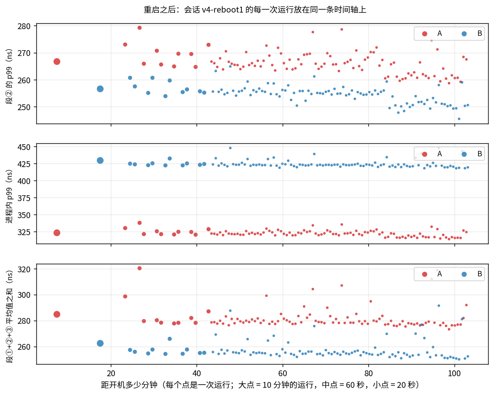
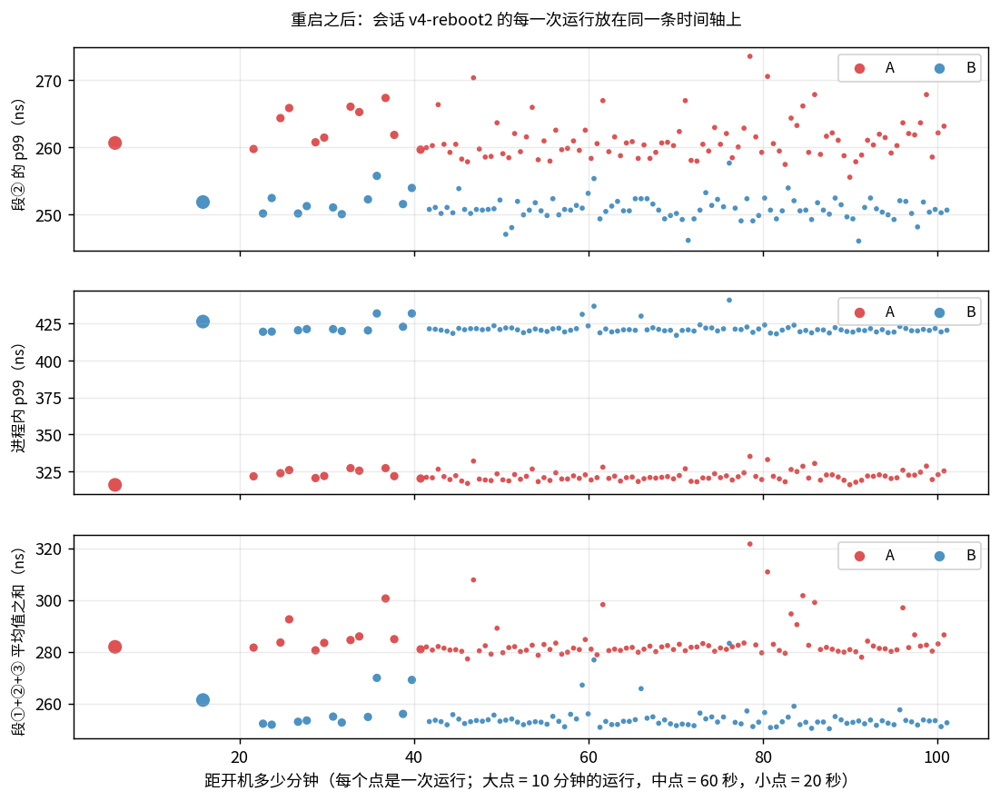

# 延迟报告

> **本报告的全部数据来自当前的代码版本 v4**（git 标签 `v4`）。正式数据是 2026-10-02 在同一次开机、同一个网络环境里连续测出来的一整套；
> 之后又重启两次，各做了一个复测会话，单独放在 §3.5，不与正式数据混用。
> 原始输出在 `logs/`（每次运行一个 `.log` + 一个 `.json`，目录说明见 README"交付物在哪"一节）。
> v4 相对 v3 是一次外部代码审查之后的修正（`docs/REVIEW.md`），其中动到热路径的只有一处：回复的身份在请求完成之前核对（§3.4）。
> v1 ~ v3 的测量与结论（跨重启、跨日期的复测等）摘要在 [`docs/HISTORY.md`](HISTORY.md)，它们的日志不在仓库里。
>
> 所有表格由 `scripts/make_report.py` 从 `logs/` 下的 JSON 生成（`<!-- BEGIN:x -->` 与 `<!-- END:x -->` 之间），图由 `scripts/plots.py` 生成；
> 整套数据可以用 `scripts/campaign.sh` 一键重测。运行环境、代码版本、时钟质量见 §10。

## 1. 结论

1. **硬门槛全部满足。** A、B 各连续运行 10 分钟，零崩溃、**零丢包（0 超时）**、**零 mbuf 泄漏**（avail 8191 → 8191），
   本机网卡的丢弃计数与 AWS 限额计数全为 0，两条对账（请求、收包）都为 0。A 共 6514 万个样本，B 共 6777 万个。
   此外 A、B 各连续运行了 30 分钟（A 2.05 亿个请求、B 2.00 亿个请求，都是零丢包、零泄漏），
   25 个故障注入场景 × A / B 共 50 项全部通过（§8）。这一整套（主考核、交替对比、诊断口径、与系统 ping 的对比、30 分钟、新旧版本对比）共 67 次正常运行，没有丢过一个包。
   之后两次重启后的复测会话各 200 次运行、各约 6.8 亿个请求：泄漏都是 0；一个会话零丢包，另一个丢了 1 个请求（本机的丢弃计数全为 0，§3.5、§8）。
2. **排名指标（进程内耗时的 A − B）。正式成绩取 SPEC 规定的 600 秒主考核：p50 是 A 180 ns、B 170 ns（+10），p99 是 A 330 ns、B 429 ns（−99）。**
   时间戳的分辨率是 10 ns（§3.1），插值估计作为补充：**p50 +9.6 ns（95% 区间 +9.1 ~ +10.2）、p99 −98.9 ns（−102.8 ~ −95.1）**。
   A / B 交替 10 对（不带样本导出）用来评估运行之间的波动和结论稳不稳：逐对差值的平均是 **p50 +10.9 ns（+8.6 ~ +13.3，10 对全部为正）、p99 −104.7 ns（−110.8 ~ −98.7，10 对全部为负）**（§3.3）。
   **换两次开机再测（§3.5）**：主考核的 p50 差值是 +9.6 / +9.6，p99 差值是 −106.3 / −110.5；交替 10 对是 p50 +11.5 / +16.6，p99 −99.1 / −99.4，方向全部一致。
   其中 +16.6 那一次查明是内存布局造成的（同一份二进制的另一个文件实例，A 的段①整体慢 5 ns），所以 **p50 的差值应当读作"+10 ~ +17 ns"**：
   上面的置信区间只反映一次运行内部的抽样误差，不包含这一项。
3. **p99 为负不代表 runtime 更快，而是同一段 CPU 停顿在两边被记进了不同的段**（§4）。
   发送的最后一步是往网卡寄存器写"门铃"，这次写入约 250 ~ 300 ns 才完成；CPU 不等它，后面的写入在 CPU 的写入队列里排队，队列满了才停下来。
   B 两次发送之间写入少，停在下一次发送的中途（段①，计分）；A 多了调度，停在走到 T0 之前（段③，不计分）。
   证据：T0 前加 `sfence` 无变化；加 `mfence` 后 B 的慢发送消失；**不加任何栅栏指令、只多做 N 次普通内存写入，N ≤ 36 无变化，N ≥ 44 效果与 `mfence` 相同**；
   反过来，两次发送之间**少**做一次函数调用，慢发送就变多几倍（§3.4）。
4. **抽象税是正的，按"三段合计"算每个请求约 20 ~ 30 ns。** 几个互相印证的数字：
   - 每请求总账（三个被测段 ① + ② + ③ 的平均值之和；它不含 T3 之后的收尾和主循环的空转，见 §4.2）：主考核 A 比 B 多 **32.2 ns**；交替 10 对是 **+20.9 ns**（95% 区间 +11 ~ +31，10 对全部为正）。
   - 把那段停顿统一移到 T0 之前再比（两边都加 `mfence`，各 5 分钟）：进程内耗时的 A − B 是**平均 +10.3 ns、p50 +10.4 ns、p99 +14.7 ns**，每个分位数都为正；
     此时两边的段①相差不到 1 ns（本来就是同一个函数），差值全部在段②。这个口径下的每请求总账是 +26.6 ns。
   - 按来源拆开（§5、README §1.1）：接收路径本身（`put → wake → 就绪队列 → 出队 → poll → 恢复`）约 **+9 ns**；
     同一批里排在后面的包多等，平摊到每个请求约 **+2 ns**；发送侧调度约 **+17 ~ +21 ns**（这一项在不同的运行之间波动最大）。
5. **这段停顿躲不掉，但落在哪里可以安排**（§4.4）。A 的结构让它自然落在不计分的段③，所以按题目口径 A 的计分路径尾部比 B 短；
   但这不是 runtime 独有的优势（B 在 T0 前加一条 `mfence`，计分路径是 170 / 320，不比 A 的 180 / 330 高），也不稳固（见下一条）。
   工程上的取舍可以如实地说成一句话：A 用计分路径上 p50 约 +10 ns、每请求总共约 20 ~ 30 ns 的代价，换来了可组合、易扩展的异步写法。
6. **这一版（v4）是外部代码审查之后的修正，同场配对没有检测到性能退化；中间走过一次弯路，如实记在 §3.4。**
   审查的六条意见全部属实、全部采纳（`docs/REVIEW.md`），其中两条是行为缺陷：回复的身份要在请求完成之前核对（R1）；A 的发送重试要响应停止（R2）。
   同场配对 6 轮：v4 相对 v3，A 的段② 平均 −1.1 ns（区间 −4.6 ~ +2.5），进程内 p50 −0.8 ns（−4.1 ~ +2.6），p99 −3.0 ns（−13.2 ~ +7.3）；B 同样如此。
   这些区间都跨过 0：在这个环境和样本量下没有检测到差别，不等于证明了零成本。
   但 v4 的第一版顺手删掉了 sleep 之后原有的那次核对，结果 A、B 的慢发送占比都升高了几倍（A 约 0.3% → 2% ~ 10%）。
   用五个版本同场轮流的二分法查明：原因就是少了那一次函数调用。最终版保留了它，作为第二道独立的检查。
7. **测量方法是本题的一部分。** 下面几处如果不处理，报出来的数字就是错的或者说不清的：
   - 用非序列化的 `rdtsc` 打点，段② p50 的 A − B 会被报成 +120 ns（B 读包数据的 cache miss 被乱序执行"藏掉"）→ 统一用 `rdtscp`；
   - 把运行起点取在准备工作之前，sleep 误差的最大值会多出几十微秒的启动假象 → 起点定在启动后 1 ms；
   - 时间戳分辨率只有 10 ns，两个分位数相减只能得到 10 的整数倍 → 标定并报告分辨率，另给插值分位数，并限定它的适用范围；
   - 一亿个样本并不独立，直接当独立样本算，置信区间会窄几十倍 → 分块自助法；单次运行看不到运行之间的波动 → 交替 10 对；
   - 比较两个版本时拿两组不同时段的数字相减，会把时段的波动算成代码的差别 → 同一次开机里轮流跑、逐轮配对；
   - 测量工具自己会干扰测量（样本导出曾让 A 的慢发送变多，`HISTORY.md` 第 2 节）→ 修正工具，并用不带样本导出的交替 / 轮流数据核对正式结果；
   - 系统 ping 的速率不能按参数推算（实测比名义低约 3%）→ 实测 C 的速率，再把 A / B 的速率对齐（§6）；
   - 环境本身会变：这台实例两天里被云平台切换过两次，往返时间从约 160 µs 变成约 53 µs → 一套数据必须在同一个环境里连续测完。
   - 内存布局会变：内容逐字节相同的二进制，只因为文件被重写了一遍，A 的段①就整体慢了 5 ns，持续了一百多次运行（§3.5）→ 一个会话固定用同一个文件；
     置信区间给的是精度，不是准确度，结论要换一次开机再核对。
8. **kernel bypass 的收益（A 对 C，同一对端、同样的帧、实测速率对齐）**：
   - 单路低速率（各约 1000 包/秒）：p50 **35.0 对 42 µs**，p99 **38.9 对 47 µs**，p99.99 54 对 284 µs，max 0.09 对 0.41 ms。
   - 64 路（A 6.16 万、C 6.21 万包/秒）：p50 **115 对 249 µs**，p99 **126 对 582 µs**，p99.99 0.23 对 1.09 ms，max 0.47 对 18.1 ms。
   - kernel bypass 换来的主要是**确定性**：本端没有中断、没有空闲态唤醒、没有调度；越往尾部差距越大。
     A 是闭环负载、ping 是开环负载，所以这是"这个环境、这种负载下"的读数，不能把差值全部归因于绕过内核。
9. **timer**：sleep 误差 p50 10 ns（一格）、p99 260 ns（上限由主循环一轮的时长决定）；段③（发现到期 → 下一个 T0）A 为 60 / 700 ns，B 为 50 / 401 ns。
10. **异常都能解释，解释不了的如实写明**：
    - 最大值尖刺：主循环的停顿检测显示 A、B 都是约每秒 200 次被外部打断（累计占 0.06%，最长一百多微秒）→ 来自虚拟机宿主机。
    - 外来的 echo reply：来自公网地址 13.214.173.166（id=16509，不是我们的 session），属于互联网背景流量；已识别并丢弃。
    - 故障注入 50 项通过，指的是程序每次都干净收场、内部对账为 0，不等于每一个丢包的原因都已定位：`mbuf-exhaust` 场景里有约 2% 的丢失未被现有的网卡计数器解释，位置没有确定（§8）。
    - 偶发的单个丢包：两个复测会话约 13.6 亿个请求里丢了 1 个，本机没有任何丢弃计数；与旧版本上见过的 4 次是同一类，位置没有确定（§8）。
    - 复测会话里 A 的段①有一百多次运行整体慢了 5 ns：查到了它跟着哪个文件实例走，没有查到具体是哪一级缓存（§3.5）。

## 2. 主考核：A 与 B 各连续 10 分钟（64 session，delay 500 µs，payload 64 B）

<!-- BEGIN:main -->
### 硬门槛

| 客户端 | 实际时长 | sent | received | 超时（丢包） | 迟到 | 对账差 | mbuf avail 初值 → 终值 | AWS allowance 超限 | 退出原因 |
|---|---|---|---|---|---|---|---|---|---|
| A async-ping | 600.0 s | 65,140,457 | 65,140,457 | 0 | 0 | 0 | 8191 → 8191（泄漏 0） | 全部为 0 | 到达 --duration-sec，停止发送并等在途请求收尾 |
| B raw-ping | 600.0 s | 67,771,119 | 67,771,119 | 0 | 0 | 0 | 8191 → 8191（泄漏 0） | 全部为 0 | 到达 --duration-sec，停止发送并等在途请求收尾 |

### 收包对账与异常包

| 客户端 | 收到的包 | = 按时回复 | + 迟到 | + 对不上号 | + 外来回复 | + 被拒绝（时间戳不符） | + 无关帧 | + ARP 请求 | 差值 | record 时二次核对不符 |
|---|---|---|---|---|---|---|---|---|---|---|
| A | 65,140,469 | 65,140,457 | 0 | 0 | 1 | 0 | 1 | 10 | 0 | 0 |
| B | 67,771,136 | 67,771,119 | 0 | 0 | 1 | 0 | 6 | 10 | 0 | 0 |
- A：[tsc 88154140586691] foreign：来自 13.214.173.166 的 echo reply（不是对端），id=16509 seq=14618，已丢弃
- B：[tsc 90262844954617] foreign：来自 13.214.173.166 的 echo reply（不是对端），id=16509 seq=14618，已丢弃

### 主循环被外部打断（诊断）

| 客户端 | 空轮询 > 1 µs：次数 | 累计 | 最长 | 取包前 > 10 µs：次数 | 最长 | sleep 误差 max | 进程内 max |
|---|---|---|---|---|---|---|---|
| A | 121,329 | 365.9 ms | 117.6 µs | 205 | 138.2 µs | 116.5 µs | 40.5 µs |
| B | 119,154 | 350.0 ms | 114.4 µs | 235 | 137.0 µs | 126.5 µs | 80.1 µs |

### 分位数（ns）与 A − B

| 指标 | | p50 | p90 | p99 | p99.9 | p99.99 | max |
|---|---|---|---|---|---|---|---|
| **in-process ①+②** | A | 180 | 230 | 330 | 429 | 549 | 40,450 |
| | B | 170 | 220 | 429 | 540 | 641 | 80,090 |
| | A − B | +10 | +10 | -99 | -111 | -92 | -39,640 |
| **seg① send  T1−T0** | A | 50 | 60 | 80 | 180 | 290 | 40,340 |
| | B | 50 | 70 | 310 | 330 | 441 | 7,520 |
| | A − B | +0 | -10 | -230 | -150 | -151 | +32,820 |
| **seg② recv  T3−T2** | A | 120 | 170 | 270 | 360 | 469 | 28,330 |
| | B | 110 | 160 | 260 | 320 | 420 | 80,040 |
| | A − B | +10 | +10 | +10 | +40 | +49 | -51,710 |
| **end-to-end T3−T0** | A | 54,153 | 161,083 | 165,809 | 240,246 | 248,123 | 368,000 |
| | B | 52,972 | 157,932 | 163,446 | 232,369 | 248,123 | 522,380 |
| | A − B | +1,181 | +3,151 | +2,363 | +7,877 | +0 | -154,380 |
| **seg③ wake→next T0** | A | 60 | 310 | 700 | 1,110 | 1,332 | 32,440 |
| | B | 50 | 290 | 401 | 521 | 883 | 21,740 |
| | A − B | +10 | +20 | +299 | +589 | +449 | +10,700 |
| **sleep error** | A | 10 | 120 | 260 | 669 | 3,120 | 116,460 |
| | B | 10 | 100 | 240 | 549 | 2,935 | 126,490 |
| | A − B | +0 | +20 | +20 | +120 | +185 | -10,030 |
| **deadline→next T0 (误差+③)** | A | 70 | 429 | 790 | 1,203 | 3,556 | 117,190 |
| | B | 60 | 370 | 509 | 870 | 3,187 | 126,550 |
| | A − B | +10 | +59 | +281 | +333 | +369 | -9,360 |

### 段① 按「距上一次发送多久」分档（ns，诊断）

| 距上次发送 | A 样本占比 | A p50 | A p99 | B 样本占比 | B p50 | B p99 |
|---|---|---|---|---|---|---|
| 距上次发送<100ns | 0.0% | 0 | 0 | 2.4% | 310 | 390 |
| 100–250ns | 0.0% | 70 | 80 | 0.0% | 200 | 401 |
| 250–500ns | 18.5% | 50 | 150 | 13.5% | 50 | 70 |
| 500ns–2µs | 48.8% | 50 | 80 | 47.2% | 50 | 70 |
| ≥2µs | 32.7% | 50 | 80 | 36.9% | 50 | 80 |

### rx_burst 包数分布（非空 burst）

- A：1: 85.70%  2: 12.42%  3: 1.70%  4: 0.18%
- B：1: 87.85%  2: 10.82%  3: 1.24%  4: 0.09%
<!-- END:main -->

## 3. 这些数字有多可信

一个分位数只是一个点。要回答"它有多可信"，需要四样东西：尺子的精度（§3.1）、一次运行内部的抽样误差（§3.2）、不同运行之间的波动（§3.3）、
换一个版本之后变了多少（§3.4），以及换一次开机、换一天之后还成不成立（§3.5）。

### 3.1 尺子：时间戳的分辨率是 10 ns

程序启动时会标定时钟（结果在每份 JSON 的 `env` 字段里）：这台机器的 TSC 读数不是每个周期加 1，而是**每 10 ns 跳一步**（一步 26 个周期）。
所以任何一个时间差都只能是 10 ns 的整数倍，§2 的分位数也都落在 10 ns 的格点上（偶尔出现的 561、429 这类数是直方图桶的中点，对应格点 560、430）。

这带来两个后果：

1. **单个时间差有 ±10 ns 的量化误差，但平均值没有偏差**：一个真实长度为 16 ns 的间隔，会被量成 10 ns 或 20 ns，取哪个看起止时刻落在格子的什么位置，平均起来仍是 16 ns。
   程序标定出的"读一次时钟"的成本就是这样得到的（约 18 ns；单次读数只能是 10 或 20）。
2. **两个分位数相减，结果只能是 10 ns 的整数倍**。§2 里"进程内 p50 的 A − B = +10 ns"的准确读法是"差了一格"，真实差值可能是几纳秒到十几纳秒。

为了看清一格以内的差别，下面的置信区间用的是**插值分位数**：把落在同一格的样本看成均匀分布在这一格内（格点 ± 5 ns），再在格内线性插值。
这是处理分组数据的标准做法；A 和 B 用的是同一把尺子，相减是公平的。`pingkit` 里有一个单元测试用模拟数据验证了它：
两个只差 2 ns 的分布，格点分位数分不出来，插值分位数能还原到 1 ns 以内；紧贴分布硬边界的地方误差可到半格（5 ns）。
程序把插值分位数也写进了 JSON（`p50_interp` 等），与离线脚本独立算出的结果一致（相差不超过 0.05 ns）。

**适用范围。** 按格点插值的前提是"直方图的桶宽不超过时钟的一格"，在这台机器上就是 1.6 µs 以内的值——进程内耗时、段①、段②的各分位数都在这个范围里。
更大的值（端到端延迟、sleep 误差的极端尾部）桶宽超过一格，直方图已经分不清桶里的几个格点，程序只在桶内线性插值，精度就是桶宽（相对 0.8% 以内），不比普通分位数更准；
报告里这些量一律用普通分位数。插值是模型估计，小数位数不代表测量精度：A、B 的分布形状不同时，硬边界附近的偏差不保证完全抵消（最多半格）。

### 3.2 一次运行内部：分块自助法的 95% 置信区间

主考核运行时加了 `--samples`，把每个样本的段①、段②和 T2 原样存了下来（缓冲区在启动时一次分配好，运行中不分配；写文件发生在关停之后）。
`scripts/ci.py` 用这些原始样本算置信区间，要点有两个：

- **先分别求 A、B 的分位数，再相减。** A 和 B 是两次独立的运行，样本之间没有一一对应关系。
- **以"时间块"为单位重抽，而不是以单个样本为单位。** 样本并不独立：同一批到达的回复、同一次被宿主机打断、对端的往返时间换了一档，
  都会连续影响成千上万个样本。把时间轴切成 20 秒一块，以块为单位有放回地重抽，块内的相关性原样保留。

<!-- BEGIN:ci -->
样本：A 65,140,457 个，B 67,771,119 个（与主考核是同一次运行）；时间块 20 秒，重抽 2000 次；时间戳分辨率 10 ns。单位 ns。

| 指标 | 统计量 | A | B | A − B（格点） | **A − B（插值）** | 95% 置信区间 | A 更慢的把握 |
|---|---|---|---|---|---|---|---|
| **进程内 ① + ②** | 平均 | 186.8 | 181.6 | — | **+5.2** | [+4.0, +6.3] | 100% |
| | p50 | 177.7 | 168.1 | +10 | **+9.6** | [+9.1, +10.2] | 100% |
| | p90 | 229.0 | 224.3 | +10 | **+4.7** | [+1.8, +7.2] | 100% |
| | p99 | 332.1 | 431.0 | -100 | **-98.9** | [-102.8, -95.1] | 0% |
| | p99.9 | 425.6 | 536.7 | -110 | **-111.1** | [-118.8, -102.9] | 0% |
| | p99.99 | 548.4 | 641.1 | -90 | **-92.7** | [-103.3, -81.1] | 0% |
| **段①（发送）** | 平均 | 54.8 | 60.9 | — | **-6.2** | [-6.9, -5.5] | 0% |
| | p50 | 52.4 | 52.8 | +0 | **-0.5** | [-0.5, -0.5] | 0% |
| | p90 | 63.7 | 68.3 | -10 | **-4.6** | [-4.9, -4.4] | 0% |
| | p99 | 80.6 | 311.2 | -230 | **-230.6** | [-234.3, -226.1] | 0% |
| | p99.9 | 183.6 | 332.3 | -150 | **-148.7** | [-150.8, -146.3] | 0% |
| | p99.99 | 294.8 | 437.6 | -150 | **-142.8** | [-145.8, -139.2] | 0% |
| **段②（接收）** | 平均 | 132.0 | 120.7 | — | **+11.3** | [+10.6, +12.1] | 100% |
| | p50 | 123.0 | 112.2 | +10 | **+10.8** | [+10.4, +11.2] | 100% |
| | p90 | 171.8 | 159.6 | +10 | **+12.2** | [+10.5, +13.9] | 100% |
| | p99 | 273.2 | 255.3 | +10 | **+17.9** | [+15.7, +20.1] | 100% |
| | p99.9 | 356.9 | 322.0 | +40 | **+34.8** | [+28.8, +41.2] | 100% |
| | p99.99 | 471.1 | 420.2 | +50 | **+50.9** | [+42.5, +59.0] | 100% |

**样本并不独立，块长的选择很重要。** 同样的数据，用不同的方式重抽，A − B 的 95% 区间如下：

| 重抽方式 | 进程内平均 A − B | 进程内 p50 A − B | 进程内 p99 A − B |
|---|---|---|---|
| 假装 1.33 亿个样本相互独立 | [+5.2, +5.2] | [+9.6, +9.6] | [-99.0, -98.8] |
| 按 0.1 秒分块（6001 块） | [+5.0, +5.3] | [+9.5, +9.7] | [-99.4, -98.6] |
| 按 1 秒分块（601 块） | [+4.8, +5.5] | [+9.4, +9.8] | [-100.1, -97.8] |
| 按 5 秒分块（121 块） | [+4.5, +5.9] | [+9.3, +10.0] | [-101.2, -96.7] |
| **按 20 秒分块（31 块）** | [+4.0, +6.4] | [+9.0, +10.2] | [-103.0, -94.8] |
| 按 60 秒分块（11 块） | [+3.6, +6.7] | [+8.9, +10.4] | [-104.1, -93.5] |

区间随块长增大而变宽：相关性不只存在于相邻的样本之间，还存在于几秒到几十秒的尺度上（对端的往返时间会换档，见下面的每秒序列）。块太短会把这部分相关性切断、把区间算窄，所以上表采用 20 秒的块；按这个块长，区间比"假装独立"宽 43 ~ 123 倍。块再长（60 秒，只剩 10 块）区间还会略宽，但块数太少时重抽本身就不可靠。所以**单次运行的区间应当看作不确定度的下限**；不同运行之间的波动见 §3.3。

**段① 的 p99 为什么不稳定。** 段① ≥ 130 ns 的样本占比：A 0.87%（95% 区间 0.78% ~ 0.98%），B 2.56%（2.32% ~ 2.85%）。

**10 分钟内的变化范围。** 把每一秒单独算一次（进程内耗时，ns）：

| | 每秒 p50：最小 / 中位 / 最大 | 每秒 p99：最小 / 中位 / 最大 | 每秒平均：最小 / 中位 / 最大 |
|---|---|---|---|
| A | 172.8 / 177.4 / 184.3 | 313.6 / 327.7 / 353.7 | 180.3 / 185.8 / 194.5 |
| B | 163.9 / 168.0 / 173.8 | 415.8 / 426.8 / 461.6 | 175.9 / 180.6 / 195.3 |
<!-- END:ci -->


上图：把 10 分钟切成 600 个 1 秒，每一秒单独算 p50 和 p99（A 和 B 是先后两次运行，横轴只是各自的运行时间）。
曲线上的台阶来自环境：对端的往返时间会在两档之间切换（这次测量时多数时候约 53 µs，偶尔换到约 158 µs 的一档），回复"扎堆"到达的程度跟着变。
**环境平稳的时候区间就窄，不平稳的时候就宽**，所以单次运行的区间只说明"那一次"有多确定，不能替代多跑几轮。


上图：把"重抽 → 求分位数 → 相减"重复 2000 次得到的 A − B 的分布。整个分布离 0 越远，"A 与 B 有差别"这个结论越可靠。

### 3.3 不同运行之间：A / B 交替 10 对

§3.2 的区间只反映**一次运行内部**的抽样误差。不同的运行之间还有别的东西在变——最主要的是对端的状态：
对端网卡驱动的自适应中断合并让往返时间在两档之间切换，回复"扎堆"到达的程度也跟着变，这会影响两边的尾部分位数。
这部分波动只能靠多跑几轮来看。做法：A、B 交替各跑 10 轮（奇数对先 A 后 B，偶数对先 B 后 A，抵消顺序和时间漂移的影响），对"逐对的差值"做统计。
这 20 轮都**不带**样本导出。

<!-- BEGIN:ab -->
**10 对 × 60 秒**（`logs/ab-20261002-124231`；奇数对先 A 后 B，偶数对先 B 后 A；全部 20 轮都是 0 丢包、0 泄漏）

逐对结果（ns；分位数为插值分位数，括号里是程序直接打印的格点值）：

| 对 | 顺序 | 进程内 p50：A / B | A − B | 进程内 p99：A / B | A − B | 进程内平均 A − B | 段① ≥ 125 ns 占比：A / B | 往返 p50：A / B（µs） |
|---|---|---|---|---|---|---|---|---|
| 1 | A → B | 182.3（180）/ 164.9（160） | +17.4 | 330.7（330）/ 422.6（420） | -91.9 | +12.1 | 0.50% / 2.32% | 58 / 53 |
| 2 | B → A | 175.8（180）/ 165.6（170） | +10.2 | 319.2（320）/ 421.5（420） | -102.3 | +5.0 | 0.22% / 2.26% | 53 / 53 |
| 3 | A → B | 174.7（170）/ 165.2（170） | +9.5 | 318.3（320）/ 422.4（420） | -104.1 | +4.1 | 0.24% / 2.26% | 53 / 53 |
| 4 | B → A | 177.0（180）/ 167.6（170） | +9.4 | 324.8（320）/ 442.1（441） | -117.3 | -0.1 | 0.28% / 4.46% | 53 / 160 |
| 5 | A → B | 173.1（170）/ 165.9（170） | +7.2 | 318.6（320）/ 422.1（420） | -103.5 | +2.1 | 0.22% / 2.35% | 53 / 53 |
| 6 | B → A | 177.2（180）/ 165.6（170） | +11.6 | 326.0（330）/ 424.4（420） | -98.4 | +5.8 | 0.28% / 2.47% | 53 / 53 |
| 7 | A → B | 175.7（180）/ 166.6（170） | +9.1 | 321.3（320）/ 437.0（441） | -115.7 | +0.4 | 0.25% / 4.08% | 53 / 158 |
| 8 | B → A | 175.0（180）/ 166.7（170） | +8.3 | 319.5（320）/ 433.5（429） | -114.0 | +0.3 | 0.23% / 3.45% | 53 / 55 |
| 9 | A → B | 181.8（180）/ 165.8（170） | +16.0 | 324.1（320）/ 427.5（429） | -103.4 | +8.5 | 0.27% / 2.70% | 53 / 53 |
| 10 | B → A | 175.6（180）/ 165.0（160） | +10.6 | 324.5（320）/ 421.3（420） | -96.8 | +6.4 | 0.29% / 2.24% | 53 / 53 |

对 10 个逐对差值（A − B，ns）做统计：

| 指标 | 平均 | 95% 置信区间 | 最小 | 最大 | A − B > 0 的对数 | 先 A 后 B 的对：平均 | 先 B 后 A 的对：平均 |
|---|---|---|---|---|---|---|---|
| 进程内 p50 | **+10.9** | [+8.6, +13.3] | +7.2 | +17.4 | 10 / 10 | +11.8 | +10.0 |
| 进程内 p99 | **-104.7** | [-110.8, -98.7] | -117.3 | -91.9 | 0 / 10 | -103.7 | -105.8 |
| 进程内平均 | **+4.5** | [+1.6, +7.3] | -0.1 | +12.1 | 9 / 10 | +5.4 | +3.5 |
| 段② p50 | **+10.4** | [+8.4, +12.4] | +7.2 | +16.3 | 10 / 10 | +11.3 | +9.5 |
| 段② p99 | **+10.3** | [+6.9, +13.8] | +4.1 | +19.1 | 10 / 10 | +10.4 | +10.2 |
| 段② 平均 | **+10.1** | [+8.1, +12.1] | +7.1 | +16.4 | 10 / 10 | +10.9 | +9.4 |
| 段① 平均 | **-5.7** | [-7.1, -4.2] | -9.4 | -3.9 | 0 / 10 | -5.5 | -5.9 |
| ① + ② + ③ 平均 | **+20.9** | [+11.0, +30.9] | +1.3 | +48.4 | 10 / 10 | +24.0 | +17.9 |

段① ≥ 125 ns 的占比在各轮之间的范围：A 0.22% ~ 0.50%，B 2.24% ~ 4.46%。A 的段① p99 各轮为 70 / 70 / 70 / 70 / 70 / 70 / 70 / 70 / 70 / 70 ns：占比低于 1% 时读数是 70 ~ 80 ns，一旦高于 1% 就跳到 130 ns 以上。
<!-- END:ab -->


怎么读上面两张表：

- **看方向**：统计表的"A − B > 0 的对数"一列。p50、段②、每请求总账如果每一对都是正的，p99 每一对都是负的，结论就不依赖于"恰好挑了哪一次运行"。
- **看顺序有没有影响**：最后两列（先 A 后 B 的对、先 B 后 A 的对）应当接近。
- **排名口径的平均值（① + ② 的平均）差值常常在 0 附近**：B 段①里的那段停顿与 A 段②里的税，在平均值上相互抵消（§4）。
  这正是只看排名口径会低估抽象税的原因；把段③也算上的三段合计才不会漏掉它。
- **正式成绩仍是 §2 的 600 秒主考核**；这一节回答的是"换一次运行，结论还在不在"。在看 A − B 的大小时，这一节的数字更干净一些，主考核那一对则用来算置信区间和按批内位置拆分（§5）：
  主考核为了导出原始样本开了 `--samples`，交替的 20 轮没有开。样本导出曾经干扰过测量（已在 v3 修正，`HISTORY.md` 第 2 节），
  现在它对 A 的影响很小（主考核里 A 的慢发送占比是 0.87%，交替的 10 轮是 0.22% ~ 0.50%）；对照组 B 带样本导出时慢发送的占比总是落在较低的一档，原因没有查明，所以两种口径下 B 的平均值可以差几纳秒。

### 3.4 这次修改（v3 → v4）改变了什么：同场配对

v4 是外部代码审查之后的修正（六条意见的处理见 `docs/REVIEW.md`）。其中只有一条动到了热路径：
**回复的身份（id、seq、回带的发送时间戳）在请求完成之前核对**——以前 `id/seq` 对上就算完成，时间戳在 sleep 之后才核对。
这次比较发生在段②之内，A、B 各多一次 8 字节的比较。它花了多少，用同场配对来回答：v3 的 A、v4 的 A、v3 的 B、v4 的 B 四者轮流跑。

<!-- BEGIN:vab -->
**v3 ↔ v4**：6 轮，每轮里 v3 的 A、v4 的 A、v3 的 B、v4 的 B 各跑 60 秒（顺序逐轮轮换，都不带样本导出）；共 24 次运行，丢包合计 0，泄漏合计 0，被拒绝的回复合计 0。逐轮配对后的平均值与 95% 区间（ns）：

| 指标 | A：v4 − v3 | B：v4 − v3 | A − B（v3） | A − B（v4） | **A − B 的变化** | A − B 变小的轮数 |
|---|---|---|---|---|---|---|
| 进程内 p50 | -0.8 [-4.1, +2.6] | +0.1 [-2.3, +2.4] | +10.0 [+8.3, +11.7] | +9.1 [+7.6, +10.6] | **-0.8 [-2.7, +1.0]** | 5 / 6 |
| 进程内 p99 | -3.0 [-13.2, +7.3] | -6.9 [-14.6, +0.8] | -105.2 [-116.5, -93.9] | -101.2 [-107.0, -95.4] | **+4.0 [-6.7, +14.7]** | 2 / 6 |
| 进程内 平均 | -1.0 [-4.8, +2.8] | -3.5 [-7.6, +0.6] | +1.7 [-3.3, +6.8] | +4.2 [+2.4, +6.0] | **+2.5 [-1.6, +6.6]** | 2 / 6 |
| 段① 平均 | +0.1 [-0.5, +0.6] | -3.9 [-8.1, +0.3] | -8.7 [-12.5, -5.0] | -4.8 [-5.8, -3.8] | **+4.0 [+0.1, +7.9]** | 1 / 6 |
| 段② 平均 | -1.1 [-4.6, +2.5] | +0.4 [-1.6, +2.3] | +10.5 [+8.6, +12.4] | +9.0 [+6.9, +11.1] | **-1.5 [-3.7, +0.8]** | 5 / 6 |
| 段② p50 | -0.7 [-3.2, +1.8] | +0.2 [-1.4, +1.7] | +10.1 [+9.0, +11.2] | +9.2 [+7.8, +10.6] | **-0.9 [-2.5, +0.7]** | 5 / 6 |
| 段② p99 | -3.0 [-12.8, +6.8] | +0.1 [-4.1, +4.3] | +12.7 [+5.8, +19.6] | +9.5 [+4.8, +14.3] | **-3.2 [-10.2, +3.9]** | 5 / 6 |
| 段③ 平均 | -1.3 [-9.1, +6.4] | -3.9 [-10.5, +2.7] | +22.1 [+11.4, +32.9] | +24.7 [+15.8, +33.6] | **+2.6 [-4.3, +9.5]** | 3 / 6 |
| ① + ② + ③ 平均（总账） | -2.4 [-13.7, +9.0] | -7.4 [-17.0, +2.1] | +23.9 [+8.4, +39.3] | +28.9 [+18.5, +39.3] | **+5.1 [-5.0, +15.1]** | 3 / 6 |

段① ≥ 125 ns 的占比：v3 的 A 0.22% ~ 0.46%，v4 的 A 0.23% ~ 0.36%；v3 的 B 2.30% ~ 8.33%，v4 的 B 2.19% ~ 2.59%。
<!-- END:vab -->

- **段②（新加的比较所在的地方）**：看"段② 平均 / p50 / p99"三行的前两列——A 和 B 各自的 v4 − v3。
- **A − B 的变化**：倒数第二列。两边加的是同一次比较，A − B 不应当变。
- 比较两个版本只能这样做（同一次开机、轮流、逐轮配对）。拿两组不同时段的数字直接相减，会把时段之间的波动算成代码的差别（`HISTORY.md` 第 3 节里有一次这样的教训）。

**一次走了弯路的经过。** v4 的第一版在把核对提前的同时，删掉了 sleep 之后原有的那次核对（觉得它多余了）。同场对比立刻显示：
段②没有变，但 A、B 的**慢发送都变多了**，进程内 p99 各高了几十纳秒。用二分法查是哪一处改动引起的：

<!-- BEGIN:bisect -->
各 20 秒，五个版本轮流跑 3 轮；占比给出最小 ~ 最大，其余是 3 次的中位数（ns）：

| 版本 | A：段① ≥ 125 ns 占比 | A：段① 平均 | A：段③ 平均 | A：进程内 p50 / p99 | B：段① ≥ 125 ns 占比 | B：段① 平均 | B：段③ 平均 | B：进程内 p50 / p99 |
|---|---|---|---|---|---|---|---|---|
| v3 | 0.27% ~ 0.64% | 53.7 | 95.4 | 178.0 / 326.0 | 2.28% ~ 3.64% | 60.1 | 74.4 | 169.2 / 424.0 |
| v3 + 最小的改动（接收时核对 + 停止检查），其余不动 | 0.25% ~ 0.32% | 53.7 | 94.6 | 178.7 / 329.8 | 2.45% ~ 4.78% | 63.7 | 99.3 | 171.2 / 442.1 |
| 同上，再去掉 sleep 之后的那次核对 | 2.44% ~ 2.83% | 58.7 | 96.5 | 179.9 / 371.3 | 10.97% ~ 11.36% | 79.7 | 54.0 | 170.9 / 480.0 |
| v4 的第一版（去掉了那次核对） | 1.95% ~ 2.19% | 58.2 | 94.5 | 179.7 / 365.1 | 11.26% ~ 12.45% | 79.6 | 54.1 | 171.0 / 480.4 |
| **最终的 v4**（保留那次核对） | 0.26% ~ 0.29% | 53.9 | 94.0 | 177.9 / 325.2 | 2.32% ~ 3.80% | 58.9 | 76.1 | 170.1 / 425.6 |

共 30 次运行。各版本的含义和重现方法见 `logs/r1-bisect/README.md`。
<!-- END:bisect -->

- **只加接收时的核对（以及停止检查），与 v3 没有差别**；**去掉 sleep 之后的那次核对，慢发送就变多**；把它加回来，又回到 v3 的水平。五个版本里只有这一个因素在变。
- 三段的总和没有变（看 B：段①多出来的，正好是段③少掉的）。这是 §4 的机制的又一个直接证据：那次核对是一次函数调用，位于"上一次发送"与"下一个 T0"之间；
  少了它，T0 之前做的事变少，上一次发送留下的那段停顿就更多地落进计分的段①。**两次发送之间多做或少做一次函数调用，就能让 B 的慢发送占比差出几倍。**
- 所以最终的 v4 保留了那次核对，作为第二道、独立的检查：接收侧用 driver 记下的 T0 判定，sleep 之后用 session 自己记下的 T0 再核对一次，
  不符记入 `record_mismatch`（应恒为 0）。它不是为了让数字好看而加的东西——v1 ~ v3 一直有这次调用；v4 只是没有把它删掉。
- 这件事也说明了排名口径的尾部分位数有多敏感：它取决于两次发送之间恰好执行了多少次写入。§4.4 给出了不依赖这一点的比法。

### 3.5 换一次开机、换一天

§3.2 ~ §3.4 的数据都来自同一次开机。还要问：换一次开机、换一天，结论还成不成立？正式数据测完之后重启机器，用 `scripts/session.sh` 把最核心的几组重测一遍
（主考核一对 → 交替 10 对 → A / B 每 20 秒交替连续监测 1 小时），结果单独存放在 `logs/sessions/`，不覆盖正式数据：

<!-- BEGIN:sessions -->
| 会话 | 代码版本 | 这次开机的时间（UTC） | 测量开始（UTC） | 进程内 p50：A / B | 主考核 A − B：p50 [95% 区间] | p99 [95% 区间] | 每请求总账 | 交替 10 对的逐对差值：p50 | p99 | 每请求总账 | 对数 | 丢包 / 泄漏（主考核 + 交替合计） |
|---|---|---|---|---|---|---|---|---|---|---|---|---|
| **正式数据** | v4 | 2026-10-02 03:02:32 | 2026-10-02 12:22 | 177.7 / 168.1 | **+9.6** [+9.1, +10.2] | **-98.9** [-102.8, -95.1] | **+32.2** | **+10.9** [+8.6, +13.3] | **-104.7** [-110.8, -98.7] | **+20.9** [+11.0, +30.9] | 10 对 | 0 / 0 |
| **v4-reboot1** | v4 | 2026-10-02 14:54:58 | 2026-10-02 14:57 | 175.8 / 166.2 | **+9.6** [+9.0, +10.2] | **-106.3** [-110.1, -102.3] | **+22.4** | **+11.5** [+9.4, +13.5] | **-99.1** [-103.8, -94.5] | **+29.3** [+19.0, +39.6] | 10 对 | 0 / 0 |
| **v4-reboot2** | v4 | 2026-10-02 16:42:15 | 2026-10-02 16:42 | 173.3 / 163.7 | **+9.6** [+9.3, +9.9] | **-110.5** [-114.6, -106.7] | **+20.6** | **+16.6** [+15.4, +17.8] | **-99.4** [-103.4, -95.3] | **+29.1** [+24.1, +34.1] | 10 对 | 0 / 0 |
共 3 个会话，分属 3 次不同的开机（由内核的 boot_id 区分）。表里的时间是 UTC；按北京时间，各会话的开始时刻是：正式数据 10-02 20:22、v4-reboot1 10-02 22:57、v4-reboot2 10-03 00:42（2 个自然日）。

各会话主考核那一对的拆分（每请求的 A − B，ns；三项的含义见 §5）与环境：

| 会话 | ① 接收路径本身 | ② 批内排队 | ③ 发送侧调度 | 每请求总账 | 段① ≥ 125 ns 占比：A / B | 往返 p50：A / B（µs） | 往返 min：A / B（µs） | 网卡发送计数的偏移 |
|---|---|---|---|---|---|---|---|---|
| 正式数据 | +8.9 | +1.8 | +20.8 | **+32.2** | 0.87% / 2.56% | 54 / 53 | 23.1 / 24.0 | 1,932,719,441 |
| v4-reboot1 | +8.1 | +1.4 | +13.0 | **+22.4** | 0.47% / 2.75% | 53 / 53 | 23.9 / 22.9 | 122 |
| v4-reboot2 | +7.6 | +1.4 | +11.8 | **+20.6** | 0.27% / 2.91% | 53 / 53 | 23.0 / 22.9 | 50 |

各会话交替 10 对的逐对差值按三段拆开（各段平均值的 A − B，ns，括号里是 95% 区间；最后两列是 A、B 各自段①平均值在 10 次运行里的中位数）：

| 会话 | 段① | 段② | 段③ | A 的段①平均 | B 的段①平均 |
|---|---|---|---|---|---|
| 正式数据 | **-5.7** [-7.1, -4.2] | **+10.1** [+8.1, +12.1] | **+16.5** [+9.1, +23.9] | 54.0 | 58.8 |
| v4-reboot1 | **-4.7** [-5.2, -4.1] | **+10.7** [+8.6, +12.7] | **+23.3** [+14.0, +32.5] | 53.8 | 58.3 |
| v4-reboot2 | **-0.8** [-2.0, +0.3] | **+10.7** [+9.3, +12.1] | **+19.2** [+15.4, +23.0] | 58.5 | 58.9 |
<!-- END:sessions -->

每个会话里的全部运行，按"距开机多久"分窗（看有没有随时间变化的状态）：

<!-- BEGIN:drift -->
会话 `v4-reboot1`（代码版本 v4，开机时间 2026-10-02 14:54:58 UTC）共 200 次运行，按开始时刻距开机多久分窗，每个窗口取各次运行的中位数（ns）：

| 距开机 | 运行次数 A / B | A 段② p99 | B 段② p99 | A 段① ≥ 125 ns 占比 | A 段③ 平均 | 进程内 p50：A − B | 进程内 p99：A − B | 每请求总账：A − B | 丢包 / 泄漏 |
|---|---|---|---|---|---|---|---|---|---|
| 0 ~ 10 分钟 | 1 / 0 | 267 | — | 0.47% | 100 | — | — | — | 0 / 0 |
| 10 ~ 20 分钟 | 0 / 1 | — | 257 | — | — | — | — | — | 0 / 0 |
| 20 ~ 30 分钟 | 3 / 4 | 273 | 259 | 0.52% | 112 | +11.8 | **-94** | **+42.0** | 0 / 0 |
| 30 ~ 40 分钟 | 6 / 4 | 268 | 256 | 0.25% | 95 | +10.1 | **-101** | **+22.3** | 0 / 0 |
| 40 ~ 50 分钟 | 11 / 12 | 266 | 256 | 0.29% | 95 | +9.7 | **-102** | **+23.4** | 0 / 0 |
| 50 ~ 60 分钟 | 15 / 15 | 266 | 256 | 0.30% | 95 | +9.8 | **-100** | **+24.2** | 0 / 0 |
| 60 ~ 70 分钟 | 15 / 15 | 266 | 255 | 0.28% | 95 | +10.8 | **-101** | **+25.2** | 0 / 0 |
| 70 ~ 80 分钟 | 15 / 14 | 267 | 255 | 0.29% | 94 | +10.0 | **-101** | **+24.6** | 0 / 0 |
| 80 ~ 90 分钟 | 15 / 15 | 262 | 254 | 0.32% | 96 | +9.7 | **-103** | **+24.1** | 0 / 0 |
| 90 ~ 100 分钟 | 15 / 15 | 261 | 251 | 0.29% | 95 | +9.9 | **-105** | **+23.7** | 0 / 0 |
| 100 ~ 110 分钟 | 4 / 5 | 264 | 250 | 0.33% | 96 | +10.5 | **-99** | **+28.7** | 0 / 0 |

会话 `v4-reboot2`（代码版本 v4，开机时间 2026-10-02 16:42:15 UTC）共 200 次运行，按开始时刻距开机多久分窗，每个窗口取各次运行的中位数（ns）：

| 距开机 | 运行次数 A / B | A 段② p99 | B 段② p99 | A 段① ≥ 125 ns 占比 | A 段③ 平均 | 进程内 p50：A − B | 进程内 p99：A − B | 每请求总账：A − B | 丢包 / 泄漏 |
|---|---|---|---|---|---|---|---|---|---|
| 0 ~ 10 分钟 | 1 / 0 | 261 | — | 0.27% | 101 | — | — | — | 0 / 0 |
| 10 ~ 20 分钟 | 0 / 1 | — | 252 | — | — | — | — | — | 0 / 0 |
| 20 ~ 30 分钟 | 5 / 4 | 261 | 251 | 0.26% | 95 | +16.9 | **-98** | **+30.9** | 0 / 0 |
| 30 ~ 40 分钟 | 4 / 6 | 266 | 252 | 0.34% | 99 | +15.6 | **-96** | **+30.0** | 0 / 0 |
| 40 ~ 50 分钟 | 14 / 13 | 260 | 251 | 0.27% | 95 | +15.4 | **-101** | **+27.7** | 0 / 0 |
| 50 ~ 60 分钟 | 15 / 15 | 260 | 251 | 0.27% | 95 | +15.2 | **-101** | **+27.8** | 0 / 0 |
| 60 ~ 70 分钟 | 15 / 15 | 260 | 251 | 0.27% | 95 | +15.3 | **-100** | **+27.9** | 0 / 0 |
| 70 ~ 80 分钟 | 15 / 14 | 260 | 251 | 0.26% | 96 | +15.0 | **-100** | **+29.1** | 1 / 0 |
| 80 ~ 90 分钟 | 15 / 15 | 261 | 251 | 0.32% | 96 | +15.8 | **-99** | **+28.9** | 0 / 0 |
| 90 ~ 100 分钟 | 15 / 15 | 261 | 250 | 0.31% | 95 | +15.6 | **-98** | **+28.4** | 0 / 0 |
| 100 ~ 110 分钟 | 1 / 2 | 263 | 250 | 0.74% | 96 | +20.0 | **-95** | **+34.8** | 0 / 0 |
<!-- END:drift -->





**这几张表说明了什么。**

1. **硬门槛。** 两个复测会话各 200 次运行、各约 6.8 亿个请求：`v4-reboot1` 丢包 0、泄漏 0；`v4-reboot2` 泄漏 0，丢了 1 个请求
   （连续监测里的一次 20 秒的 A，距开机 71 分钟；本机的各项丢弃计数全是 0，见 §8 末尾"关于偶发的单个丢包"）。
   两个会话里被拒收的回复都是 0，记录时的第二次核对不一致也是 0。
2. **结论的方向在三次开机里一致。**
   - 主考核那一对：p50 的差值 +9.6 / +9.6 / +9.6，p99 的差值 −98.9 / −106.3 / −110.5。
   - 交替 10 对：三个会话共 30 对，每一对都是 p50 为正、p99 为负、每请求总账为正。
   - 连续监测：两个会话共 178 对 20 秒的运行，p50 的差值 178 对全为正，p99 的差值 178 对全为负，每请求总账 174 对为正。
   - 段②（接收路径，A 真正多做事的地方）的 A − B：交替 10 对里是 +10.1 / +10.7 / +10.7，连续监测里是 +9.9 / +9.6——这是三次开机之间最稳定的一个数。
3. **没有再出现"A 的尾部变重"的状态。** 旧版本的一次重启后复测里，A 的尾部曾在某个时段变重、p99 的差值翻成正的（`HISTORY.md` 第 1 节）。
   这两个会话各 100 次 A 的运行里，A 的段② p99 一直在 255 ~ 280 ns 之间，段① ≥ 125 ns 的占比在 0.19% ~ 0.74% 之间，p99 的差值始终是负的。

**不一致的地方：`v4-reboot2` 的交替 10 对里 p50 的差值是 +16.6，另外两个会话是 +10.9 和 +11.5。** 区间互不重叠，不是抽样误差。按三段拆开（上面第三张表）：
多出来的 5 ns 全部在段①——这个会话从交替 10 对开始，A 的段①平均值从 54 ns 变成了 58.5 ns，之后的 99 次 A 的运行无一例外；B 不变，段②、段③的差值也不变。

追查的结果（实验记录在 `logs/sessions/v4-reboot2/placement/`）：

- 这个会话的主考核一对结束之后、交替 10 对开始时，cargo 把 `async-ping` 又编译了一次（触发原因没有查明），得到的文件内容与之前完全相同，但它是一个新写出的文件。
  慢 5 ns 的 99 次运行，以及会话结束后补测的 5 次，全部出自这一个文件。
- 把它再重写一遍（重新编译，结果逐字节相同），同一路径、同样的命令行，段①回到 54 ns；`cp` 出来的 18 份副本（包括重写之前留下的一份）也都在 54 ~ 55 ns。
- 所以这 5 ns 不来自代码，不来自命令行，也不来自"换了一次开机"（同一次开机里两种结果都出现了）。
  **推断**（没有直接验证）：它取决于这个文件在内存里落在哪些物理页上——文件只要还在页缓存里，每次运行用到的就是同一批物理页，所以结果在 104 次运行里完全一致；
  物理页的位置决定了按物理地址索引的缓存里哪些数据互相挤占。虚拟机里没有硬件性能计数器，无法确认到具体是哪一级缓存；这些副本里没有再碰到慢的那一种，所以也无法按需复现。

这件事对读数的含义比它本身更重要：

- **p50 的差值应当读作"+10 ~ +17 ns"，而不是"+9.6 ± 0.3"。** §3.2 的置信区间回答的是"这一次运行内部的抽样误差有多大"；它测不到"同一份代码换一种内存布局会差多少"。
  后者在这里是 5 ns，与差值本身（10 ns）同一个量级。同类的效应在别处也看得到：`placement/README.md` 里段②的平均值在各次运行之间有 127 与 132 两档。
- **每请求总账同理**：主考核 +32.2 / +22.4 / +20.6，交替 10 对 +20.9 / +29.3 / +29.1，连续监测 +24.1 / +29.5。应当读作"+20 ~ +32 ns"。
  它的波动主要来自段③（发送侧调度，单对之间从 +1 到 +55）。
- 为了让一个会话自始至终使用同一个文件，`scripts/session.sh` 已改为开始时编译一次、之后不再调用 cargo，并把二进制的 md5 和写入时间记在会话目录里。
  已有的三个会话是改之前测的。

**一处需要说明的干扰。** `v4-reboot1` 的交替 10 对里，第 1 对运行期间，同一台机器的其他核上跑了一次合规检查（含 clippy 和单元测试，约半分钟），违反了"测量期间不做编译"的做法。
去掉第 1 对、只用其余 9 对：p50 +11.6 [+9.2, +13.9]，p99 −99.6 [−104.8, −94.4]，每请求总账 +27.9 [+16.7, +39.2]；与 10 对的 +11.5 / −99.1 / +29.3 没有实质差别。表里保留的是 10 对。

**环境。** 两个会话里，网卡发送计数的偏移各自是一个固定值（122 和 50），400 次运行没有变过，说明测量期间没有发生云平台侧的事件（`HISTORY.md` 第 4 节）。
往返时间的 p50 是 53 µs，但两个会话各有几次短运行（200 次里分别有 10 次和 5 次）落在 158 µs 左右——对端的中断合并切到了另一档（§9 第 4 条）。
在那几次运行里请求速率低 10% ~ 15%，进程内 p50 的变化在 6 ns 以内，p99 两边都高出 7 ~ 26 ns，A − B 的符号不变。

**这一节不能说明什么。** 三个会话估不出"开机之间的方差"；它们只说明结论的方向没有变，并且给出了一个之前不知道的误差来源。三个会话前后一共不到 6 小时（按北京时间跨了 10 月 2 日、3 日两个自然日），
没有覆盖一天里的不同时段，也没有覆盖对端或网络路径的变化。

## 4. 抽象税到底是多少：为什么尾部的 A − B 是负的

A 做的事比 B 多（wake、就绪队列、poll），按理说每个分位数都应该更慢。§2 的 p50 确实如此，但 p90 以上 A 反而更快。
这一节说明：**负值不是 runtime 更快，而是同一段等待在两边被记进了不同的段**；并用三个实验把这段等待的来源定位到 CPU 的写入队列。

### 4.1 现象：负值全部来自段①，而两边的段①是同一个函数

§2 的分位数表里，段②（接收）的 A − B 在每个分位数上都是正的；负值全部来自段①（发送）。
而两边的段①调用的是同一个发送函数。按"距上一次发送多久"分档（§2 的分档表）可以看到差别在哪：

<!-- BEGIN:gap -->
- B 有 2.36% 的发送紧跟在上一次发送之后（间隔不到 100 ns）；这些发送的段① p50 是 310 ns，而间隔足够时（500 ns ~ 2 µs 那一档）是 50 ns。
- A 几乎没有这样的发送（间隔不到 100 ns 的占 0.000%）。
- 间隔在 250 ns 以上的各档，A / B 的段① p50 分别是 250 ~ 500ns：50 / 50（p99 150 / 70）；500ns ~ 2µs：50 / 50（p99 80 / 70）；≥2µs：50 / 50（p99 80 / 80） ns。
<!-- END:gap -->

也就是说：B 的慢发送就是那些"紧跟在上一次发送之后"的发送；A 的同一个发送函数在同样的间隔下并不慢，因为 A 的两次发送很少挨得这么近。

### 4.2 总账：把三段加起来，A 比 B 慢

分位数不能相加，平均值可以。把三个被测段的平均值加起来（下表的"三段合计"）：

它覆盖的是三个计时区间，不是完整的 CPU 成本：T3 之后的收尾（登记下一次 sleep、把状态存回 future、返回 executor）不在任何一段里，只通过"让同一批里后面的包多等"间接体现在段②里；
主循环的空转也不在内；段③还包含排在别的 session 后面等的时间。所以这个合计适合用来看"时间在三段之间怎么挪动"，以及作为排名口径的补充，不宜当成精确的 runtime 开销。

<!-- BEGIN:totals -->
每个请求的平均耗时落在哪一段（ns；1 个 `#` ≈ 10 ns）：

```text
B  seg3 |########           80.4
   seg1 |######             60.9  <- includes the stall
   seg2 |############      120.7
   total                   262.0

A  seg3 |###########       107.4  <- scheduling + the stall land here (not ranked)
   seg1 |#####              54.8
   seg2 |#############     132.0  <- the runtime's tax
   total                   294.2  <- A - B = +32.2 ns per request
```

| 每个请求的平均耗时（ns） | A | B | A − B |
|---|---|---|---|
| 段① 发送（T0 → T1） | 54.8 | 60.9 | -6.2 |
| 段② 接收（T2 → T3） | 132.0 | 120.7 | +11.3 |
| 段③ timer 发现到期 → 下一个 T0（不计分） | 107.4 | 80.4 | +27.0 |
| **排名口径：① + ②** | 186.8 | 181.6 | **+5.2** |
| 发送侧合计：③ + ①（发现到期 → T1） | 162.2 | 141.3 | +20.8 |
| **三段合计：① + ② + ③** | 294.2 | 262.0 | **+32.2** |
<!-- END:totals -->


把三段加起来，A 的每个请求比 B 多花的时间见表的最后一行——这是按平均值算的抽象税。只看排名口径（① + ②）时平均值的差要小得多，是因为 B 的段①里多了一段停顿，A 的同一段停顿落在了不计分的段③里。

### 4.3 这段等待是什么：三个实验

程序有一个诊断开关 `--diag-pre-t0`，在读 T0 **之前**多做一件事（默认关闭；打开后报告会标明"不参与排名"）。用它做了三个实验：

**实验一：读 T0 之前先执行 `sfence`。** 结果：**没有任何变化**。
ENA 驱动在发送路径里有 `sfence`，最初的猜测是"紧跟的发送卡在驱动的 sfence 上，等上一个包的写合并缓冲排空"。
如果是这样，在 T0 之前先做一次 sfence 就应该把等待吸收掉。实验否定了这个猜测（本报告的早期版本曾把它写成结论，已更正）。

**实验二：读 T0 之前先执行 `mfence`**（等此前所有的写入真正完成）。结果：B 的慢发送**消失**了，等待移到了段③（§4.4 的表）。

**实验三：读 T0 之前多做 N 次普通的内存写入**（往栈上的数组写 N 个字，不带任何栅栏指令，也不等待任何东西）。

<!-- BEGIN:stores -->
| 客户端 | 读 T0 之前多做的写入次数 | 距上次发送 < 250 ns 的发送占比 | 这些发送的段①平均 | 段① p99 | 段① ≥ 125 ns 占比 | 段③ 平均 | 进程内 p99 |
|---|---|---|---|---|---|---|---|
| B | 0（主考核） | 2.38% | 309 ns | 310 | 2.56% | 80 | 429 |
| B | 8 | 2.28% | 306 ns | 310 | 2.50% | 80 | 429 |
| B | 16 | 2.48% | 307 ns | 310 | 2.73% | 83 | 429 |
| B | 32 | 1.95% | 310 ns | 310 | 2.20% | 79 | 420 |
| B | 36 | 2.73% | 311 ns | 310 | 2.99% | 88 | 429 |
| B | 40 | 0.35% | 204 ns | 70 | 0.65% | 86 | 320 |
| B | 44 | 0.00% | — | 70 | 0.27% | 87 | 310 |
| B | 48 | 0.00% | — | 70 | 0.52% | 108 | 320 |
| B | 64 | 0.00% | — | 70 | 0.31% | 88 | 310 |
| B | 128 | 0.00% | — | 70 | 0.28% | 94 | 310 |
| A | 64 | 0.00% | — | 70 | 0.31% | 102 | 330 |
| A | 0（主考核） | 0.00% | 66 ns | 80 | 0.87% | 107 | 330 |
<!-- END:stores -->

结果是一个干净的**阈值**（看上表"段① ≥ 125 ns 占比"一列在哪两行之间突然降到接近 0）：阈值以下多写多少个字都没有变化，阈值以上 B 不再有"紧跟的慢发送"，效果与 `mfence` 相同。
这个阈值在 v1 ~ v3 的同一个实验里都落在 40 与 48 个字之间。对 A 做同样的事（多写 64 个字）则没有变化——它的停顿本来就在 T0 之前。
§3.4 的二分是同一件事的反方向：在 T0 之前**少**做一次函数调用，慢发送就变多。

这三个实验合在一起，指向同一个机制：

```text
发送函数的最后一步是往网卡的寄存器写一个数（"门铃"，告诉网卡有新包）。
        │
        ▼
这次写入要经过 PCIe 到达设备，约 250 ~ 300 ns 才真正完成。CPU 不会停下来等它：
写入先进入 CPU 内部的"写入队列"（store queue）排队，后面的指令继续执行。
        │
        ▼
但写入必须按顺序完成：门铃没写完，排在它后面的写入一个都出不去，只能在队列里越积越多。
队列的容量是有限的（几十到一百多个，取决于 CPU 型号）。一旦填满，CPU 就不得不停下来，等门铃写完。
        │
        ├── B：两次发送之间做的事少，写入也少 → 队列在【下一次发送的中途】填满
        │       └─▶ 停顿落在 T0 之后、T1 之前 = 段①（计分）
        │
        └── A：两次发送之间多了调度（保存 task 状态、出入就绪队列……），写入更多
                └─▶ 队列在【走到 T0 之前】就填满 → 停顿落在段③（不计分）
```

- 实验三直接验证了它：给 B 在 T0 之前凭空加上四十多次写入，B 的停顿也移到了 T0 之前。
- 实验一、二与之吻合：`sfence` 只约束写入的先后顺序，并不要求等队列排空，所以吸收不了这段等待；`mfence` 则明确要求等此前的写入全部完成。
- 需要如实说明的局限：这台虚拟机没有开放硬件性能计数器，无法在指令级别直接观察写入队列的占用。
  "写入队列被门铃堵住"是与全部三个实验吻合的解释，不是直接观测到的；队列的确切容量也没有测。

同一时刻两边各在做什么（示意，1 个字符 = 10 ns；pkt1 / pkt2 是连续要发的两个包）：

```text
ns          0    50   100  150  200  250  300  350  400
            |----|----|----|----|----|----|----|----|
doorbell        [== pkt1's doorbell write in flight ==]

B  pkt1     [###][..]
B  pkt2             [#~~~~~~~~ stalled ~~~~~~~~~~~][##]
                    ^T0                               ^T1
                    |<-------- seg1 = 300 ns -------->|   <- ranked

A  pkt1     [###]
A  sched        [..... scheduling ....~~ stalled ~]       <- seg3, NOT ranked
A  pkt2                                           [###]
                                                  ^T0 ^T1
                                                  |<->|   <- seg1 = 50 ns, ranked

[###] tx_burst    [...] our own code    [~~~] CPU stalled: store queue full behind the doorbell write
```

两边的第二个包都在约 400 ns 时交给网卡。A 没有更快，这段停顿在 B 那边算进段①，在 A 那边算进段③。

### 4.4 把这段停顿统一移到 T0 之前，再比一次

既然差别只在"停顿落在 T0 的哪一侧"，那就让两边都落在同一侧：A、B 都加 `--diag-pre-t0 mfence` 各跑 5 分钟。
这不是排名口径（SPEC 规定的 T0 位置没有这条指令），而是用来回答"去掉这个记账差异之后，抽象税是多少"。

<!-- BEGIN:diag -->
进程内耗时 ① + ②（ns；格点分位数 / 平均值）：

| 口径 | | 平均 | p50 | p90 | p99 | p99.9 | p99.99 | 段① ≥ 125 ns 占比 | 段① p99 | 段③ 平均 | ① + ② + ③ 平均 |
|---|---|---|---|---|---|---|---|---|---|---|---|
| 按 SPEC 的口径（主考核） | A | 186.8 | 180 | 230 | 330 | 429 | 549 | 0.87% | 80 | 107.4 | 294.2 |
|  | B | 181.6 | 170 | 220 | 429 | 540 | 641 | 2.56% | 310 | 80.4 | 262.0 |
| | **A − B** | **+5.2** | **+10** | **+10** | **-99** | **-111** | **-92** | | -230 | +27.0 | **+32.2** |
| 读 T0 前先 `sfence` | A | 183.6 | 180 | 220 | 320 | 401 | 509 | 0.32% | 70 | 96.3 | 279.9 |
|  | B | 178.2 | 160 | 220 | 420 | 530 | 629 | 2.30% | 310 | 76.7 | 254.9 |
| | **A − B** | **+5.4** | **+20** | **+0** | **-100** | **-129** | **-120** | | -240 | +19.5 | **+25.0** |
| 读 T0 前先 `mfence` | A | 187.5 | 180 | 230 | 330 | 429 | 549 | 0.45% | 80 | 130.2 | 317.6 |
|  | B | 177.2 | 170 | 220 | 320 | 401 | 509 | 0.38% | 70 | 113.8 | 291.0 |
| | **A − B** | **+10.3** | **+10** | **+10** | **+10** | **+28** | **+40** | | +10 | +16.3 | **+26.6** |

`mfence` 口径下 A − B 的置信区间（同样的分块自助法；A 33,403,535 个样本，B 33,266,430 个）：

| 指标 | 统计量 | A | B | A − B（格点） | **A − B（插值）** | 95% 置信区间 | A 更慢的把握 |
|---|---|---|---|---|---|---|---|
| **进程内 ① + ②** | 平均 | 187.5 | 177.2 | — | **+10.3** | [+9.0, +11.7] | 100% |
| | p50 | 179.2 | 168.7 | +10 | **+10.4** | [+9.7, +11.3] | 100% |
| | p90 | 229.4 | 219.2 | +10 | **+10.2** | [+7.0, +13.4] | 100% |
| | p99 | 331.9 | 317.2 | +10 | **+14.7** | [+10.1, +19.2] | 100% |
| | p99.9 | 425.2 | 399.1 | +30 | **+26.1** | [+15.8, +36.5] | 100% |
| | p99.99 | 549.0 | 512.4 | +40 | **+36.6** | [+22.3, +50.3] | 100% |
| **段①（发送）** | 平均 | 56.3 | 55.5 | — | **+0.8** | [+0.6, +0.9] | 100% |
| | p50 | 53.7 | 53.7 | +0 | **+0.1** | [+0.0, +0.1] | 100% |
| | p90 | 68.2 | 64.6 | +10 | **+3.6** | [+3.5, +3.8] | 100% |
| | p99 | 79.8 | 74.7 | +10 | **+5.0** | [+4.1, +6.0] | 100% |
| | p99.9 | 177.0 | 165.1 | +10 | **+11.9** | [+7.9, +14.8] | 100% |
| | p99.99 | 282.4 | 267.4 | +10 | **+15.0** | [+7.7, +22.4] | 100% |
| **段②（接收）** | 平均 | 131.2 | 121.7 | — | **+9.5** | [+8.4, +10.9] | 100% |
| | p50 | 122.2 | 112.7 | +10 | **+9.5** | [+8.9, +10.3] | 100% |
| | p90 | 172.0 | 162.9 | +10 | **+9.1** | [+6.5, +12.1] | 100% |
| | p99 | 273.3 | 259.7 | +10 | **+13.6** | [+9.9, +18.0] | 100% |
| | p99.9 | 361.1 | 336.1 | +20 | **+25.0** | [+15.2, +35.6] | 100% |
| | p99.99 | 472.9 | 438.8 | +30 | **+34.0** | [+22.9, +47.6] | 100% |
<!-- END:diag -->


上图：纵轴是"比横轴更慢的请求占多少"（对数坐标）。左边是 SPEC 规定的口径，B 的曲线在 300 ~ 450 ns 处多出一个"肩膀"，就是那些停在段①里的发送；
右边是把停顿移到 T0 之前之后，肩膀消失，A 的曲线在每个分位数上都在 B 的右边（更慢）。

**怎么读上表**：`sfence` 口径与主考核相同（没有效果）；`mfence` 口径下，两边的段①几乎相同（"段① p99"一列），A − B 在每个分位数上都是正的，
而且各分位数的差值大小相近——两条曲线近似平移。这才是 runtime 的抽象税。每请求总账（最后一列）在两种口径下的 A − B 应当接近，说明 `mfence` 主要是把停顿挪了位置。

**一个可以带走的结论：这段停顿躲不掉，但落在哪里可以安排。** 把几种情况并排看（ns）：

<!-- BEGIN:placement -->
| | 计分路径（① + ②）p50 | 计分路径 p99 | 段① ≥ 125 ns 占比 | 段③ p99（不计分） | ① + ② + ③ 平均 |
|---|---|---|---|---|---|
| A | 180 | 330 | 0.87% | 700 | 294.2 |
| B | 170 | 429 | 2.56% | 401 | 262.0 |
| B，读 T0 前加 `mfence` | 170 | 320 | 0.38% | 700 | 291.0 |
| A，读 T0 前加 `mfence` | 180 | 330 | 0.45% | 730 | 317.6 |
<!-- END:placement -->

- A 的结构让停顿**自然**落在不计分的段③：两次发送之间隔着"timer 触发 → wake → poll → 走到 `send()`"这段调度，停顿在走到 T0 之前就已经付完了。
  所以按 SPEC 的口径，A 的计分路径尾部比 B 短（表的前两行的 p99），代价是中位数高一格。
- 这**不是 runtime 独有的优势**：B 在 T0 之前加一条指令（表的第三行），停顿同样挪到段③，计分路径在每个分位数上都不比 A 高。所以它不能算作"A 比 B 快"的证据（这也是 §1 第 3 条的意思）。
- 它也**不是稳固的**：§3.4 里只是少了一次函数调用，A 的慢发送占比就从零点几个百分点变成了百分之几。
- "段③不计分"是这道题的设定（SPEC §7："它不在'下单 → 收到回报'这条路径上……不计分不等于可以随便做"）。这里的发送由定时器触发，调度落在段③；
  如果发送由收到的行情触发，同样的调度就在"行情到 → 报单出"的关键路径上，所以这个结论不能直接搬到那种场景。
- 能搬走的是手法：**必须付的等待，安排到非关键路径上去付**——比如发完之后、等下一个事件的空档里把写入队列排空，而不是留到下一次发送的开头。
  §4.3 的实验和 §3.4 的二分都说明这种安排是可以由实现者控制的。

## 5. 税收在哪：段②按"包在批内的位置"拆开

`rx_burst` 一次可能取回好几个包，它们共用一个 T2，但只能一个一个处理，所以同一批里排在后面的包，段②天然更长。
这部分"排队"时间 A 和 B 都有，但不一样长。用原始样本可以把每个回复在它那一批里的位置还原出来（同一批的样本 T2 相同、且相邻），分别统计：

<!-- BEGIN:burst -->
| 这个回复在它那一批里的位置 | 占比：A / B | 段② 平均：A / B | **A − B** | 95% 区间 | 段② p50：A / B | **A − B** | 95% 区间 | 段② p99 A − B | 95% 区间 |
|---|---|---|---|---|---|---|---|---|---|
| 独占一批（批大小 = 1） | 73.7% / 77.3% | 127.7 / 118.6 | **+9.1** | [+8.7, +9.5] | 121.6 / 111.6 | **+10.0** | [+9.7, +10.3] | +6.4 | [+5.3, +7.6] |
| 批内第 1 个 | 85.9% / 88.0% | 126.4 / 117.4 | **+8.9** | [+8.7, +9.2] | 120.6 / 110.8 | **+9.8** | [+9.6, +10.0] | +7.0 | [+6.1, +8.0] |
| 批内第 2 个 | 12.3% / 10.7% | 163.0 / 142.8 | **+20.1** | [+19.6, +20.7] | 147.2 / 127.7 | **+19.4** | [+19.2, +19.7] | +25.6 | [+23.9, +27.4] |
| 批内第 3 个 | 1.6% / 1.2% | 187.0 / 156.3 | **+30.7** | [+29.9, +31.7] | 163.4 / 133.5 | **+29.9** | [+29.6, +30.2] | +47.8 | [+44.5, +51.4] |
| 批内第 4 个及以后 | 0.2% / 0.1% | 220.0 / 170.0 | **+50.0** | [+48.2, +52.2] | 190.5 / 144.4 | **+46.1** | [+44.5, +48.0] | +87.4 | [+78.2, +98.2] |

核对这种还原方法：把由样本还原出的批大小分布，与程序运行时自己统计的 rx_burst 分布逐档相比，A 总共相差 12 批、B 相差 15 批，而运行中收到的非 echo 包分别是 12 个、17 个（程序的统计包含所有包，样本只含 echo reply；一个非 echo 包若与回复同批到达，会同时改变相邻两档的计数）——差别全部来自这些包。同一批内段②随位置递增的比例：A 100.0000%、B 100.0000%。
<!-- END:burst -->


- **批内第 1 个包的差值，是最干净的抽象税**：它没有排在任何包后面，A 比 B 多出来的就是 `put → wake → 就绪队列 → 出队 → poll → 恢复` 这条路径本身。
- **每往后一个位置，差值再增加一些**。A 处理完一个包之后的"收尾"比 B 长：task 恢复执行、读到 T3 之后，还要登记下一次 sleep 的 timer、
  把状态存回 future、返回 executor；B 在同样的位置只需要改一个状态、往堆里放一个 deadline。这段收尾不在当前这个包的段②里，却会让同一批里后面的包多等。
  （这一项在 v1 里是现在的两倍多：当时登记 sleep 时多读了一次时钟，v2 去掉了，见 `HISTORY.md` 第 3 节。）

把每个请求的 A − B 按来源拆成三项（README §1.1 逐项解释它们各自对应哪些代码）：

<!-- BEGIN:tax -->
每个请求的平均值，A − B，ns：

| 来源 | 主考核 | `mfence` 口径 |
|---|---|---|
| ① 接收路径本身（批内第 1 个包的段②差值） | +8.9 | +7.7 |
| ② 批内排队（后面的包多等，按占比平摊） | +1.8 | +1.8 |
| ③ 发送侧调度（段① + 段③ 的差值） | +20.8 | +17.1 |
| **合计 = 每请求总账** | **+32.2** | **+26.6** |
| 其中段①的差值 | -6.2 | +0.8 |
| 每往后一个位置，段②增加：A | 37 / 24 / 33 | 39 / 27 / 36 |
| 每往后一个位置，段②增加：B | 25 / 14 / 14 | 27 / 16 / 16 |
<!-- END:tax -->

## 6. C：系统 ping（内核网卡）与 A 的端到端对比

C 的测法与可比性论证见 README §4.5。这里的 A、B、C 是同一个环境里紧挨着测的。两点说明：

- **速率是实测的，不是按参数推算的。** `ping -i 0.001` 的实际速率比名义的 1000 包/秒低百分之几（每个 ping 进程结束时会报告自己实际跑了多久）。
  所以先测 C，取它实测的速率，再给 A / B 选 delay 使它们的实测速率与之对齐；表里每一行的"实测速率"都是"发出的包数 ÷ 实际时长"。残余的偏差如实列在表里。
- **负载的形状不同。** A / B 是闭环的（收到回复后等 delay 再发），ping 是开环的（按固定间隔发，不管回复到没到）。即使平均速率对齐，
  相位、批量和在途请求数的分布也不一样。所以下面的差值是"这个环境、这种负载下"的读数，不能把端到端的差值全部归因于"有没有绕过内核"。

<!-- BEGIN:c -->
#### 场景一：64 路、速率对齐，端到端（µs）

| 客户端 | 条件 | 实测速率（包/秒） | 样本 | 丢包 | min | p50 | p90 | p99 | p99.9 | p99.99 | max |
|---|---|---|---|---|---|---|---|---|---|---|---|
| A | 64 session，delay 940 µs | 61,601 | 3,696,195 | 0 | 26.4 | 114.6 | 121.7 | 125.6 | 187.9 | 229.2 | 471.4 |
| B | 64 session，delay 940 µs | 61,907 | 3,714,549 | 0 | 27.3 | 108.3 | 120.9 | 124.1 | 128.0 | 191.8 | 422.8 |
| C | 64 × `ping -U -i 0.001`（用户态↔用户态） | 62,059 | 3,840,000 | 0 | 34.0 | 249.0 | 443.0 | 582.0 | 662.0 | 1,090.0 | 18,100.0 |
| C | 64 × `ping -i 0.001`（内核收包时间戳） | 61,991 | 3,840,000 | 0 | 29.0 | 204.0 | 376.0 | 470.0 | 515.0 | 547.0 | 622.0 |

#### 场景二：单路、低速率，端到端（µs）

| 客户端 | 条件 | 实测速率（包/秒） | 样本 | 丢包 | min | p50 | p90 | p99 | p99.9 | p99.99 | max |
|---|---|---|---|---|---|---|---|---|---|---|---|
| A | 1 session，delay 965 µs | 1,000 | 29,997 | 0 | 30.2 | 35.0 | 36.9 | 38.9 | 41.1 | 54.2 | 89.6 |
| C | 1 × `ping -U -i 0.001`（用户态↔用户态） | 1,000 | 30,000 | 0 | 37.0 | 42.0 | 44.0 | 47.0 | 55.0 | 284.0 | 412.0 |
| C | 1 × `ping -i 0.001`（内核收包时间戳） | 1,000 | 30,000 | 0 | 34.0 | 39.0 | 41.0 | 44.0 | 47.0 | 57.0 | 116.0 |
<!-- END:c -->

## 7. 段①的尾巴在哪：`probe` 构建的拆解

`cargo build --release -p async-ping -p raw-ping --features probe`，各运行 30 秒（`logs/probe/`）。

<!-- BEGIN:probe -->
段①的三个子步骤（ns；只统计距上次发送 ≥ 250 ns 的发送；每步各含一次约 18 ns 的时钟读取）：

| | | p50 | p90 | p99 | p99.9 | p99.99 |
|---|---|---|---|---|---|---|
| 取 mbuf | A | 20 | 20 | 20 | 20 | 20 |
| 取 mbuf | B | 20 | 20 | 20 | 20 | 40 |
| 写包 | A | 20 | 20 | 20 | 30 | 30 |
| 写包 | B | 20 | 20 | 20 | 30 | 30 |
| tx_burst | A | 50 | 60 | 60 | 140 | 230 |
| tx_burst | B | 50 | 60 | 60 | 140 | 270 |

`tx_burst` 超过 125 ns 的占比，按「发送计数 % 32」分（32 个 LLQ 条目 = 一个 4 KB 页）：

| 余数 | 0 | 1 | 2 | 3 | 4 | 5 | 6 | 7 | 8 | 9 | 10 | 11 | 12 | 13 | 14 | 15 | 16 | 17 | 18 | 19 | 20 | 21 | 22 | 23 | 24 | 25 | 26 | 27 | 28 | 29 | 30 | 31 |
|---|---|---|---|---|---|---|---|---|---|---|---|---|---|---|---|---|---|---|---|---|---|---|---|---|---|---|---|---|---|---|---|---|
| A | 0.14 | 0.17 | 0.26 | 0.19 | 0.14 | 0.15 | 0.22 | 0.22 | 0.16 | 0.16 | 0.21 | 0.16 | 0.13 | 0.14 | 0.19 | 0.19 | 0.15 | 0.15 | 0.23 | 0.18 | 0.14 | 0.15 | 0.27 | 0.20 | 0.15 | 0.17 | 0.42 | 0.21 | 0.16 | 0.15 | 0.26 | 0.19 |
| B | 0.24 | 0.20 | 0.21 | 0.32 | 0.21 | 0.20 | 0.22 | 0.34 | 0.22 | 0.23 | 0.24 | 0.34 | 0.19 | 0.19 | 0.23 | 0.32 | 0.20 | 0.20 | 0.19 | 0.31 | 0.21 | 0.21 | 0.21 | 0.34 | 0.19 | 0.21 | 0.22 | 0.38 | 0.22 | 0.22 | 0.26 | 0.37 |
<!-- END:probe -->

- "取 mbuf"和"写包"直到 p99.99 都是平的；**尾巴全部在 `tx_burst` 里**，A 和 B 相同。
- 除了 §4 说的"紧跟的发送"之外，还有另一类慢发送：即使间隔足够，仍有一小部分 `tx_burst` 要 150 ~ 270 ns。
  它们集中在"发送计数 % 4 == 3"的位置（每 4 个 LLQ 条目 = 512 B 设备内存一次），并以 32 个条目（一个 4 KB 页）为周期起伏；
  A、B 规律相同 → 这是网卡 / PCIe 一侧的行为，与 runtime 无关。
- 段①的分布是两段式的（约 50 ns 的主体 + 150 ns 以上的少数），中间几乎没有样本，所以**段①的 p99 落在哪一段，只取决于慢发送的占比在 1% 的哪一边**：
  低于 1% 读数是 70 ~ 80 ns，高于 1% 就跳到 150 ns 以上。程序因此把这个占比单独报出来（"段① ≥ 125 ns 的样本占 x%"），它比 p99 本身稳定、也更有解释力。

## 8. 可靠性：主动制造故障，以及 30 分钟连续运行

"跑 10 分钟没出事"只能说明正常情况下没问题。`scripts/fault.py` 反过来做：故意制造各种异常，每个场景对 A、B 各跑一次，
逐条核对"没有崩溃、退出码符合预期、mbuf 零泄漏、两条对账都为 0、样本数自洽"，再加上该场景特有的预期。

<!-- BEGIN:fault -->
来源：`logs/fault/20261002-143203/`（每个场景的完整日志与 JSON 都在里面）

| 场景 | 注入的故障 | 客户端 | 结果 | 观察到的行为 |
|---|---|---|---|---|
| `baseline` | 正常运行 5 秒（对照组） | A | ✔ 通过 | 收到 577,611，超时 0 |
| `baseline` | 正常运行 5 秒（对照组） | B | ✔ 通过 | 收到 577,948，超时 0 |
| `timeout-race` | 超时设成 1 µs：超时与回复反复抢跑（回复先到算收到，超时扫描先到则算丢失、回复算迟到） | A | ✔ 通过 | 收到 125,453，超时 428,449，其中迟到收到 428,449（超时的请求事后几乎都等到了迟到的回复） |
| `timeout-race` | 超时设成 1 µs：超时与回复反复抢跑（回复先到算收到，超时扫描先到则算丢失、回复算迟到） | B | ✔ 通过 | 收到 24,814，超时 591,433，其中迟到收到 591,433（超时的请求事后几乎都等到了迟到的回复） |
| `blackhole` | 对端 MAC 填一个不存在的地址：发出去的包全部石沉大海 | A | ✔ 通过 | 发 30,428，收到 0，超时 30,428（100% 丢失，如实计数） |
| `blackhole` | 对端 MAC 填一个不存在的地址：发出去的包全部石沉大海 | B | ✔ 通过 | 发 30,464，收到 0，超时 30,464（100% 丢失，如实计数） |
| `sigint` | 运行中途收到 SIGINT（Ctrl-C） | A | ✔ 通过 | 信号发出后 17 ms 退出，报告完整，收到 333,389 |
| `sigint` | 运行中途收到 SIGINT（Ctrl-C） | B | ✔ 通过 | 信号发出后 17 ms 退出，报告完整，收到 332,494 |
| `sigterm` | 运行中途收到 SIGTERM（kill） | A | ✔ 通过 | 信号发出后 38 ms 退出，报告完整 |
| `sigterm` | 运行中途收到 SIGTERM（kill） | B | ✔ 通过 | 信号发出后 17 ms 退出，报告完整 |
| `freeze` | 进程被冻结 2 秒（SIGSTOP → SIGCONT）：模拟被调度器 / 宿主机长时间夺走 CPU | A | ✔ 通过 | 停顿检测报告最长停顿 2.02 s；恢复后继续运行，收到 690,766，超时 0，迟到 0 |
| `freeze` | 进程被冻结 2 秒（SIGSTOP → SIGCONT）：模拟被调度器 / 宿主机长时间夺走 CPU | B | ✔ 通过 | 停顿检测报告最长停顿 2.02 s；恢复后继续运行，收到 683,927，超时 0，迟到 0 |
| `mbuf-exhaust` | mbuf 池故意配得太小（1040 个，光 RX 环就要 1023 个）：运行中反复取不到 mbuf | A | ✔ 通过 | 驱动补 RX 环失败 28,122,966 次，发送侧取不到 mbuf 29,996 次（1 µs 后重试）；收到 374,906，丢失 6,331，网卡 imissed 计数 6,331（丢包全部能由网卡的丢弃计数解释） |
| `mbuf-exhaust` | mbuf 池故意配得太小（1040 个，光 RX 环就要 1023 个）：运行中反复取不到 mbuf | B | ✔ 通过 | 驱动补 RX 环失败 29,397,671 次，发送侧取不到 mbuf 35,731 次（1 µs 后重试）；收到 357,873，丢失 7,882，网卡 imissed 计数 7,729（网卡的丢弃计数解释了其中 98%；其余 153 个不在网卡的任何计数器里，见报告 §8） |
| `small-rings` | RX / TX 环缩到 256 个描述符 | A | ✔ 通过 | 收到 578,667，超时 0，tx-full 0 |
| `small-rings` | RX / TX 环缩到 256 个描述符 | B | ✔ 通过 | 收到 577,135，超时 0，tx-full 0 |
| `sessions-1` | 边界：只有 1 个 session | A | ✔ 通过 | 收到 5,618，超时 0 |
| `sessions-1` | 边界：只有 1 个 session | B | ✔ 通过 | 收到 5,622，超时 0 |
| `sessions-256` | 边界：256 个 session（delay 2000 µs） | A | ✔ 通过 | 收到 617,311，超时 0 |
| `sessions-256` | 边界：256 个 session（delay 2000 µs） | B | ✔ 通过 | 收到 617,305，超时 0 |
| `delay-0` | 边界：delay = 0（收到回复立刻发下一个，4 个 session） | A | ✔ 通过 | 收到 173,618，超时 0 |
| `delay-0` | 边界：delay = 0（收到回复立刻发下一个，4 个 session） | B | ✔ 通过 | 收到 173,613，超时 0 |
| `payload-8` | 边界：payload 最小值 8 字节（只放得下时间戳） | A | ✔ 通过 | 收到 346,293，超时 0 |
| `payload-8` | 边界：payload 最小值 8 字节（只放得下时间戳） | B | ✔ 通过 | 收到 346,372，超时 0 |
| `payload-1472` | 边界：payload 最大值 1472 字节（正好一个 1500 MTU 的包；delay 2000 µs，约 0.4 Gbit/s） | A | ✔ 通过 | 收到 154,443，超时 0 |
| `payload-1472` | 边界：payload 最大值 1472 字节（正好一个 1500 MTU 的包；delay 2000 µs，约 0.4 Gbit/s） | B | ✔ 通过 | 收到 153,542，超时 0 |
| `bandwidth-1.2G` | 满 MTU 的包 + delay 500 µs：单向约 1.2 Gbit/s，把链路 / 对端推到带宽上限附近 | A | ✔ 通过 | 发 919,710（1.39 Gbit/s），丢失 12（13 ppm），迟到 0；本机网卡 imissed / ierrors / rx_nombuf / AWS 限额计数全为 0 → 包不是在本机丢的（见下文说明） |
| `bandwidth-1.2G` | 满 MTU 的包 + delay 500 µs：单向约 1.2 Gbit/s，把链路 / 对端推到带宽上限附近 | B | ✔ 通过 | 发 924,737（1.40 Gbit/s），丢失 0（0 ppm），迟到 0；本机网卡 imissed / ierrors / rx_nombuf / AWS 限额计数全为 0 → 包不是在本机丢的（见下文说明） |
| `duration-1` | 边界：只跑 1 秒 | A | ✔ 通过 | 实际 1.00 s，收到 115,757 |
| `duration-1` | 边界：只跑 1 秒 | B | ✔ 通过 | 实际 1.00 s，收到 115,748 |
| `second-instance` | 运行中再启动另一个客户端抢同一张网卡 | A | ✔ 通过 | 第二个进程被拒绝（退出码 2）；先启动的进程不受影响，收到 691,238，超时 0 |
| `second-instance` | 运行中再启动另一个客户端抢同一张网卡 | B | ✔ 通过 | 第二个进程被拒绝（退出码 2）；先启动的进程不受影响，收到 692,437，超时 0 |
| `tx-stuck-txfull` | 发送从第 2 秒起一直失败（TX 环满），直到 duration（4 秒）到期：必须按时收尾，不能卡在重试里 | A | ✔ 通过 | 实际 4.00 s 结束（设定 4 s）；发送失败 34,501,627 次；故障前收到 231,088，超时 0 |
| `tx-stuck-txfull` | 发送从第 2 秒起一直失败（TX 环满），直到 duration（4 秒）到期：必须按时收尾，不能卡在重试里 | B | ✔ 通过 | 实际 4.00 s 结束（设定 4 s）；发送失败 67,887,300 次；故障前收到 231,274，超时 0 |
| `tx-stuck-nombuf` | 发送从第 2 秒起一直失败（取不到 mbuf），直到 duration（4 秒）到期 | A | ✔ 通过 | 实际 4.00 s 结束（设定 4 s）；发送失败 34,353,333 次；故障前收到 231,337，超时 0 |
| `tx-stuck-nombuf` | 发送从第 2 秒起一直失败（取不到 mbuf），直到 duration（4 秒）到期 | B | ✔ 通过 | 实际 4.00 s 结束（设定 4 s）；发送失败 68,140,813 次；故障前收到 231,214，超时 0 |
| `tx-stuck-sigint` | 发送从第 2 秒起一直失败，第 4 秒收到 SIGINT（设定 60 秒）：必须立刻收尾 | A | ✔ 通过 | 信号后 0.02 s 退出；收到 SIGINT/SIGTERM，停止发送并收尾；发送失败 32,386,594 次 |
| `tx-stuck-sigint` | 发送从第 2 秒起一直失败，第 4 秒收到 SIGINT（设定 60 秒）：必须立刻收尾 | B | ✔ 通过 | 信号后 0.02 s 退出；收到 SIGINT/SIGTERM，停止发送并收尾；发送失败 63,941,875 次 |
| `tx-recovers-late` | 发送在第 2 ~ 8 秒之间失败，duration 4 秒：停止之后才恢复。不能等到恢复，也不能在停止阶段再发新请求 | A | ✔ 通过 | 实际 4.00 s 结束，进程总共存活 4.2 s（故障要到第 8 秒才解除）；发出 231,334 = 收到 231,334 |
| `tx-recovers-late` | 发送在第 2 ~ 8 秒之间失败，duration 4 秒：停止之后才恢复。不能等到恢复，也不能在停止阶段再发新请求 | B | ✔ 通过 | 实际 4.00 s 结束，进程总共存活 4.2 s（故障要到第 8 秒才解除）；发出 215,612 = 收到 215,612 |
| `tx-never-works` | 发送从一开始就一直失败（duration 2 秒）：一个请求也发不出去，报告仍然要合法 | A | ✔ 通过 | 发出 0，收到 0，实际 2.00 s 结束；发送失败 34,308,450 次；报告正常生成 |
| `tx-never-works` | 发送从一开始就一直失败（duration 2 秒）：一个请求也发不出去，报告仍然要合法 | B | ✔ 通过 | 发出 0，收到 0，实际 2.00 s 结束；发送失败 67,941,640 次；报告正常生成 |
| `bad-sessions` | 非法参数：--sessions 0 | A | ✔ 通过 | 参数错误：--sessions 至少为 1 |
| `bad-sessions` | 非法参数：--sessions 0 | B | ✔ 通过 | 参数错误：--sessions 至少为 1 |
| `bad-payload` | 非法参数：--payload 1473（超过 MTU） | A | ✔ 通过 | 参数错误：--payload 需在 8..=1472 之间（前 8 字节放发送时刻 TSC；上限由 1500 的 MTU 决定） |
| `bad-payload` | 非法参数：--payload 1473（超过 MTU） | B | ✔ 通过 | 参数错误：--payload 需在 8..=1472 之间（前 8 字节放发送时刻 TSC；上限由 1500 的 MTU 决定） |
| `bad-mbufs` | 非法参数：--mbufs 太小（未跳过检查） | A | ✔ 通过 | 参数错误：--mbufs 1023 太小：64 个 session 至少需要 2688 |
| `bad-mbufs` | 非法参数：--mbufs 太小（未跳过检查） | B | ✔ 通过 | 参数错误：--mbufs 1023 太小：64 个 session 至少需要 2688 |
| `bad-pci` | 网卡地址不存在 | A | ✔ 通过 | 初始化失败：找不到 DPDK 端口（网卡是否已 bind？） 失败: No such device (errno 19) |
| `bad-pci` | 网卡地址不存在 | B | ✔ 通过 | 初始化失败：找不到 DPDK 端口（网卡是否已 bind？） 失败: No such device (errno 19) |

共 50 项，通过 50 项。每一项都核对：没有崩溃、退出码符合预期、mbuf 零泄漏、请求对账 = 0、收包对账 = 0、样本数 = received（record 时的二次核对全部通过），以及该场景特有的预期。
<!-- END:fault -->

几个场景值得单独说明：

- **`timeout-race`**：超时设成 1 µs，超时扫描与回复到达反复抢跑。回复先到的算收到；扫描先到的算丢失，随后到达的回复被识别为"迟到"并释放。
  两边的超时数都等于迟到数（每一个超时的请求事后都等到了回复），没有一个回复被错配给后面的请求。
- **`freeze`**：进程被冻结 2 秒。恢复后程序自己的停顿检测报告了这次 2 秒的停顿；冻结期间到达的回复还在接收环里，恢复后被正常处理（端到端延迟如实记为约 2 秒），没有丢包。
- **`mbuf-exhaust`**：mbuf 池小到连接收环都几乎填不满。驱动补充接收环失败了上千万次，发送侧也取不到 mbuf（1 µs 后重试）；
  接收环没有空缓冲区时网卡只能丢包并记入 `imissed`。没有泄漏、没有崩溃、两条对账为 0。
  **丢失数与 `imissed` 多数时候逐个对得上，但丢得多的时候对不全**：这一轮里 A 丢 6,331 个、`imissed` 也是 6,331；B 丢 7,882 个、`imissed` 是 7,729，差 153 个（2%）。
  为了查这部分，用一个只在退出时多打印"全部发生变化的网卡计数器"的实验版程序重跑了几次：差出来的那些不在任何别的计数器里（没有别的丢弃类计数器变化），
  请求都发出去了（网卡发送计数的增量等于 `sent`），退出前等 2 秒再读 `imissed` 也不再增加（不是计数器滞后）。
  **这 153 个差额未被现有的计数器解释，具体丢在哪里没有确定。**（"不在这张网卡的计数器里"不足以证明"没有到达这张网卡"；超时数与 `imissed` 也只是数量上的对应，不是逐包的身份匹配。）
  这个场景的通过条件是：没有崩溃、零泄漏、两条内部对账为 0，并且 `imissed` 在数量上能解释至少四分之三的超时——这是故障测试的容差，不是"原因完全定位"的证据。
  它是一个故意配坏的场景；正常工作点的正式运行没有超时，`imissed` 始终是 0。
- **`bandwidth-1.2G`**：满 MTU 的包以每秒 10 万个往返，单向约 1.2 Gbit/s。A 和 B 都出现了百万分之几十到一百多的丢包（多次运行在 20 ~ 160 ppm 之间波动，**与是 A 还是 B 无关**）；
  本机网卡的 `imissed`、`ierrors`、`rx_nombuf` 以及 AWS 的限额计数全部为 0，迟到数为 0（包没有晚到，是真的没到）。
  同样的包速换成 64 字节载荷、或同样的载荷把速率降到 0.4 Gbit/s，丢包都是 0。所以这些包是在本机之外丢的（对端或链路在这个带宽下的行为），与 runtime 无关。
  这超出了 SPEC 的工作点（载荷 64 字节），放在这里是为了说明"丢包必须能解释"是怎么做的：对账 → 本机计数器 → 改变一个变量复测。
- **`second-instance`**：igb_uio 并不阻止第二个进程打开同一张网卡，两个进程同时驱动会互相破坏收发队列。程序启动时会先拿一把文件锁，拿不到就拒绝启动。
- **`tx-stuck-*`、`tx-recovers-late`、`tx-never-works`（v4 新增）**：发送持续失败时程序还能不能按时收尾。用带故障钩子的专用构建（cargo 特性 `fault`，正式的可执行文件里没有这段代码）
  让发送从某一时刻起一律返回"TX 环满"或"取不到 mbuf"。五个场景里 A、B 都在设定的时刻结束（4.00 秒）、SIGINT 后 0.02 秒退出、不等故障恢复、
  一个请求都发不出去时报告照常生成。修复之前 A 做不到：把修复去掉重跑，设定 4 秒的运行 14 秒后仍未退出，SIGINT 也无效（`docs/REVIEW.md` R2）。

30 分钟连续运行（硬门槛要求 10 分钟）：

<!-- BEGIN:soak -->
| 客户端 | 实际时长 | sent | received | 超时（丢包） | 迟到 | 对账差 | 收包对账差 | mbuf 泄漏 | 网卡发送计数 − sent − ARP 应答 | 网卡接收计数 − 程序收到的包 | 网卡丢弃 / AWS 限额计数 | 进程内 p50 / p99 / p99.99（ns） | 最长一次被打断 |
|---|---|---|---|---|---|---|---|---|---|---|---|---|---|
| A | 1800.0 s | 204,770,393 | 204,770,393 | 0 | 0 | 0 | 0 | 0 | 1932719441 | 0 | 0 | 180 / 320 / 509 | 141 µs |
| B | 1800.0 s | 199,821,535 | 199,821,535 | 0 | 0 | 0 | 0 | 0 | 1932719441 | 0 | 0 | 170 / 429 / 660 | 46 µs |
<!-- END:soak -->

这两次 30 分钟运行都是零丢包。表里"网卡发送计数 − sent − ARP 应答"一列不是 0，而是一个在这段时间里每次运行都相同的固定偏移：
网卡自身的计数器是累计值，云平台事件会把它重置成别的数（`HISTORY.md` 第 4 节），所以丢包与否一律以程序自己的对账为准；这个偏移只用来确认"程序说发了的包，网卡确实都发了"——
如果有请求没有发出去，偏移会变小。

**关于偶发的单个丢包。** 正常配置下，到目前为止一共出现过 5 次"一次运行里恰好有 1 个请求超时、回复始终没有到"：
v1 ~ v3 的测量里 4 次（B 3 次、A 1 次，合计约 43 亿个请求；`HISTORY.md` 第 5 节）；v4 上 1 次，出在复测会话 `v4-reboot2` 连续监测里的一次 20 秒的 A
（`logs/sessions/v4-reboot2/drift/runs/A-045.json`，230.8 万个请求）。v4 的正式数据（这一整套 67 次运行）和另一个复测会话里没有出现。

这一次的核对结果与前 4 次相同：

- 请求确实交给了网卡：网卡发送计数的偏移（50）与同一次开机里其余 199 次运行相同；
- 没有包到了本机却被丢掉：网卡收到 2,308,170 个包，程序收到的也是 2,308,170 个，每一个都归了类；`imissed` / `ierrors` / `rx_nombuf` 和 AWS 的 5 项限额计数全为 0；
- 那次运行里主循环最长的一次停顿是 31 µs，远小于 10 ms 的超时；回复也不是迟到（`late` 为 0）。

所以它不是在本机丢的；丢的是去程的请求还是回程的回复，从本机一侧分不出来，对端和链路我们看不到。量级约十亿分之一，A、B 都出现过，与 runtime 无关。

**一条查过、没有得到支持的线索。** 能逐项核对的 3 次（包括这一次）里，同一次运行都恰好收到 1 个"无关帧"（既不是 echo reply 也不是 ARP 的帧）。
在两个复测会话里，20 秒的运行约有 12% 会碰到无关帧（356 次里 42 次），三次都碰上不太像巧合，于是怀疑它是网络对那个请求回的 ICMP 差错报文。
程序只给无关帧计数、不记录内容，所以做了一个只用于诊断的构建（不改仓库里的代码：把无关帧的前 96 个字节和每个超时的 id / seq / T0 记进异常明细），
在同一次开机里跑了 12 次 10 分钟的 A（共 2 小时、8.04 亿个请求；记录在 `logs/sessions/v4-reboot2/otherlog/`）。一共记到 46 个无关帧，来自 35 个不同的公网地址：
21 个是发给这张网卡公网地址的 ICMP echo request，25 个是 TCP SYN 扫描（多数指向 22 端口）——全是互联网上的背景探测，平均每 2 ~ 3 分钟一个，没有一个是差错报文。
这 2 小时里没有再丢包，所以"丢包的那一刻收到的无关帧是什么"没有直接看到。能确定的是：无关帧不是对我们请求的应答，原来的猜测没有得到任何支持。
还解释不了的是三次都碰上（按现在的到达率，纯属巧合的概率不到 1%）；不能排除公网探测的到达与丢包在网关或对端一侧有某种关联，但从本机一侧无法验证。

## 9. 怎么读这些数字

1. **排名指标（按 SPEC 的口径）**：进程内耗时的 A − B，p50 为正；p99 为负，是记账位置造成的（§4），不代表 runtime 更快。
   尾部分位数的差值取决于两次发送之间恰好执行了多少次写入（§3.4），在旧版本的跨重启复测里连符号都翻过一次（`HISTORY.md` 第 1 节），不宜单独引用。
   p50 的差值在三次开机里方向一致，但大小随内存布局在 +10 ~ +17 ns 之间变化（§3.5）；§3.2 的置信区间不包含这一项。
2. **抽象税**：看几个互相印证的数字——每请求总账（§4.2）、`mfence` 口径下的各分位数（§4.4）、段②按批内位置的拆分与三项来源（§5）。
3. **正式成绩是 600 秒主考核（§2）；交替 10 对（§3.3）是它的稳定性证据**：不带样本导出，反映运行之间的波动。主考核那一对同时给出一次运行内部的置信区间和按批内位置的拆分。
4. **端到端主要由对端和网络路径决定**：对端网卡驱动的自适应中断合并让往返时间随速率非单调变化，而且会在两档之间切换；网络路径本身也会变。
   这部分不受我们控制，也是排名只看进程内耗时的原因；比较 A 与 C 时速率要对齐（§6）。
5. **sleep 误差与段③**：p50 两边相同；A 的尾部更长，一部分是 timer 到期后"wake → 就绪队列 → poll → 走到 send()"这条路径，另一部分就是 §4 的那段停顿。不计入排名指标。
6. **max**：单个样本，由虚拟机宿主机的偶发停顿决定（§2 的"主循环被外部打断"表）；看 p99.99 更有意义。
7. **样本在 sleep 之后记录**：按 SPEC 的 loop 形状，reply 的 mbuf 在 sleep 期间被持有，醒来后才 `record` 并释放。回复的身份则在接收时就已核对（§3.4）。
8. **绝对值不能跨环境、跨版本比较**：除 §3.5 的两个复测会话之外，本报告的全部数字来自同一次开机；连同复测会话在内，都是同一个网络环境。与 `HISTORY.md` 里旧版本的数字相比，往返时间短了三分之二，请求速率高了约 15%；能比的是方法和结论。
9. **还能怎么优化**：见 README §1.1（抽象税的来源、占比、已经做了的纠正和不值得做的事）。

## 10. 环境、版本与可复现性

<!-- BEGIN:env -->
| 项目 | 值 |
|---|---|
| 代码版本（git 提交） | `e50c0f882898`（构建时源码树干净） |
| 编译器 / 构建 | rustc 1.98.1 (48a229cea 2026-09-01)，release |
| DPDK | 25.11.3 |
| CPU | AMD EPYC 9R45 |
| 内核 | 6.18.48-107.148.amzn2023.x86_64 |
| 内核启动参数 | `BOOT_IMAGE=(hd0,gpt1)/boot/vmlinuz-6.18.48-107.148.amzn2023.x86_64 root=UUID=53e8e4c5-7263-4b35-8691-edf05a740452 ro console=tty0 console=ttyS0,115200n8 nvme_core.io_timeout=4294967295 rd.emergency=poweroff rd.shell=0 selinux=1 security=selinux quiet default_hugepagesz=2M hugepagesz=2M hugepages=1024 isolcpus=managed_irq,domain,3 nohz_full=3 rcu_nocbs=3 irqaffinity=0-2 rcu_nocb_poll nosoftlockup nmi_watchdog=0 tsc=reliable` |
| 网卡 | 0000:28:00.0，驱动 igb_uio，写合并映射：是 |
| 时钟 | clocksource tsc；CPU 标志 rdtscp constant_tsc nonstop_tsc tsc_known_freq；TSC 2.600 GHz |
| 时间戳分辨率 | TSC 读数每 26 个周期跳一步 = **10.0 ns**（所有时间差都是它的整数倍） |
| 读一次时钟的成本 | 平均 17.6 ns（A）/ 17.6 ns（B）；每个被测段恰好包含一次 |
| 周期 → 纳秒换算的准确度 | 与内核 CLOCK_MONOTONIC_RAW 相比，10 分钟内相差 +0.1 ppm（A）/ +0.1 ppm（B） |
| 命令行 | `--pci 0000:28:00.0 --src-ip 10.202.15.133 --dst-ip 10.202.8.15 --dst-mac 06:ff:fd:b6:f0:cd --lcore 3 --progress-sec 0 --json logs/final/A-600.json --delay-us 500 --duration-sec 600 --samples logs/tmp/A-600.samples` |
<!-- END:env -->

- 重测整套数据：`scripts/campaign.sh`（约 2 小时 15 分钟）；只重新生成表和图：`scripts/make_report.py && scripts/plots.py`。
- 新旧版本的同场对比：`scripts/versions-ab.sh <旧标签>`。
- 重启后的复测会话：`scripts/session.sh <名字>`（约 1 小时 45 分钟：主考核一对 → 交替 10 对 → 连续监测 1 小时），结果在 `logs/sessions/<名字>/`。
  三次开机用的提交号不同（`e50c0f882898`、`d8324d9e3936`、`556a373584b8`），但这三个提交之间 `crates/` 没有任何改动，后两次只是把测量结果和文档提交进仓库。
- 原始样本文件（10 分钟约 440 MB）不进仓库；进仓库的是由它算出的 `logs/final/ci.json`、`logs/diag/ci-mfence.json`。
- 核对交付物是否满足 SPEC 的每条硬性要求：`scripts/check-compliance.sh`。
