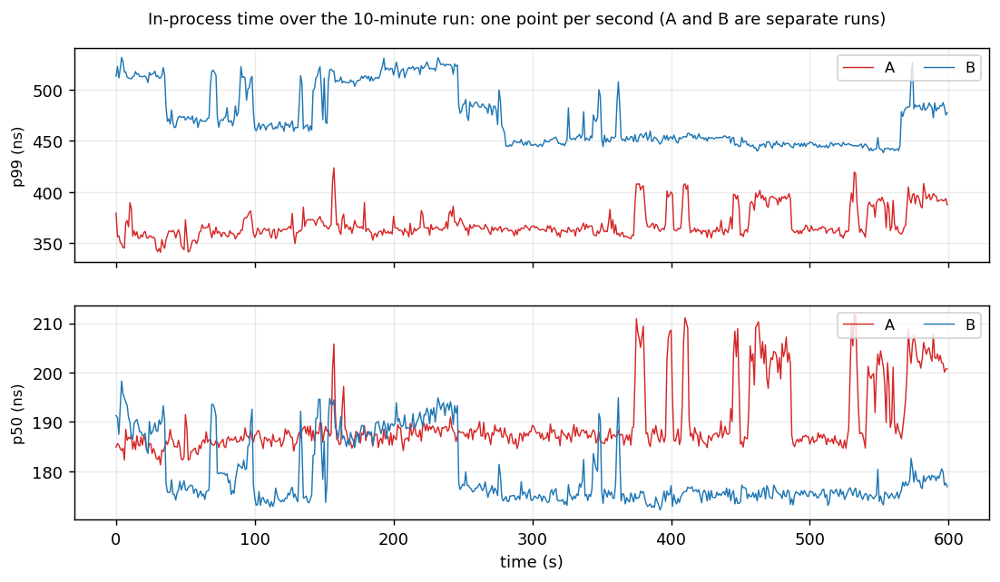
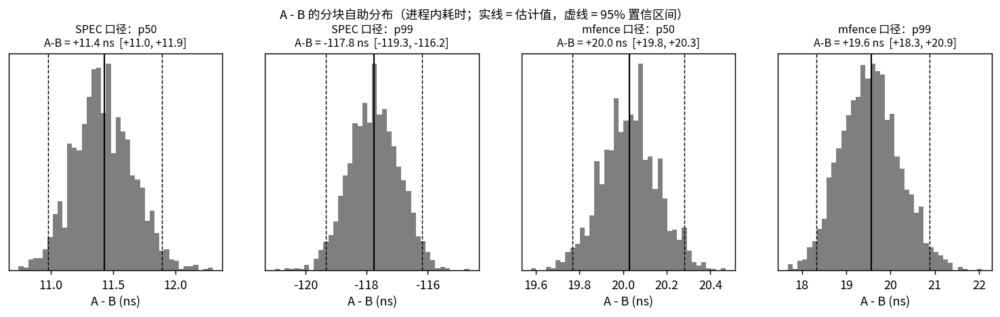
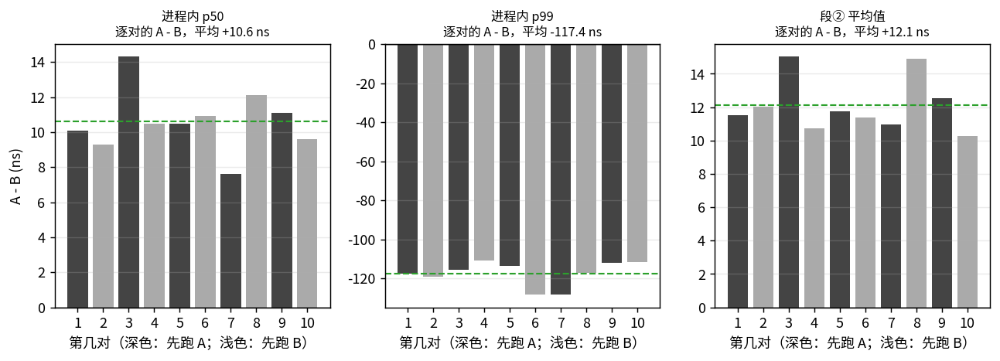
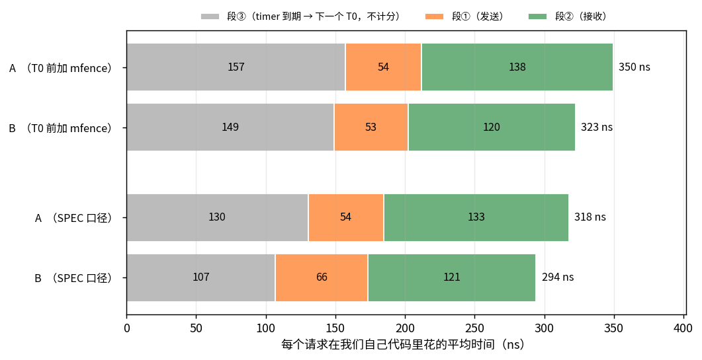
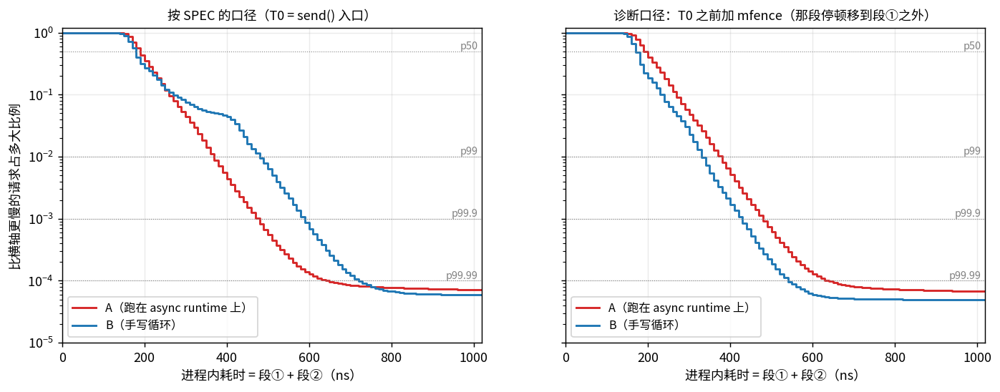
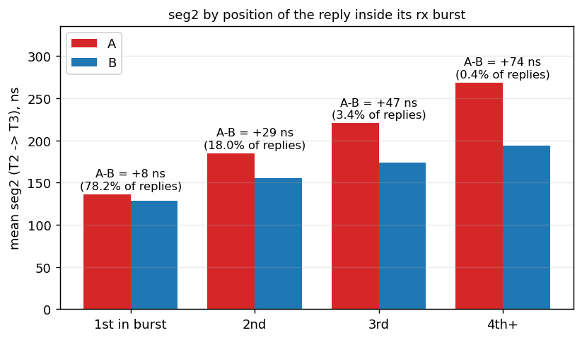

# 延迟报告

> **本报告的数据来自代码版本 v2**（git 标签 `v2`）。v2 相对 v1 只有一处纠正：`Sleep` 第一次被 poll 时不再多读一次时钟（§5.1）。
> v1 的全部数据在 `logs/v1/`，v1 的完整报告冻结在 [`docs/v1/REPORT.md`](v1/REPORT.md)，两个版本的对比见 §5.1。
>
> 所有表格由 `scripts/make_report.py` 从 `logs/` 下的 JSON 生成（`<!-- BEGIN:x -->` 与 `<!-- END:x -->` 之间），图由 `scripts/plots.py` 生成；
> 整套数据可以用 `scripts/campaign.sh` 一键重测。运行环境、代码版本、时钟质量见 §10。

## 1. 结论

1. **硬门槛全部满足。** A、B 各连续运行 10 分钟，零崩溃、**零丢包（0 超时）**、**零 mbuf 泄漏**（avail 8191 → 8191），
   本机网卡的丢弃计数与 AWS 限额计数全为 0，两条对账（请求、收包）都为 0。A 共 5598 万个样本，B 共 5826 万个。
   此外 A、B 各连续运行了 30 分钟（零泄漏；A 1.75 亿个请求零丢包，B 1.74 亿个请求里有 1 个超时，已核对不是在本机丢的），
   20 个故障注入场景 × A / B 共 40 项全部通过；测量期间还碰上一次云平台侧的瞬时事件，程序干净地扛了过去（§8）。
2. **排名指标（进程内耗时的 A − B，按 SPEC 规定的口径）：p50 = +10 ns（180 对 170），p99 = −120 ns（330 对 450）。**
   时间戳的分辨率是 10 ns（§3.1），用插值分位数看是 **p50 +11.4 ns、p99 −117.8 ns**。
   A / B 交替 10 对，逐对差值的平均是 p50 +10.6 ns（95% 区间 +9.3 ~ +11.9，10 对全部为正）、p99 −117.5 ns（−122 ~ −113，10 对全部为负）（§3.3）。
   **p50 的差值在两个代码版本、三次开机、两个日期、各个时段里都稳定（+9 ~ +20 ns）；p99 的差值不稳定**：
   6 组主考核里它在 −87 ~ −121 之间，v1 重启后有约 20 分钟它是 +52（§3.4）。
3. **p99 为负不代表 runtime 更快，而是同一段 CPU 停顿在两边被记进了不同的段**（§4）。
   发送的最后一步是往网卡寄存器写"门铃"，这次写入约 250 ~ 300 ns 才完成；CPU 不等它，后面的写入在 CPU 的写入队列里排队，队列满了才停下来。
   B 两次发送之间写入少，停在下一次发送的中途（段①，计分）；A 多了调度，停在走到 T0 之前（段③，不计分）。
   三个实验定位了它：T0 前加 `sfence` 无变化；加 `mfence` 后 B 的慢发送消失；**不加任何栅栏指令、只多做 N 次普通内存写入，N ≤ 40 无变化，N ≥ 44 效果与 `mfence` 相同**。
4. **抽象税是正的，每个请求约 25 ~ 30 ns。** 三个互相印证的数字（下面是正式数据这一组；v2 的 3 个会话里总账在 +24 ~ +31 之间，§3.4）：
   - 每请求总账（① + ② + ③ 的平均值）：A 比 B 多 **23.5 ns**（主考核）；交替 10 对是 **+26.8 ns**（95% 区间 +20 ~ +34，10 对全部为正）。
   - 把那段停顿统一移到 T0 之前再比（两边都加 `mfence`，各 5 分钟）：进程内耗时的 A − B 是**平均 +19 ns、p50 +20 ns、p99 +20 ns**，每个分位数都为正且大小相近；
     此时两边的段①相差不到 1 ns（本来就是同一个函数），差值全部在段②。
   - 按来源拆开（§5、README §1.1）：接收路径本身（`put → wake → 就绪队列 → 出队 → poll → 恢复`）约 **+10 ns**；
     同一批里排在后面的包多等，平摊到每个请求约 **+2 ns**；发送侧调度约 **+12 ns**。
5. **一次由数据引出的纠正（v1 → v2，§5.1）。** 按批内位置拆开段②之后，发现 A 处理一个包的完整周期比 B 长约 20 ns；读代码找到原因——
   登记 sleep 时多读了一次时钟（约 18 ns）。先在临时副本里实验，确认后并入。同一时段轮流跑 8 轮的结果：
   批内排队这一项 −3.1 ns（8 轮全部下降），段② p99 的 A − B 从约 +31 降到约 +18。第二天换一次开机又轮流跑了 14 轮，结果重现：
   段② p99 的 A − B 低 11.2 ns（14 轮全部更低），段② 平均低 2.9 ns。**这次纠正对每请求总账的贡献约 3 ns**
   （两天 22 轮配对：−3.7，区间 −7.9 ~ +0.4）；两组正式数据的总账差了 14 ns（37.4 对 23.5），其中大部分是会话之间的波动，不是代码的功劳（§5.1）。
   v1 的全部数据和报告都保留着。
6. **测量方法是本题的一部分。** 下面几处如果不处理，报出来的数字就是错的或者说不清的：
   - 用非序列化的 `rdtsc` 打点，段② p50 的 A − B 会被报成 +120 ns（B 读包数据的 cache miss 被乱序执行"藏掉"）→ 统一用 `rdtscp`；
   - 把运行起点取在准备工作之前，sleep 误差的最大值会多出几十微秒的启动假象 → 起点定在启动后 1 ms；
   - 时间戳分辨率只有 10 ns，两个分位数相减只能得到 10 的整数倍 → 标定并报告分辨率，另给插值分位数；
   - 一亿个样本并不独立，直接当独立样本算，置信区间会窄几十倍 → 分块自助法；单次运行看不到运行之间的波动 → 交替 10 对；
   - 段①的 p99 落在一个两段式分布的悬崖边上 → 直接报告"慢发送的占比"（§7）；
   - 只测一个时段、一次开机，会把一个会变的数当成固定的数 → 重启两次、跨两天复测，每次连续监测 1 小时（§3.4）；
   - 拿两个不同时段的会话直接相减来比较两个版本，会把会话之间的波动算成代码的差别 → 同一次开机里轮流跑、逐轮配对（§3.4、§5.1）；
   - 环境本身会变：一次云平台侧的事件之后，往返时间的下限从 52 µs 变成 36 µs，两边的段②都快了约 10 ns → 正式数据全部取自事件之后的同一个环境（§8.1）。
7. **kernel bypass 的收益（A 对 C，同一对端、同样的帧，同一环境下测）**：
   - 单路低速率：p50 **47.4 对 53 µs**，p99 **51.8 对 58 µs**，p99.99 67 对 184 µs，max 0.11 对 4.07 ms。
   - 64 路同速率：p50 **189 对 270 µs**，p99 **197 对 587 µs**，p99.99 0.26 对 1.77 ms，max 0.38 对 13.3 ms。
   - kernel bypass 换来的主要是**确定性**：本端没有中断、没有空闲态唤醒、没有调度；越往尾部差距越大。
8. **timer**：sleep 误差 p50 10 ns（一格）、p99 260 ns（上限由主循环一轮的时长决定）；段③（发现到期 → 下一个 T0）A 为 60 / 721 ns，B 为 50 / 410 ns。
9. **异常都能解释**：
   - 最大值尖刺：主循环的停顿检测显示 A、B 都是约每秒 218 次被外部打断（累计占 0.04%，最长四十多微秒），
     sleep 误差的最大值落在其中最长的一次之内 → 来自虚拟机宿主机。（事件之前的那台宿主机更吵：最长到过一百多到三百多微秒。）
   - 1 个外来 echo reply：来自公网地址 13.214.173.166（id=16509，不是我们的 session），大约每 14 分钟出现一次，属于互联网背景流量；已识别并丢弃。
   - 故障注入里出现的每一个丢包、云平台事件里的 64 个丢包和 4842 个重复回复，都有出处（§8）。

## 2. 主考核：A 与 B 各连续 10 分钟（64 session，delay 500 µs，payload 64 B）

<!-- BEGIN:main -->
### 硬门槛

| 客户端 | 实际时长 | sent | received | 超时（丢包） | 迟到 | 对账差 | mbuf avail 初值 → 终值 | AWS allowance 超限 | 退出原因 |
|---|---|---|---|---|---|---|---|---|---|
| A async-ping | 600.0 s | 55,975,622 | 55,975,622 | 0 | 0 | 0 | 8191 → 8191（泄漏 0） | 全部为 0 | 到达 --duration-sec，停止发送并等在途请求收尾 |
| B raw-ping | 600.0 s | 58,263,125 | 58,263,125 | 0 | 0 | 0 | 8191 → 8191（泄漏 0） | 全部为 0 | 到达 --duration-sec，停止发送并等在途请求收尾 |

### 收包对账与异常包

| 客户端 | 收到的包 | = 按时回复 | + 迟到 | + 对不上号 | + 外来回复 | + 无关帧 | + ARP 请求 | 差值 | 时间戳核对不符 |
|---|---|---|---|---|---|---|---|---|---|
| A | 55,975,639 | 55,975,622 | 0 | 0 | 1 | 6 | 10 | 0 | 0 |
| B | 58,263,148 | 58,263,125 | 0 | 0 | 1 | 13 | 9 | 0 | 0 |
- A：[tsc 45668930989452] foreign：来自 13.214.173.166 的 echo reply（不是对端），id=16509 seq=14618，已丢弃
- B：[tsc 47890439933522] foreign：来自 13.214.173.166 的 echo reply（不是对端），id=16509 seq=14618，已丢弃

### 主循环被外部打断（诊断）

| 客户端 | 空轮询 > 1 µs：次数 | 累计 | 最长 | 取包前 > 10 µs：次数 | 最长 | sleep 误差 max | 进程内 max |
|---|---|---|---|---|---|---|---|
| A | 130,893 | 240.0 ms | 40.7 µs | 101 | 44.9 µs | 41.7 µs | 16.0 µs |
| B | 130,400 | 252.0 ms | 44.7 µs | 89 | 23.8 µs | 42.6 µs | 15.9 µs |

### 分位数（ns）与 A − B

| 指标 | | p50 | p90 | p99 | p99.9 | p99.99 | max |
|---|---|---|---|---|---|---|---|
| **in-process ①+②** | A | 180 | 230 | 330 | 420 | 540 | 16,010 |
| | B | 170 | 250 | 450 | 561 | 660 | 15,880 |
| | A − B | +10 | -20 | -120 | -141 | -120 | +130 |
| **seg① send  T1−T0** | A | 50 | 60 | 80 | 170 | 290 | 5,620 |
| | B | 50 | 70 | 310 | 330 | 429 | 13,290 |
| | A − B | +0 | -10 | -230 | -160 | -139 | -7,670 |
| **seg② recv  T3−T2** | A | 120 | 180 | 270 | 350 | 460 | 15,850 |
| | B | 110 | 170 | 260 | 340 | 429 | 15,830 |
| | A − B | +10 | +10 | +10 | +10 | +31 | +20 |
| **end-to-end T3−T0** | A | 162,658 | 230,793 | 233,944 | 243,396 | 262,301 | 402,810 |
| | B | 160,295 | 163,446 | 240,246 | 246,547 | 252,849 | 470,640 |
| | A − B | +2,363 | +67,347 | -6,302 | -3,151 | +9,452 | -67,830 |
| **seg③ wake→next T0** | A | 60 | 320 | 721 | 1,123 | 1,320 | 41,510 |
| | B | 50 | 300 | 410 | 770 | 938 | 42,340 |
| | A − B | +10 | +20 | +311 | +353 | +382 | -830 |
| **sleep error** | A | 10 | 120 | 260 | 601 | 1,547 | 41,730 |
| | B | 10 | 110 | 260 | 561 | 1,618 | 42,630 |
| | A − B | +0 | +10 | +0 | +40 | -71 | -900 |
| **deadline→next T0 (误差+③)** | A | 70 | 441 | 809 | 1,190 | 2,049 | 42,530 |
| | B | 60 | 410 | 641 | 920 | 1,926 | 42,800 |
| | A − B | +10 | +31 | +168 | +270 | +123 | -270 |

### 段① 按「距上一次发送多久」分档（ns，诊断）

| 距上次发送 | A 样本占比 | A p50 | A p99 | B 样本占比 | B p50 | B p99 |
|---|---|---|---|---|---|---|
| 距上次发送<100ns | 0.0% | 70 | 70 | 5.2% | 300 | 330 |
| 100–250ns | 0.0% | 60 | 80 | 0.0% | 200 | 250 |
| 250–500ns | 26.0% | 50 | 150 | 21.4% | 50 | 70 |
| 500ns–2µs | 54.1% | 50 | 70 | 52.8% | 50 | 70 |
| ≥2µs | 19.9% | 50 | 70 | 20.6% | 50 | 70 |

### rx_burst 包数分布（非空 burst）

- A：1: 78.51%  2: 18.03%  3: 3.13%  4: 0.33%
- B：1: 78.07%  2: 18.06%  3: 3.42%  4: 0.46%
<!-- END:main -->

## 3. 这些数字有多可信

一个分位数只是一个点。要回答"它有多可信"，需要四样东西：尺子的精度（§3.1）、一次运行内部的抽样误差（§3.2）、不同运行之间的波动（§3.3）、
换一次开机、换一个时段之后还成不成立（§3.4）。

### 3.1 尺子：时间戳的分辨率是 10 ns

程序启动时会标定时钟（结果在每份 JSON 的 `env` 字段里）：这台机器的 TSC 读数不是每个周期加 1，而是**每 10 ns 跳一步**（一步 26 个周期）。
所以任何一个时间差都只能是 10 ns 的整数倍，§2 的分位数也都落在 10 ns 的格点上（偶尔出现的 561、429 这类数是直方图桶的中点，对应格点 560、430）。

这带来两个后果：

1. **单个时间差有 ±10 ns 的量化误差，但平均值没有偏差**：一个真实长度为 16 ns 的间隔，会被量成 10 ns 或 20 ns，取哪个看起止时刻落在格子的什么位置，平均起来仍是 16 ns。
   程序标定出的"读一次时钟"的成本就是这样得到的（约 18 ns；单次读数只能是 10 或 20）。
2. **两个分位数相减，结果只能是 10 ns 的整数倍**。§2 里"进程内 p50 的 A − B = +10 ns"的准确读法是"差了一格"，真实差值可能是几纳秒到十几纳秒。

为了看清一格以内的差别，下面的置信区间用的是**插值分位数**：把落在同一格的样本看成均匀分布在这一格内（格点 ± 5 ns），再在格内线性插值。
这是处理分组数据的标准做法；A 和 B 用的是同一把尺子，相减是公平的。`pingkit` 里有一个单元测试用模拟数据验证了它：
两个只差 2 ns 的分布，格点分位数分不出来，插值分位数能还原到 1 ns 以内；紧贴分布硬边界的地方误差可到半格（5 ns）。
程序把插值分位数也写进了 JSON（`p50_interp` 等），与离线脚本独立算出的结果一致（相差不超过 0.05 ns）。

### 3.2 一次运行内部：分块自助法的 95% 置信区间

主考核运行时加了 `--samples`，把每个样本的段①、段②和 T2 原样存了下来（缓冲区在启动时一次分配好，运行中不分配；写文件发生在关停之后）。
`scripts/ci.py` 用这些原始样本算置信区间，要点有两个：

- **先分别求 A、B 的分位数，再相减。** A 和 B 是两次独立的运行，样本之间没有一一对应关系。
- **以"时间块"为单位重抽，而不是以单个样本为单位。** 样本并不独立：同一批到达的回复、同一次被宿主机打断、对端的往返时间换了一档，
  都会连续影响成千上万个样本。把时间轴切成 20 秒一块，以块为单位有放回地重抽，块内的相关性原样保留。

<!-- BEGIN:ci -->
样本：A 55,975,622 个，B 58,263,125 个（与主考核是同一次运行）；时间块 20 秒，重抽 2000 次；时间戳分辨率 10 ns。单位 ns。

| 指标 | 统计量 | A | B | A − B（格点） | **A − B（插值）** | 95% 置信区间 | A 更慢的把握 |
|---|---|---|---|---|---|---|---|
| **进程内 ① + ②** | 平均 | 187.1 | 187.1 | — | **-0.0** | [-0.5, +0.4] | 43% |
| | p50 | 177.0 | 165.6 | +10 | **+11.4** | [+11.0, +11.9] | 100% |
| | p90 | 233.5 | 246.0 | -20 | **-12.5** | [-14.2, -11.0] | 0% |
| | p99 | 332.8 | 450.5 | -120 | **-117.8** | [-119.3, -116.2] | 0% |
| | p99.9 | 416.9 | 557.4 | -140 | **-140.5** | [-143.0, -138.1] | 0% |
| | p99.99 | 535.8 | 663.5 | -120 | **-127.7** | [-131.6, -123.6] | 0% |
| **段①（发送）** | 平均 | 54.4 | 66.2 | — | **-11.7** | [-12.0, -11.4] | 0% |
| | p50 | 52.2 | 51.9 | +0 | **+0.3** | [+0.3, +0.3] | 100% |
| | p90 | 63.5 | 65.2 | -10 | **-1.7** | [-2.0, -1.5] | 0% |
| | p99 | 77.9 | 314.0 | -230 | **-236.1** | [-238.3, -233.9] | 0% |
| | p99.9 | 174.1 | 329.4 | -160 | **-155.3** | [-156.9, -153.7] | 0% |
| | p99.99 | 288.7 | 427.0 | -140 | **-138.3** | [-140.6, -136.0] | 0% |
| **段②（接收）** | 平均 | 132.7 | 121.0 | — | **+11.7** | [+11.4, +12.1] | 100% |
| | p50 | 122.6 | 111.6 | +10 | **+11.0** | [+10.7, +11.3] | 100% |
| | p90 | 177.4 | 167.6 | +10 | **+9.9** | [+9.3, +10.3] | 100% |
| | p99 | 274.7 | 260.4 | +10 | **+14.3** | [+13.6, +15.0] | 100% |
| | p99.9 | 350.5 | 335.1 | +10 | **+15.4** | [+13.6, +17.1] | 100% |
| | p99.99 | 458.3 | 434.4 | +30 | **+23.9** | [+20.5, +26.9] | 100% |

**样本并不独立，块长的选择很重要。** 同样的数据，用不同的方式重抽，A − B 的 95% 区间如下：

| 重抽方式 | 进程内平均 A − B | 进程内 p50 A − B | 进程内 p99 A − B |
|---|---|---|---|
| 假装 1.14 亿个样本相互独立 | [-0.1, -0.0] | [+11.4, +11.4] | [-117.9, -117.6] |
| 按 0.1 秒分块（6001 块） | [-0.1, +0.1] | [+11.4, +11.5] | [-118.1, -117.4] |
| 按 1 秒分块（601 块） | [-0.2, +0.2] | [+11.3, +11.6] | [-118.5, -117.0] |
| 按 5 秒分块（121 块） | [-0.4, +0.3] | [+11.2, +11.7] | [-119.0, -116.5] |
| **按 20 秒分块（31 块）** | [-0.5, +0.4] | [+11.0, +11.9] | [-119.4, -116.1] |
| 按 60 秒分块（11 块） | [-0.7, +0.7] | [+10.7, +12.2] | [-119.9, -115.1] |

区间随块长增大而变宽：相关性不只存在于相邻的样本之间，还存在于几秒到几十秒的尺度上（对端的往返时间会换档，见下面的每秒序列）。块太短会把这部分相关性切断、把区间算窄，所以上表采用 20 秒的块；按这个块长，区间比"假装独立"宽 11 ~ 49 倍。块再长（60 秒，只剩 10 块）区间还会略宽，但块数太少时重抽本身就不可靠。所以**单次运行的区间应当看作不确定度的下限**；不同运行之间的波动见 §3.3。

**段① 的 p99 为什么不稳定。** 段① ≥ 130 ns 的样本占比：A 0.81%（95% 区间 0.76% ~ 0.86%），B 5.45%（5.33% ~ 5.57%）。

**10 分钟内的变化范围。** 把每一秒单独算一次（进程内耗时，ns）：

| | 每秒 p50：最小 / 中位 / 最大 | 每秒 p99：最小 / 中位 / 最大 | 每秒平均：最小 / 中位 / 最大 |
|---|---|---|---|
| A | 174.2 / 176.7 / 182.0 | 322.4 / 332.5 / 356.9 | 183.0 / 187.1 / 191.3 |
| B | 163.0 / 165.5 / 170.6 | 422.7 / 450.8 / 493.6 | 177.7 / 187.1 / 203.2 |
<!-- END:ci -->



上图：把 10 分钟切成 600 个 1 秒，每一秒单独算 p50 和 p99（A 和 B 是先后两次运行，横轴只是各自的运行时间）。
这一次的曲线很平：只有几纳秒的起伏和一两处小台阶。这是 §8.1 那次事件之后的环境；事件之前（v1 的同一张图，`docs/v1/img/timeseries.png`）
曲线上有持续几秒到几十秒、幅度几十纳秒的台阶——对端的往返时间在两档之间来回切换。**环境平稳的时候区间就窄，不平稳的时候就宽**，
所以单次运行的区间只说明"那一次"有多确定，不能替代多跑几轮。



上图：把"重抽 → 求分位数 → 相减"重复 2000 次得到的 A − B 的分布。整个分布离 0 越远，"A 与 B 有差别"这个结论越可靠。

### 3.3 不同运行之间：A / B 交替 10 对

§3.2 的区间只反映**一次运行内部**的抽样误差。不同的运行之间还有别的东西在变——最主要的是对端的状态：
对端网卡驱动的自适应中断合并让往返时间在 100 ~ 250 µs 之间换档，回复"扎堆"到达的程度也跟着变，这会影响两边的尾部分位数。
这部分波动只能靠多跑几轮来看。做法：A、B 交替各跑 10 轮（奇数对先 A 后 B，偶数对先 B 后 A，抵消顺序和时间漂移的影响），对"逐对的差值"做统计。

<!-- BEGIN:ab -->
**10 对 × 60 秒**（`logs/ab-20261001-165521`；奇数对先 A 后 B，偶数对先 B 后 A；全部 20 轮都是 0 丢包、0 泄漏）

逐对结果（ns；分位数为插值分位数，括号里是程序直接打印的格点值）：

| 对 | 顺序 | 进程内 p50：A / B | A − B | 进程内 p99：A / B | A − B | 进程内平均 A − B | 段① ≥ 125 ns 占比：A / B | 往返 p50：A / B（µs） |
|---|---|---|---|---|---|---|---|---|
| 1 | A → B | 175.8（180）/ 165.7（170） | +10.1 | 332.3（330）/ 449.8（450） | -117.5 | -0.7 | 0.55% / 5.32% | 160 / 160 |
| 2 | B → A | 176.9（180）/ 167.6（170） | +9.3 | 334.9（330）/ 453.9（450） | -119.0 | -9.2 | 0.67% / 11.67% | 229 / 159 |
| 3 | A → B | 178.4（180）/ 164.1（160） | +14.3 | 331.1（330）/ 446.7（450） | -115.6 | +2.8 | 0.35% / 5.65% | 160 / 160 |
| 4 | B → A | 175.6（180）/ 165.1（170） | +10.5 | 331.4（330）/ 442.4（441） | -111.0 | +0.5 | 0.57% / 4.70% | 160 / 160 |
| 5 | A → B | 175.1（180）/ 164.6（160） | +10.5 | 331.0（330）/ 444.7（441） | -113.7 | -0.0 | 0.54% / 5.38% | 160 / 160 |
| 6 | B → A | 176.3（180）/ 165.4（170） | +10.9 | 330.2（330）/ 458.5（460） | -128.3 | -2.8 | 0.45% / 6.40% | 160 / 160 |
| 7 | A → B | 175.4（180）/ 167.8（170） | +7.6 | 331.5（330）/ 459.9（460） | -128.4 | -13.4 | 0.42% / 13.00% | 160 / 160 |
| 8 | B → A | 176.6（180）/ 164.5（160） | +12.1 | 333.7（330）/ 450.7（450） | -117.0 | +1.1 | 0.48% / 6.09% | 160 / 160 |
| 9 | A → B | 175.9（180）/ 164.8（160） | +11.1 | 333.1（330）/ 445.3（450） | -112.2 | +0.5 | 0.48% / 5.55% | 160 / 160 |
| 10 | B → A | 174.4（170）/ 164.8（160） | +9.6 | 329.2（330）/ 441.0（441） | -111.8 | +0.1 | 0.51% / 4.67% | 160 / 160 |

对 10 个逐对差值（A − B，ns）做统计：

| 指标 | 平均 | 95% 置信区间 | 最小 | 最大 | A − B > 0 的对数 | 先 A 后 B 的对：平均 | 先 B 后 A 的对：平均 |
|---|---|---|---|---|---|---|---|
| 进程内 p50 | **+10.6** | [+9.3, +11.9] | +7.6 | +14.3 | 10 / 10 | +10.7 | +10.5 |
| 进程内 p99 | **-117.5** | [-122.0, -112.9] | -128.4 | -111.0 | 0 / 10 | -117.5 | -117.4 |
| 进程内平均 | **-2.1** | [-5.8, +1.5] | -13.4 | +2.8 | 5 / 10 | -2.2 | -2.1 |
| 段② p50 | **+10.8** | [+10.1, +11.5] | +9.5 | +12.9 | 10 / 10 | +11.0 | +10.5 |
| 段② p99 | **+15.3** | [+13.7, +16.9] | +12.3 | +19.7 | 10 / 10 | +15.4 | +15.3 |
| 段② 平均 | **+12.1** | [+10.9, +13.3] | +10.2 | +15.0 | 10 / 10 | +12.4 | +11.9 |
| 段① 平均 | **-14.2** | [-17.6, -10.8] | -24.3 | -10.2 | 0 / 10 | -14.5 | -13.9 |
| ① + ② + ③ 平均 | **+26.8** | [+20.2, +33.5] | +11.1 | +43.6 | 10 / 10 | +25.8 | +27.9 |

段① ≥ 125 ns 的占比在各轮之间的范围：A 0.35% ~ 0.67%，B 4.67% ~ 13.00%。A 的段① p99 各轮为 70 / 70 / 70 / 70 / 70 / 70 / 70 / 70 / 70 / 70 ns：占比低于 1% 时读数是 70 ~ 80 ns，一旦高于 1% 就跳到 130 ns 以上。
<!-- END:ab -->



- **方向是稳定的**：p50 的差值 10 对全部为正，p99 的差值 10 对全部为负，段②的差值与每请求总账 10 对全部为正。
- **顺序没有影响**：先跑 A 的对与先跑 B 的对，差值的平均数几乎相同（表的最后两列）。
- **排名口径的平均值（① + ② 的平均）差值在 0 附近**（−2.1，区间 −5.8 ~ +1.5）：B 段①里的那段停顿与 A 段②里的税，在平均值上几乎相互抵消（§4）。
  这正是只看排名口径会低估抽象税的原因；把段③也算上的总账是 +26.8 ns。
- **这里的区间与 §3.2 接近**，是因为这一次环境很平稳。v1 的同一项测量里，交替 10 对的区间明显比单次运行的宽（`docs/v1/REPORT.md` §3.3）。
- **导出原始样本没有干扰测量**：这 20 轮没有开 `--samples`，A / B 进程内平均值的中位数是 186 / 186 ns；开了导出的主考核是 187.1 / 187.1 ns。

### 3.4 换一次开机、换一个时段、换一个版本

§3.2、§3.3 回答的是"这一次"有多确定。还要问：换一次开机、换一天、换一个时段，结论还成不成立？到目前为止一共有 6 组"主考核 + 交替多对"的数据，
跨两个代码版本、三次开机、两个日期、一次云平台侧的环境变化（由 `scripts/campaign.sh`、`scripts/session.sh`、`scripts/day.sh` 产生，互不覆盖）：

<!-- BEGIN:sessions -->
| 会话 | 代码版本 | 这次开机的时间 | 测量开始（UTC） | 进程内 p50：A / B | 主考核 A − B：p50 [95% 区间] | p99 [95% 区间] | 每请求总账 | 交替多对的逐对差值：p50 | p99 | 每请求总账 | 对数 | 丢包 / 泄漏（全部轮次合计） |
|---|---|---|---|---|---|---|---|---|---|---|---|---|
| **正式数据** | v1 | 2026-09-30 10:34:16 | 2026-10-01 08:12 | 189.8 / 178.8 | **+11.0** [+8.8, +13.4] | **-112.6** [-125.1, -99.3] | **+37.4** | **+13.5** [+10.1, +16.9] | **-107.2** [-117.2, -97.1] | **+39.5** [+31.9, +47.1] | 10 对 | 0 / 0 |
| **reboot1** | v1 | 2026-10-01 11:43:39 | 2026-10-01 11:44 | 190.2 / 176.2 | **+14.0** [+13.7, +14.4] | **-102.3** [-104.7, -100.0] | **+33.2** | **+19.5** [+16.2, +22.7] | **+51.6** [+18.0, +85.2] | **+38.4** [+32.5, +44.3] | 10 对 | 0 / 0 |
| **v2（网络事件之前）** | v2 | 2026-10-01 11:43:39 | 2026-10-01 14:12 | 186.7 / 177.6 | **+9.1** [+8.8, +9.4] | **-120.9** [-123.9, -117.3] | **+24.6** | **+9.9** [+6.3, +13.5] | **-127.9** [-139.2, -116.5] | **+30.7** [+24.5, +37.0] | 10 对 | 64 / 0 |
| **正式数据** | v2 | 2026-10-01 11:43:39 | 2026-10-01 16:35 | 177.0 / 165.6 | **+11.4** [+11.0, +11.9] | **-117.8** [-119.3, -116.2] | **+23.5** | **+10.6** [+9.3, +11.9] | **-117.5** [-122.0, -112.9] | **+26.8** [+20.2, +33.5] | 10 对 | 0 / 0 |
| **day2-v1** | v1 | 2026-10-02 00:09:18 | 2026-10-02 00:15 | 179.6 / 167.6 | **+12.0** [+10.5, +13.2] | **-93.7** [-95.5, -91.4] | **+33.9** | **+11.6** [+10.7, +12.4] | **-96.5** [-102.8, -90.1] | **+29.4** [+25.3, +33.5] | 14 对 | 0 / 0 |
| **day2-v2** | v2 | 2026-10-02 00:09:18 | 2026-10-02 02:18 | 195.2 / 183.5 | **+11.7** [+11.4, +12.0] | **-86.9** [-89.1, -84.9] | **+30.9** | **+10.2** [+8.9, +11.4] | **-107.1** [-113.6, -100.5] | **+26.0** [+22.3, +29.7] | 14 对 | 0 / 0 |
共 6 个会话，分属 3 次不同的开机（由内核的 boot_id 区分），代码版本 v1 / v2（v1、v2 的区别只有一处：v2 的 `Sleep` 第一次被 poll 时不再读时钟，见 §5）。

各会话主考核那一对的抽象税拆分（每请求的 A − B，ns；三项的含义见 §5）：

| 会话 | 代码版本 | ① 接收路径本身 | ② 批内排队 | ③ 发送侧调度 | 每请求总账 | 进程内 p50 的 A − B | 进程内 p99 的 A − B |
|---|---|---|---|---|---|---|---|
| 正式数据 | v1 | +7.5 | +5.5 | +23.8 | **+37.4** | +11.0 | -112.6 |
| reboot1 | v1 | +11.7 | +5.7 | +15.8 | **+33.2** | +14.0 | -102.3 |
| v2（网络事件之前） | v2 | +9.9 | +2.3 | +12.6 | **+24.6** | +9.1 | -120.9 |
| 正式数据 | v2 | +9.8 | +2.2 | +11.8 | **+23.5** | +11.4 | -117.8 |
| day2-v1 | v1 | +7.8 | +5.9 | +20.2 | **+33.9** | +12.0 | -93.7 |
| day2-v2 | v2 | +11.6 | +2.5 | +16.7 | **+30.9** | +11.7 | -86.9 |

同一个版本的各个会话之间差多少（最小 ~ 最大；括号里是平均值）：

| 代码版本 | 会话数 | ① 接收路径本身 | ② 批内排队 | ③ 发送侧调度 | 每请求总账 | 进程内 p50 的 A − B |
|---|---|---|---|---|---|---|
| v1 | 3 | +7.5 ~ +11.7（+9.0） | +5.5 ~ +5.9（+5.7） | +15.8 ~ +23.8（+19.9） | +33.2 ~ +37.4（+34.9） | +11.0 ~ +14.0（+12.3） |
| v2 | 3 | +9.8 ~ +11.6（+10.4） | +2.2 ~ +2.5（+2.3） | +11.8 ~ +16.7（+13.7） | +23.5 ~ +30.9（+26.3） | +9.1 ~ +11.7（+10.7） |
<!-- END:sessions -->

**六组数据放在一起看：**

- **p50 的 A − B 始终为正**：主考核 +9 ~ +14，交替多对 +10 ~ +20。
- **每请求总账始终为正**：v1 +29 ~ +40，v2 +24 ~ +31。
- **主考核的 p99 差值都在 −87 ~ −121**，但 v1 重启后那一组的交替 10 对是 **+52**——符号翻了。下面专门说这一组。
- **绝对值会漂，差值不跟着漂**：第二天同一次开机里，前后相隔两小时的两组主考核，A / B 的 p50 从 179.6 / 167.6 变成 195.2 / 183.5（两边都慢了约 16 ns），
  差值是 +12.0 和 +11.7。
- **三项税里，谁稳谁不稳**（上面第二、三张表）：
  - 批内排队最稳：v1 的三个会话是 +5.5 ~ +5.9，v2 的三个会话是 +2.2 ~ +2.5。它只由代码决定，换开机、换日期都不动。
  - 接收路径本身在 +7.5 ~ +11.7 之间，与版本无关（这段代码两个版本相同），波动幅度约为时钟的半格。
  - **发送侧调度最不稳**：+11.8 ~ +23.8，同一版本的会话之间能差 5 ~ 8 ns。每请求总账的波动几乎全部来自它。

**跨会话的波动有多大。** 单次运行的 95% 区间（§3.2）给 p50 的差值是 ±0.3 ~ ±2.3 ns，而 6 个会话的 p50 差值分布在 +9.1 ~ +14.0（标准差约 1.6 ns）；
每请求总账在同一版本的会话之间能差 4 ~ 7 ns。也就是说，**单次运行的区间只描述"那一次"，会话之间的波动比它大几倍**。
这 6 个会话之间不只差一次开机，还差着日期、时段和一次环境变化，所以这里给的是"实际见到的范围"，不是严格意义上的"开机之间的方差"。
要比较两个版本，应当用同一次开机里轮流跑的配对数据（下面"第二天"一节与 §5.1），不能拿两个会话直接相减。

#### v1 重启后的那 20 分钟

v1 重启后的会话（`logs/v1/sessions/reboot1/`）里，10 分钟主考核几乎原样复现了重启前的结果，但 20 分钟后的交替 10 对里 p99 的差值翻成了正的。
为了弄清发生了什么，接着用 `scripts/drift.sh` 让 A、B 每 20 秒交替一次连续跑了 1 小时（89 对），把那次开机之后的 200 次运行放到一条时间轴上：

<!-- BEGIN:drift -->
会话 `reboot1`（代码版本 v1，开机时间 2026-10-01 11:43:39 UTC）共 200 次运行，按开始时刻距开机多久分窗，每个窗口取各次运行的中位数（ns）：

| 距开机 | 运行次数 A / B | A 段② p99 | B 段② p99 | A 段① ≥ 125 ns 占比 | A 段③ 平均 | 进程内 p50：A − B | 进程内 p99：A − B | 每请求总账：A − B | 丢包 / 泄漏 |
|---|---|---|---|---|---|---|---|---|---|
| 0 ~ 10 分钟 | 1 / 0 | 312 | — | 0.91% | 138 | — | — | — | 0 / 0 |
| 10 ~ 20 分钟 | 0 / 1 | — | 280 | — | — | — | — | — | 0 / 0 |
| 20 ~ 30 分钟 | 5 / 4 | 481 | 278 | 2.11% | 121 | +18.6 | **+60** | **+36.1** | 0 / 0 |
| 30 ~ 40 分钟 | 4 / 6 | 463 | 278 | 3.46% | 124 | +21.8 | **+53** | **+40.7** | 0 / 0 |
| 40 ~ 50 分钟 | 1 / 0 | 472 | — | 2.60% | 123 | — | — | — | 0 / 0 |
| 50 ~ 60 分钟 | 10 / 10 | 342 | 277 | 1.06% | 132 | +13.3 | **-66** | **+38.7** | 0 / 0 |
| 60 ~ 70 分钟 | 15 / 14 | 343 | 277 | 1.20% | 133 | +12.4 | **-69** | **+33.8** | 0 / 0 |
| 70 ~ 80 分钟 | 15 / 15 | 355 | 278 | 1.27% | 134 | +14.0 | **-57** | **+36.2** | 0 / 0 |
| 80 ~ 90 分钟 | 15 / 15 | 342 | 278 | 1.44% | 134 | +11.2 | **-78** | **+32.4** | 0 / 0 |
| 90 ~ 100 分钟 | 14 / 15 | 346 | 278 | 1.64% | 135 | +12.8 | **-67** | **+37.8** | 0 / 0 |
| 100 ~ 110 分钟 | 15 / 15 | 345 | 279 | 1.37% | 133 | +13.5 | **-66** | **+29.1** | 0 / 0 |
| 110 ~ 120 分钟 | 5 / 5 | 345 | 281 | 1.40% | 130 | +13.1 | **-72** | **+31.0** | 0 / 0 |

会话 `day2-v1`（代码版本 v1，开机时间 2026-10-02 00:09:18 UTC）共 150 次运行，按开始时刻距开机多久分窗，每个窗口取各次运行的中位数（ns）：

| 距开机 | 运行次数 A / B | A 段② p99 | B 段② p99 | A 段① ≥ 125 ns 占比 | A 段③ 平均 | 进程内 p50：A − B | 进程内 p99：A − B | 每请求总账：A − B | 丢包 / 泄漏 |
|---|---|---|---|---|---|---|---|---|---|
| 0 ~ 10 分钟 | 1 / 0 | 287 | — | 4.15% | 134 | — | — | — | 0 / 0 |
| 10 ~ 20 分钟 | 0 / 1 | — | 262 | — | — | — | — | — | 0 / 0 |
| 20 ~ 30 分钟 | 1 / 1 | 306 | 278 | 0.58% | 130 | +9.5 | **-110** | **+21.0** | 0 / 0 |
| 30 ~ 40 分钟 | 3 / 4 | 306 | 281 | 0.53% | 129 | +10.8 | **-105** | **+25.1** | 0 / 0 |
| 40 ~ 50 分钟 | 4 / 3 | 309 | 284 | 0.43% | 127 | +10.8 | **-104** | **+29.3** | 0 / 0 |
| 50 ~ 60 分钟 | 3 / 4 | 335 | 304 | 0.57% | 132 | +13.2 | **-81** | **+35.3** | 0 / 0 |
| 60 ~ 70 分钟 | 4 / 4 | 327 | 301 | 0.56% | 132 | +12.6 | **-87** | **+33.2** | 0 / 0 |
| 70 ~ 80 分钟 | 11 / 10 | 325 | 300 | 0.56% | 128 | +12.6 | **-90** | **+28.0** | 0 / 0 |
| 80 ~ 90 分钟 | 10 / 9 | 325 | 300 | 0.52% | 127 | +12.0 | **-93** | **+26.5** | 0 / 0 |
| 90 ~ 100 分钟 | 9 / 10 | 318 | 296 | 0.53% | 131 | +11.5 | **-98** | **+33.2** | 0 / 0 |
| 100 ~ 110 分钟 | 10 / 11 | 314 | 286 | 0.60% | 132 | +11.4 | **-97** | **+30.7** | 0 / 0 |
| 110 ~ 120 分钟 | 10 / 9 | 331 | 308 | 0.59% | 128 | +10.7 | **-92** | **+30.5** | 0 / 0 |
| 120 ~ 130 分钟 | 9 / 9 | 329 | 305 | 0.63% | 131 | +11.0 | **-93** | **+34.0** | 0 / 0 |

会话 `day2-v2`（代码版本 v2，开机时间 2026-10-02 00:09:18 UTC）共 150 次运行，按开始时刻距开机多久分窗，每个窗口取各次运行的中位数（ns）：

| 距开机 | 运行次数 A / B | A 段② p99 | B 段② p99 | A 段① ≥ 125 ns 占比 | A 段③ 平均 | 进程内 p50：A − B | 进程内 p99：A − B | 每请求总账：A − B | 丢包 / 泄漏 |
|---|---|---|---|---|---|---|---|---|---|
| 20 ~ 30 分钟 | 2 / 1 | 292 | 278 | 0.61% | 131 | +8.7 | **-124** | **+19.7** | 0 / 0 |
| 30 ~ 40 分钟 | 3 / 4 | 298 | 281 | 0.72% | 131 | +10.3 | **-114** | **+26.0** | 0 / 0 |
| 40 ~ 50 分钟 | 3 / 3 | 299 | 284 | 0.53% | 130 | +9.5 | **-113** | **+30.6** | 0 / 0 |
| 50 ~ 60 分钟 | 3 / 4 | 317 | 304 | 0.67% | 133 | +9.7 | **-98** | **+30.7** | 0 / 0 |
| 60 ~ 70 分钟 | 5 / 4 | 319 | 301 | 0.60% | 131 | +10.6 | **-94** | **+27.4** | 0 / 0 |
| 70 ~ 80 分钟 | 9 / 10 | 316 | 300 | 0.82% | 127 | +10.4 | **-96** | **+29.7** | 0 / 0 |
| 80 ~ 90 分钟 | 10 / 9 | 316 | 300 | 0.72% | 131 | +10.4 | **-100** | **+28.1** | 0 / 0 |
| 90 ~ 100 分钟 | 11 / 10 | 312 | 296 | 0.70% | 130 | +10.1 | **-102** | **+30.7** | 0 / 0 |
| 100 ~ 110 分钟 | 9 / 11 | 304 | 286 | 0.66% | 128 | +9.7 | **-105** | **+25.7** | 0 / 0 |
| 110 ~ 120 分钟 | 10 / 9 | 322 | 308 | 0.81% | 131 | +8.9 | **-99** | **+28.8** | 0 / 0 |
| 120 ~ 130 分钟 | 10 / 9 | 319 | 305 | 0.70% | 130 | +9.2 | **-103** | **+28.5** | 0 / 0 |
| 130 ~ 140 分钟 | 0 / 1 | — | 291 | — | — | — | — | — | 0 / 0 |
<!-- END:drift -->


上图：每个点是一次运行，横轴是距开机多少分钟。上：段② 的 p99；中：进程内耗时的 p99；下：三段平均值之和。

**看到了什么**

- 开机后 20 ~ 40 分钟的那段时间里，**A 的尾部变重了**：段② p99 从 310 变成 410 ~ 540，段① ≥ 125 ns 的占比从不到 1% 变成 2% ~ 5%；
  进程内 p99 因此从 370 升到 480 ~ 610，越过了 B（上图中间一栏，红点跑到了蓝点上面）。那 10 轮 A 无一例外。
- **同一时段穿插着跑的 B 纹丝不动**：段② p99 一直是 278 ~ 290，间隔足够的发送 p99 仍是 70 ~ 80。
- **A 的三段总和没有变**（上图最下一栏）：段①、段②多出来的时间，正好等于段③少掉的时间。所以每请求总账的 A − B 在整条时间轴上都稳定在 +29 ~ +41 ns。
- 之后的一小时里这个状态没有再出现（89 轮 A 的段② p99 全部在 318 ~ 384）。

**排除了什么**

| 怀疑 | 结论 | 依据 |
|---|---|---|
| 代码不同 | 不是 | 与重启前是同一份代码 |
| 是否导出原始样本 | 不是 | 带和不带 `--samples` 的 A 交替测，没有差别；重启前也一样 |
| 本机别的核在忙 | 不是 | 系统的 CPU 记录（sar）：那 20 分钟里核 0 ~ 2 的占用只有 0.3% |
| 网卡或发送函数整体变慢 | 不是 | B 调用的是同一个发送函数，同一时段不受影响 |
| 被宿主机打断得更多 | 不是 | 停顿检测：A、B 都是每秒 213 ~ 219 次，与平时相同 |
| 刚跑完分析脚本（大量内存活动）留下的状态 | 不充分 | 故意先跑一遍分析脚本再立刻测 A，只有轻微升高（段② p99 350），没有回到 450 以上 |

**能确定的和不能确定的**

- 能确定：这是 A 独有的、随时间变化的状态；它**不增加总耗时，只是把时间从段③挪到了段①和段②**。
  这与 §4 的"p99 为负"是同一类现象——时间在三段之间挪动——所以按平均值算的总账不受影响，而只看其中两段的排名指标会被它左右，尾部分位数尤其明显。
- 不能确定：它的触发条件。没能按需复现，机制没有查明。它也未必是重启造成的：重启前见过它较轻的形态（某些运行里 A 的慢发送占比到过 3.8%），
  当时归结为"p99 落在悬崖边上"（§7）。
- 到目前为止它只在 v1 上被观察到，但**不能据此说 v2 消除了它**：第二天换了一次开机，把 v1 和 v2 放在一起轮流跑了两个多小时，
  v1 自己也没有再出现这个状态（见下一小节）。它不随"重启"必然出现，也没有证据表明它与代码版本有关。
  `scripts/drift.sh` 和 `scripts/day.sh` 会在这种状态出现时自动补测一组 `mfence` 口径，至今没有被触发过。

#### 第二天：换一次开机，两个版本在同一条时间轴上轮流跑

前面的比较有两个缺口：所有数据都是同一天测的；v1 和 v2 没有在同一次开机里长时间同场比较过（"尾部变重"只在 v1 上见过，但 v2 没有在同样的条件下跑过）。
第二天（2026-10-02）重启之后用 `scripts/day.sh` 一次补上：v1 的主考核一对 → v1 的 A、v2 的 A、B 三者轮流各 60 秒 × 14 轮 →
三者轮流各 20 秒连续 1 小时 → v2 的主考核一对。v1 的可执行文件由 `scripts/build-version.sh v1` 从标签 `v1` 在仓库之外构建，B 的代码两个版本相同。

<!-- BEGIN:day -->
**会话 `day2`**（开机时间 2026-10-02 00:09:18 UTC；共 226 次运行，丢包合计 0，泄漏合计 0）。A1 = v1 的 A，A2 = v2 的 A；B 的代码在两个版本里相同。

三者轮流各 60 秒，共 14 轮（开机后 28 ~ 66 分钟）。逐轮配对后的平均值与 95% 区间（ns）：

| 指标 | v1：A1 − B | v2：A2 − B | **v2 − v1（A2 − A1）** | v2 更低的轮数 |
|---|---|---|---|---|
| 进程内 p50 | +11.6 [+10.7, +12.4] | +10.2 [+8.9, +11.4] | **-1.4 [-2.6, -0.2]** | 11 / 14 |
| 进程内 p99 | -96.5 [-102.8, -90.1] | -107.1 [-113.6, -100.5] | **-10.6 [-14.2, -7.0]** | 14 / 14 |
| 段② 平均 | +15.6 [+15.0, +16.1] | +12.7 [+11.7, +13.7] | **-2.9 [-4.0, -1.8]** | 13 / 14 |
| 段② p99 | +27.0 [+24.5, +29.4] | +15.7 [+12.8, +18.7] | **-11.2 [-14.9, -7.5]** | 14 / 14 |
| ① + ③ 平均（发送侧） | +13.8 [+9.9, +17.8] | +13.3 [+9.6, +17.1] | **-0.5 [-4.2, +3.2]** | 6 / 14 |
| ① + ② + ③ 平均（总账） | +29.4 [+25.3, +33.5] | +26.0 [+22.3, +29.7] | **-3.4 [-7.7, +0.9]** | 10 / 14 |

段① ≥ 125 ns 的占比：A1 0.33% ~ 0.70%，A2 0.43% ~ 0.76%，B 4.65% ~ 13.44%。

全部运行按开始时刻距开机多久分窗，每个窗口取各次运行的中位数（ns）：

| 距开机 | 运行次数 A1 / A2 / B | 段② p99：A1 / A2 / B | 段① ≥ 125 ns 占比：A1 / A2 | 进程内 p99 的 A − B：v1 / v2 | 每请求总账的 A − B：v1 / v2 |
|---|---|---|---|---|---|
| 0 ~ 10 分钟 | 1 / 0 / 0 | 287 / — / — | 4.15% / — | — / — | — / — |
| 10 ~ 20 分钟 | 0 / 0 / 1 | — / — / 262 | — / — | — / — | — / — |
| 20 ~ 30 分钟 | 1 / 2 / 1 | 306 / 292 / 278 | 0.58% / 0.61% | -110 / -124 | +21.0 / +19.7 |
| 30 ~ 40 分钟 | 3 / 3 / 4 | 306 / 298 / 281 | 0.53% / 0.72% | -105 / -114 | +25.1 / +26.0 |
| 40 ~ 50 分钟 | 4 / 3 / 3 | 309 / 299 / 284 | 0.43% / 0.53% | -104 / -113 | +29.3 / +30.6 |
| 50 ~ 60 分钟 | 3 / 3 / 4 | 335 / 317 / 304 | 0.57% / 0.67% | -81 / -98 | +35.3 / +30.7 |
| 60 ~ 70 分钟 | 4 / 5 / 4 | 327 / 319 / 301 | 0.56% / 0.60% | -87 / -94 | +33.2 / +27.4 |
| 70 ~ 80 分钟 | 11 / 9 / 10 | 325 / 316 / 300 | 0.56% / 0.82% | -90 / -96 | +28.0 / +29.7 |
| 80 ~ 90 分钟 | 10 / 10 / 9 | 325 / 316 / 300 | 0.52% / 0.72% | -93 / -100 | +26.5 / +28.1 |
| 90 ~ 100 分钟 | 9 / 11 / 10 | 318 / 312 / 296 | 0.53% / 0.70% | -98 / -102 | +33.2 / +30.7 |
| 100 ~ 110 分钟 | 10 / 9 / 11 | 314 / 304 / 286 | 0.60% / 0.66% | -97 / -105 | +30.7 / +25.7 |
| 110 ~ 120 分钟 | 10 / 10 / 9 | 331 / 322 / 308 | 0.59% / 0.81% | -92 / -99 | +30.5 / +28.8 |
| 120 ~ 130 分钟 | 9 / 10 / 9 | 329 / 319 / 305 | 0.63% / 0.70% | -93 / -103 | +34.0 / +28.5 |
| 130 ~ 140 分钟 | 0 / 0 / 1 | — / — / 291 | — / — | — / — | — / — |

"尾部变重"（段② p99 超过 400 ns）的运行：A1 0 次，A2 0 次；因此自动补测的 `mfence` 口径共 0 组。
<!-- END:day -->


上图：每个点是一次运行，横轴是距开机多少分钟；浅红是 v1 的 A，深红是 v2 的 A，蓝是 B。上：段② 的 p99；中：进程内耗时的 p99；下：三段平均值之和。

**看到了什么**

- **硬门槛**：226 次运行（其中 4 次是 10 分钟），丢包合计 0，泄漏合计 0。
- **"尾部变重"没有再出现**，两个版本都没有：150 次 A 的运行里（v1、v2 各 75 次），段② p99 没有一次超过 400 ns（v1 最高 343，v2 最高 327）。
  所以它不是"重启后 20 ~ 40 分钟必然出现"的现象；上一次的触发条件仍然不明。
- **开机后第一次运行（v1 的 A，开机后 6 ~ 16 分钟）有一处不同**：段① ≥ 125 ns 的占比是 4.15%，10 分钟里每一分钟都在 3.9% ~ 4.5%；
  之后 74 次 v1 的运行都在 0.33% ~ 1.10%。这一次段② 的 p99（287）、段③、三段总和都正常，排名口径的 A − B 也正常（p50 +12.0，p99 −93.7）。
  它与"尾部变重"的两个症状（段①慢发送变多、段② p99 升到 410 以上）只对上了前一个；重启前见过慢发送占比到 3.8% 的运行（上一小节），可能是同一回事。原因同样没有定位。
  v2 没有在开机后的前 27 分钟里跑过，所以这一条不能用来比较两个版本。
- **v2 相对 v1 的差别，在另一次开机、另一天里重现了**（上表 14 轮配对）：段② p99 的 A − B 低 11.2 ns（14 轮全部更低），段② 平均低 2.9 ns（13 / 14），
  进程内 p99 的 A − B 低 10.6 ns（14 / 14）。与前一天 8 轮的结果（−12.9、−3.7、−18.5，§5.1）方向一致、大小相近。
- **发送侧调度没有版本差别**：配对之后 v2 − v1 是 −0.5 ns（区间 −4.2 ~ +3.2，14 轮里 6 轮更低、8 轮更高）。
  所以**每请求总账的版本差别只有约 3 ns**（−3.4，区间 −7.7 ~ +0.9），而不是两组正式数据直接相减得到的 14 ns——那 14 ns 里大部分是会话之间的波动（§5.1 已据此更正）。
- **环境在一次开机之内也会变**：开机后约 51 分钟，v1 的 A、v2 的 A、B 的段② p99 同时升高了 15 ~ 20 ns（图最上一栏），
  100 ~ 110 分钟回落，之后又升高；往返时间没有跟着变（中位数前后都是 160 µs）。三者同步，所以不是 runtime 的问题；A − B 在整个过程中保持稳定。
  这类变化正是"主考核各跑一次再相减"不可靠、必须交替或轮流的原因。

**结论要怎么读**

- 排名口径的 **p99 的 A − B 不是一个稳定的数**。§1 里的数是"那一次 10 分钟运行"的如实读数，不应当被理解成这个 runtime 的固有属性。
- 稳定的是：**p50 的 A − B 为正**；**每请求总账为正**；以及 `mfence` 口径下各分位数一致为正（§4.4）。回答"抽象税是多少"应当用它们。

## 4. 抽象税到底是多少：为什么尾部的 A − B 是负的

A 做的事比 B 多（wake、就绪队列、poll），按理说每个分位数都应该更慢。§2 的 p50 确实如此，但 p90 以上 A 反而更快。
这一节说明：**负值不是 runtime 更快，而是同一段等待在两边被记进了不同的段**；并用三个实验把这段等待的来源定位到 CPU 的写入队列。

### 4.1 现象：负值全部来自段①，而两边的段①是同一个函数

§2 的分位数表里，段②（接收）的 A − B 在每个分位数上都是正的；负值全部来自段①（发送）。
而两边的段①调用的是同一个发送函数。按"距上一次发送多久"分档（§2 的分档表）可以看到差别在哪：

- B 有约 5% 的发送紧跟在上一次发送之后（间隔不到 100 ns），这些发送的段①约 310 ns，是正常值（50 ns）的 6 倍；
- A 没有这样的发送：它相邻两次发送的间隔从不低于 250 ns；
- 间隔在 250 ns 以上的各档，A 和 B 的段①相同。

### 4.2 总账：把三段加起来，A 比 B 慢

分位数不能相加，平均值可以。把每个请求在我们自己代码里花的时间按段加起来：

<!-- BEGIN:totals -->
每个请求的平均耗时落在哪一段（ns；1 个 `#` ≈ 10 ns）：

```text
B  seg3 |###########       107.0
   seg1 |#######            66.2  <- includes the stall
   seg2 |############      121.0
   total                   294.1

A  seg3 |#############     130.5  <- scheduling + the stall land here (not ranked)
   seg1 |#####              54.4
   seg2 |#############     132.7  <- the runtime's tax
   total                   317.6  <- A - B = +23.5 ns per request
```

| 每个请求的平均耗时（ns） | A | B | A − B |
|---|---|---|---|
| 段① 发送（T0 → T1） | 54.4 | 66.2 | -11.7 |
| 段② 接收（T2 → T3） | 132.7 | 121.0 | +11.7 |
| 段③ timer 发现到期 → 下一个 T0（不计分） | 130.5 | 107.0 | +23.5 |
| **排名口径：① + ②** | 187.1 | 187.1 | **-0.0** |
| 发送侧合计：③ + ①（发现到期 → T1） | 184.9 | 173.2 | +11.8 |
| **自己代码的全部时间：① + ② + ③** | 317.6 | 294.1 | **+23.5** |
<!-- END:totals -->



A 的每个请求总共比 B 多花二十多纳秒。只看排名口径（① + ②）时差值几乎为 0，是因为 B 的段①里多了一段停顿，A 的同一段停顿落在了不计分的段③里。

### 4.3 这段等待是什么：三个实验

程序有一个诊断开关 `--diag-pre-t0`，在读 T0 **之前**多做一件事（默认关闭；打开后报告会标明"不参与排名"）。用它做了三个实验：

**实验一：读 T0 之前先执行 `sfence`。** 结果：**没有任何变化**。
ENA 驱动在发送路径里有 `sfence`，最初的猜测是"紧跟的发送卡在驱动的 sfence 上，等上一个包的写合并缓冲排空"。
如果是这样，在 T0 之前先做一次 sfence 就应该把等待吸收掉。实验否定了这个猜测（本报告的早期版本曾把它写成结论，已更正）。

**实验二：读 T0 之前先执行 `mfence`**（等此前所有的写入真正完成）。结果：B 那 5% 的慢发送**消失**了，等待移到了段③。

**实验三：读 T0 之前多做 N 次普通的内存写入**（往栈上的数组写 N 个字，不带任何栅栏指令，也不等待任何东西）。

<!-- BEGIN:stores -->
| 客户端 | 读 T0 之前多做的写入次数 | 距上次发送 < 250 ns 的发送占比 | 这些发送的段①平均 | 段① p99 | 段① ≥ 125 ns 占比 | 段③ 平均 | 进程内 p99 |
|---|---|---|---|---|---|---|---|
| B | 0（主考核） | 5.22% | 304 ns | 310 | 5.45% | 107 | 450 |
| B | 8 | 4.38% | 305 ns | 310 | 4.59% | 102 | 441 |
| B | 16 | 5.23% | 307 ns | 320 | 5.46% | 108 | 450 |
| B | 32 | 4.25% | 308 ns | 310 | 4.49% | 105 | 441 |
| B | 36 | 2.99% | 311 ns | 310 | 3.25% | 97 | 429 |
| B | 40 | 4.75% | 305 ns | 320 | 4.95% | 110 | 450 |
| B | 44 | 0.00% | — | 70 | 0.48% | 119 | 310 |
| B | 48 | 0.00% | — | 70 | 0.29% | 107 | 310 |
| B | 64 | 0.00% | — | 70 | 0.65% | 131 | 320 |
| B | 128 | 0.00% | — | 70 | 0.61% | 133 | 320 |
| A | 64 | 0.00% | — | 80 | 0.60% | 139 | 330 |
| A | 0（主考核） | 0.00% | 64 ns | 80 | 0.81% | 130 | 330 |
<!-- END:stores -->

结果是一个干净的**阈值**：多写 40 个字以内毫无变化；多写 44 个字以上，B 不再有"紧跟的慢发送"，效果与 `mfence` 相同。
（v1 的同一个实验里阈值也在 40 与 48 之间，44 个字是过渡状态。）对 A 做同样的事（多写 64 个字）则没有变化——它的停顿本来就在 T0 之前。

这三个实验合在一起，指向同一个机制：

```text
发送函数的最后一步是往网卡的寄存器写一个数（"门铃"，告诉网卡有新包）。
        │
        ▼
这次写入要经过 PCIe 到达设备，约 250 ~ 300 ns 才真正完成。CPU 不会停下来等它：
写入先进入 CPU 内部的"写入队列"（store queue）排队，后面的指令继续执行。
        │
        ▼
但写入必须按顺序完成：门铃没写完，排在它后面的写入一个都出不去，只能在队列里越积越多。
队列的容量是有限的（几十到一百多个，取决于 CPU 型号）。一旦填满，CPU 就不得不停下来，等门铃写完。
        │
        ├── B：两次发送之间做的事少，写入也少 → 队列在【下一次发送的中途】填满
        │       └─▶ 停顿落在 T0 之后、T1 之前 = 段①（计分）
        │
        └── A：两次发送之间多了调度（保存 task 状态、出入就绪队列……），写入更多
                └─▶ 队列在【走到 T0 之前】就填满 → 停顿落在段③（不计分）
```

- 实验三直接验证了它：给 B 在 T0 之前凭空加上四十多次写入，B 的停顿也移到了 T0 之前。阈值在 40 与 44 之间，说明 B 自己的代码离"填满"只差这么多。
- 实验一、二与之吻合：`sfence` 只约束写入的先后顺序，并不要求等队列排空，所以吸收不了这段等待；`mfence` 则明确要求等此前的写入全部完成。
- 需要如实说明的局限：这台虚拟机没有开放硬件性能计数器，无法在指令级别直接观察写入队列的占用。
  "写入队列被门铃堵住"是与全部三个实验吻合的解释，不是直接观测到的；队列的确切容量也没有测。

同一时刻两边各在做什么（示意，1 个字符 = 10 ns；pkt1 / pkt2 是连续要发的两个包）：

```text
ns          0    50   100  150  200  250  300  350  400
            |----|----|----|----|----|----|----|----|
doorbell        [== pkt1's doorbell write in flight ==]

B  pkt1     [###][..]
B  pkt2             [#~~~~~~~~ stalled ~~~~~~~~~~~][##]
                    ^T0                               ^T1
                    |<-------- seg1 = 300 ns -------->|   <- ranked

A  pkt1     [###]
A  sched        [..... scheduling ....~~ stalled ~]       <- seg3, NOT ranked
A  pkt2                                           [###]
                                                  ^T0 ^T1
                                                  |<->|   <- seg1 = 50 ns, ranked

[###] tx_burst    [...] our own code    [~~~] CPU stalled: store queue full behind the doorbell write
```

两边的第二个包都在约 400 ns 时交给网卡。A 没有更快，这段停顿在 B 那边算进段①，在 A 那边算进段③。

### 4.4 把这段停顿统一移到 T0 之前，再比一次

既然差别只在"停顿落在 T0 的哪一侧"，那就让两边都落在同一侧：A、B 都加 `--diag-pre-t0 mfence` 各跑 5 分钟。
这不是排名口径（SPEC 规定的 T0 位置没有这条指令），而是用来回答"去掉这个记账差异之后，抽象税是多少"。

<!-- BEGIN:diag -->
进程内耗时 ① + ②（ns；格点分位数 / 平均值）：

| 口径 | | 平均 | p50 | p90 | p99 | p99.9 | p99.99 | 段① ≥ 125 ns 占比 | 段① p99 | 段③ 平均 | ① + ② + ③ 平均 |
|---|---|---|---|---|---|---|---|---|---|---|---|
| 按 SPEC 的口径（主考核） | A | 187.1 | 180 | 230 | 330 | 420 | 540 | 0.81% | 80 | 130.5 | 317.6 |
|  | B | 187.1 | 170 | 250 | 450 | 561 | 660 | 5.45% | 310 | 107.0 | 294.1 |
| | **A − B** | **-0.0** | **+10** | **-20** | **-120** | **-141** | **-120** | | -230 | +23.5 | **+23.5** |
| 读 T0 前先 `sfence` | A | 185.5 | 180 | 230 | 330 | 410 | 530 | 0.47% | 70 | 129.4 | 315.0 |
|  | B | 183.0 | 160 | 240 | 441 | 549 | 650 | 4.65% | 310 | 103.4 | 286.4 |
| | **A − B** | **+2.6** | **+20** | **-10** | **-111** | **-139** | **-120** | | -240 | +26.1 | **+28.6** |
| 读 T0 前先 `mfence` | A | 192.2 | 180 | 240 | 330 | 420 | 540 | 0.52% | 70 | 157.4 | 349.6 |
|  | B | 173.4 | 160 | 220 | 320 | 401 | 509 | 0.53% | 70 | 149.1 | 322.5 |
| | **A − B** | **+18.7** | **+20** | **+20** | **+10** | **+19** | **+31** | | +0 | +8.3 | **+27.0** |

`mfence` 口径下 A − B 的置信区间（同样的分块自助法；A 29,481,625 个样本，B 28,021,451 个）：

| 指标 | 统计量 | A | B | A − B（格点） | **A − B（插值）** | 95% 置信区间 | A 更慢的把握 |
|---|---|---|---|---|---|---|---|
| **进程内 ① + ②** | 平均 | 192.2 | 173.4 | — | **+18.7** | [+18.3, +19.1] | 100% |
| | p50 | 183.8 | 163.8 | +20 | **+20.0** | [+19.8, +20.3] | 100% |
| | p90 | 238.0 | 220.3 | +20 | **+17.7** | [+16.7, +18.7] | 100% |
| | p99 | 334.9 | 315.3 | +10 | **+19.6** | [+18.3, +20.9] | 100% |
| | p99.9 | 419.2 | 395.8 | +20 | **+23.4** | [+19.9, +26.5] | 100% |
| | p99.99 | 540.8 | 508.7 | +30 | **+32.1** | [+24.4, +39.1] | 100% |
| **段①（发送）** | 平均 | 54.2 | 53.2 | — | **+1.0** | [+0.9, +1.1] | 100% |
| | p50 | 52.2 | 51.4 | +0 | **+0.7** | [+0.7, +0.8] | 100% |
| | p90 | 63.6 | 62.2 | +0 | **+1.4** | [+1.3, +1.4] | 100% |
| | p99 | 74.9 | 74.5 | +0 | **+0.4** | [+0.2, +0.5] | 100% |
| | p99.9 | 170.2 | 169.6 | +0 | **+0.6** | [-2.1, +3.6] | 66% |
| | p99.99 | 282.6 | 282.3 | +0 | **+0.3** | [-4.3, +5.1] | 55% |
| **段②（接收）** | 平均 | 137.9 | 120.2 | — | **+17.8** | [+17.4, +18.1] | 100% |
| | p50 | 130.0 | 111.2 | +20 | **+18.8** | [+18.6, +19.0] | 100% |
| | p90 | 182.5 | 166.3 | +10 | **+16.2** | [+15.3, +17.1] | 100% |
| | p99 | 278.1 | 259.3 | +20 | **+18.8** | [+17.7, +19.9] | 100% |
| | p99.9 | 354.7 | 332.7 | +20 | **+22.0** | [+19.7, +24.7] | 100% |
| | p99.99 | 463.2 | 432.4 | +30 | **+30.7** | [+25.8, +36.0] | 100% |
<!-- END:diag -->



上图：纵轴是"比横轴更慢的请求占多少"（对数坐标）。左边是 SPEC 规定的口径，B 的曲线在 300 ~ 450 ns 处多出一个"肩膀"，就是那 5% 停在段①里的发送；
右边是把停顿移到 T0 之前之后，肩膀消失，A 的曲线在每个分位数上都在 B 的右边（更慢）。

**结论**：`sfence` 口径与主考核相同（没有效果）；`mfence` 口径下，两边的段①相差不到 1 ns（直到 p99），A − B 在每个分位数上都是正的，并且全部来自段②：
平均 +19 ns，p50 +20 ns，p99 +20 ns——**各分位数的差值大小相近，两条曲线近似平移**。这才是 runtime 的抽象税。
（v1 在这个口径下是 p50 +20、p99 +41：尾部更大，原因就是 §5.1 纠正的那次多余的读时钟。）
每请求总账在两种口径下接近（+23.5 与 +27.0），说明 `mfence` 主要是把停顿挪了位置。

## 5. 税收在哪：段②按"包在批内的位置"拆开

`rx_burst` 一次可能取回好几个包，它们共用一个 T2，但只能一个一个处理，所以同一批里排在后面的包，段②天然更长。
这部分"排队"时间 A 和 B 都有，但不一样长。用原始样本可以把每个回复在它那一批里的位置还原出来（同一批的样本 T2 相同、且相邻），分别统计：

<!-- BEGIN:burst -->
| 这个回复在它那一批里的位置 | 占比：A / B | 段② 平均：A / B | **A − B** | 95% 区间 | 段② p50：A / B | **A − B** | 95% 区间 | 段② p99 A − B | 95% 区间 |
|---|---|---|---|---|---|---|---|---|---|
| 独占一批（批大小 = 1） | 62.7% / 61.8% | 127.7 / 117.8 | **+9.9** | [+9.5, +10.3] | 120.9 / 110.7 | **+10.1** | [+9.8, +10.5] | +9.4 | [+8.4, +10.3] |
| 批内第 1 个 | 79.8% / 79.2% | 125.3 / 115.5 | **+9.8** | [+9.4, +10.1] | 119.2 / 109.3 | **+9.9** | [+9.6, +10.3] | +9.2 | [+8.4, +9.9] |
| 批内第 2 个 | 17.2% / 17.4% | 158.0 / 139.0 | **+18.9** | [+18.5, +19.4] | 144.1 / 124.5 | **+19.6** | [+19.4, +19.9] | +16.7 | [+15.8, +17.7] |
| 批内第 3 个 | 2.8% / 3.1% | 180.8 / 153.1 | **+27.7** | [+27.0, +28.4] | 161.4 / 131.1 | **+30.3** | [+29.9, +30.8] | +25.9 | [+23.5, +28.4] |
| 批内第 4 个及以后 | 0.3% / 0.4% | 208.3 / 166.5 | **+41.8** | [+40.5, +43.2] | 182.8 / 140.1 | **+42.6** | [+41.4, +43.8] | +49.2 | [+45.1, +53.4] |

核对这种还原方法：把由样本还原出的批大小分布，与程序运行时自己统计的 rx_burst 分布逐档相比，A 总共相差 16 批、B 相差 21 批，而运行中收到的非 echo 包分别是 17 个、23 个（程序的统计包含所有包，样本只含 echo reply；一个非 echo 包若与回复同批到达，会同时改变相邻两档的计数）——差别全部来自这些包。同一批内段②随位置递增的比例：A 100.0000%、B 100.0000%。
<!-- END:burst -->



- **批内第 1 个包（约占 79%）的差值，是最干净的抽象税**：它没有排在任何包后面，A 比 B 多出来的就是 `put → wake → 就绪队列 → 出队 → poll → 恢复` 这条路径本身。
- **每往后一个位置，差值再增加约十纳秒**。A 处理完一个包之后的"收尾"比 B 长：task 恢复执行、读到 T3 之后，还要登记下一次 sleep 的 timer、
  把状态存回 future、返回 executor；B 在同样的位置只需要改一个状态、往堆里放一个 deadline。这段收尾不在当前这个包的段②里，却会让同一批里后面的包多等。
- 这一项在 v1 里是现在的两倍多。下面说明它是怎么被发现、怎么被纠正的。

### 5.1 一次纠正：v1 → v2

**发现。** 按批内位置拆开之后，v1 的数据显示 A 每往后一个位置段②要增加 49 / 36 / 48 ns，而 B 只有 27 / 18 / 21 ns——A 处理一个包的完整周期比 B 长约 20 ns。
带着这个数字去读 T3 之后的代码，发现 `Sleep` 第一次被 poll 时会**先读一次时钟**，判断"是不是已经到期"，没到期才登记 timer（`crates/rt/src/timer.rs`）。
而 session 调用 `sleep_until(t3 + delay)` 之前刚刚读过 T3。读一次时钟约 18 ns，这一次完全是多余的。

**先实验，再并入。** 在仓库之外的临时副本里去掉这次读时钟，与当时的代码、B 轮流各跑 60 秒 × 2 轮（`logs/exp/sleep-unchecked/`），确认效果之后才并入正式代码。
并入的做法比实验版更彻底：**"到没到期"只在一个地方判断——主循环的 timer 阶段**（那里每轮本来就读一次时钟）；`Sleep` 自己从不读时钟，第一次 poll 只登记。
即使 deadline 已经过去，登记后的 timer 也会在紧接着的 timer 阶段被触发（新增了一个单元测试）。这样 A 和 B 每个请求读时钟的次数也对齐了。

**结果。**

<!-- BEGIN:versions -->
两个版本各自的测量（不同时段跑的，所以除了代码之外还有时段的差别；ns）：

| | v1 主考核 | **v2 主考核** | v1 · mfence 口径 | **v2 · mfence 口径** |
|---|---|---|---|---|
| A 的段②：平均 / p50 / p99（ns） | 148.1 / 135 / 309 | 132.7 / 123 / 275 | 153.7 / 140 / 317 | 137.9 / 130 / 278 |
| 每往后一个位置，段②增加：A | 49 / 36 / 48 | 33 / 23 / 28 | 49 / 35 / 45 | 27 / 24 / 29 |
| 每往后一个位置，段②增加：B | 27 / 18 / 21 | 23 / 14 / 13 | 27 / 17 / 16 | 23 / 14 / 12 |
| **② 批内排队**（A − B，每请求平均） | **+5.5** | **+2.2** | **+5.4** | **+1.1** |
| ① 接收路径本身（A − B） | +7.5 | +9.8 | +18.4 | +16.9 |
| ③ 发送侧调度（A − B） | +23.8 | +11.8 | +12.1 | +9.3 |
| 每请求总账（A − B） | **+37.4** | **+23.5** | **+35.7** | **+27.0** |
| 段②：平均 / p50 / p99 的 A − B | +13.6 / +11.5 / +25.1 | +11.7 / +11.0 / +14.3 | +23.7 / +19.2 / +39.1 | +17.7 / +18.8 / +18.8 |
| 进程内 p50：A / B / A − B | 189.8 / 178.8 / **+11.0** | 177.0 / 165.6 / **+11.4** | 194.3 / 174.2 / **+20.2** | 183.8 / 163.8 / **+20.0** |
| 进程内 p99：A / B / A − B | 370.0 / 482.6 / **-112.6** | 332.8 / 450.5 / **-117.8** | 375.8 / 334.5 / **+41.3** | 334.9 / 315.3 / **+19.6** |

同一时段轮流跑（每一轮里 v1 的 A、v2 的 A、B 各跑 60 秒，消除时段的差别；共 8 轮）。表里都是"A − B"，ns：

| 轮 | 来源 | ② 批内排队：v1 → v2 | 每往后一个位置 A 的段②增加：v1 → v2 | 段② p99 的差值：v1 → v2 | 段② 平均的差值：v1 → v2 | 进程内 p50 的差值：v1 → v2 | 进程内 p99 的差值：v1 → v2 |
|---|---|---|---|---|---|---|---|
| 1 | 并入之前的实验 | +6.1 → **+2.4** | 48 / 37 / 48 → 35 / 25 / 32 | +36.6 → **+12.9** | +20.6 → +11.4 | +25.7 → +10.4 | -68.9 → -107.1 |
| 2 | 并入之前的实验 | +5.7 → **+2.7** | 49 / 38 / 50 → 36 / 26 / 34 | +32.5 → **+22.0** | +17.4 → +14.2 | +14.9 → +13.5 | -84.1 → -89.7 |
| 3 | 20261001-161648 | +6.7 → **+3.3** | 48 / 36 / 45 → 36 / 22 / 26 | +35.0 → **+21.8** | +17.3 → +14.7 | +12.8 → +11.8 | -92.1 → -106.3 |
| 4 | 20261001-161648 | +5.8 → **+3.2** | 48 / 34 / 42 → 37 / 18 / 25 | +28.6 → **+19.4** | +15.9 → +13.5 | +13.9 → +12.2 | -100.1 → -109.6 |
| 5 | 20261001-161648 | +5.6 → **+2.4** | 48 / 35 / 52 → 33 / 22 / 28 | +35.2 → **+20.7** | +20.7 → +14.3 | +17.1 → +11.3 | -92.2 → -106.2 |
| 6 | 20261001-161648 | +5.5 → **+3.0** | 47 / 37 / 47 → 37 / 23 / 24 | +29.4 → **+20.0** | +14.5 → +13.1 | +12.5 → +10.8 | -85.6 → -106.5 |
| 7 | 20261001-161648 | +5.2 → **+2.3** | 47 / 34 / 45 → 33 / 22 / 27 | +23.4 → **+14.9** | +14.2 → +12.3 | +11.2 → +9.3 | -97.4 → -117.5 |
| 8 | 20261001-161648 | +5.8 → **+2.1** | 47 / 36 / 41 → 33 / 23 / 28 | +26.5 → **+12.3** | +14.0 → +11.2 | +12.1 → +10.2 | -88.0 → -113.3 |

逐轮的变化量（v2 − v1）：② 批内排队 -3.1（95% 区间 -3.5 ~ -2.7，8 / 8 轮下降）；段② p99 的差值 -12.9（95% 区间 -17.0 ~ -8.7，8 / 8 轮下降）；段② 平均的差值 -3.7（95% 区间 -6.0 ~ -1.5，8 / 8 轮下降）；进程内 p50 的差值 -3.8（95% 区间 -7.9 ~ +0.2，8 / 8 轮下降）；进程内 p99 的差值 -18.5（95% 区间 -27.0 ~ -9.9，8 / 8 轮下降）。
<!-- END:versions -->

**怎么读这两张表**

- 第一张表是两个版本各自的正式测量，不在同一时段跑，中间还隔着一次环境变化（§8.1），所以绝对值不能直接比（比如 A 的段②平均值少了 15 ns，其中约 10 ns 是环境变快了，B 也同样快了）。
  能比的是"A − B"和"每往后一个位置的增量"。
- 第二张表是同一时段里 v1 的 A、v2 的 A、B 轮流跑，时段的差别被消掉了，是这次纠正的直接证据：
  - **A 每往后一个位置的增量**从约 48 / 36 / 46 降到约 35 / 22 / 26 ns，每一轮都如此（B 是 23 / 14 / 13）；
  - **批内排队这一项** −3.1 ns（95% 区间 −3.5 ~ −2.7，8 轮全部下降）；
  - **段② p99 的 A − B** −12.9 ns（−17.0 ~ −8.7，8 轮全部下降）；
  - 进程内 p50 的差值 −3.8 ns（区间 −7.9 ~ +0.2，刚好碰到 0）：p50 主要由"批内第 1 个包"决定，这次纠正对它们的影响本来就小。
- 还剩下的：A 每往后一个位置仍比 B 多约 10 ns。收尾里剩下的是登记 timer（找到 timer 表、分配槽位、入堆）和把状态存回 future、返回 executor，没有再发现多余的步骤。
- 这次纠正没有改变"p99 的 A − B 为负"：那来自段①（§4），与段②无关。
- **第二天的重复与一处更正。** 第二天换了一次开机，同样的三者轮流又跑了 14 轮（§3.4"第二天"一节的表），段② 的结果重现：
  段② p99 的 A − B 低 11.2 ns（14 / 14），段② 平均低 2.9 ns（13 / 14）；主考核那一对拆出来的批内排队是 +5.9（v1）对 +2.5（v2），
  与前一天的 +5.5 对 +2.2 几乎相同（§3.4 第二张表）。
  **需要更正的是对"每请求总账"的读法**：第一张表里 v1 是 +37.4、v2 是 +23.5，差 14 ns，其中 12 ns 在"发送侧调度"这一行（+23.8 对 +11.8）。
  但这一行在会话之间本来就在 +12 ~ +24 之间波动（§3.4），而同一次开机里配对比较，两个版本的发送侧调度没有差别：
  第二天 14 轮是 −0.5 ns（区间 −4.2 ~ +3.2），两天 22 轮合并是 −0.5 ns（−4.0 ~ +3.0）。
  所以**这次纠正的实际收益是：每请求总账约 −3 ns（22 轮配对 −3.7，区间 −7.9 ~ +0.4；其中段② 平均 −3.2，区间 −4.2 ~ −2.2，22 轮里 21 轮下降），
  以及段② p99 的差值约 −11 ~ −13 ns**。之前写的"总账从约 37 降到约 24"把会话之间的波动算进了代码的功劳，已更正。


## 6. C：系统 ping（内核网卡）与 A 的端到端对比

C 的测法与可比性论证见 README §4.5。A 和 C 都是在 §8.1 那次事件之后的环境里测的（往返时间的下限约 36 ~ 48 µs）；
事件之前的那一组 A 对 C 在 `docs/v1/REPORT.md` §4，当时的往返时间更长，但结论相同。

<!-- BEGIN:c -->
#### 场景一：64 路、同速率（约 6.5 万包/秒），端到端（µs）

| 客户端 | 条件 | 样本 | 丢包 | min | p50 | p90 | p99 | p99.9 | p99.99 | max |
|---|---|---|---|---|---|---|---|---|---|---|
| A | 64 session，delay 800 µs | 4,038,675 | 0 | 38.8 | 189.4 | 192.6 | 196.5 | 238.7 | 263.9 | 379.3 |
| B | 64 session，delay 800 µs | 4,408,228 | 0 | 38.6 | 67.9 | 73.1 | 187.9 | 259.1 | 279.6 | 392.9 |
| C | 64 × `ping -U -i 0.001`（用户态↔用户态） | 3,840,000 | 0 | 43.0 | 270.0 | 459.0 | 587.0 | 671.0 | 1,770.0 | 13,300.0 |
| C | 64 × `ping -i 0.001`（内核收包时间戳） | 3,840,000 | 0 | 42.0 | 215.0 | 378.0 | 469.0 | 518.0 | 557.0 | 574.0 |

#### 场景二：单路、低速率（1000 包/秒），端到端（µs）

| 客户端 | 条件 | 样本 | 丢包 | min | p50 | p90 | p99 | p99.9 | p99.99 | max |
|---|---|---|---|---|---|---|---|---|---|---|
| A | 1 session，delay 940 µs | 30,381 | 0 | 42.3 | 47.4 | 49.3 | 51.8 | 56.5 | 66.8 | 108.2 |
| C | 1 × `ping -U -i 0.001`（用户态↔用户态） | 30,000 | 0 | 48.0 | 53.0 | 55.0 | 58.0 | 64.0 | 184.0 | 4,070.0 |
| C | 1 × `ping -i 0.001`（内核收包时间戳） | 30,000 | 0 | 46.0 | 52.0 | 54.0 | 58.0 | 75.0 | 100.0 | 138.0 |
<!-- END:c -->

## 7. 段①的尾巴在哪：`probe` 构建的拆解

`cargo build --release -p async-ping -p raw-ping --features probe`，各运行 30 秒（`logs/probe/`）。

<!-- BEGIN:probe -->
段①的三个子步骤（ns；只统计距上次发送 ≥ 250 ns 的发送；每步各含一次约 18 ns 的时钟读取）：

| | | p50 | p90 | p99 | p99.9 | p99.99 |
|---|---|---|---|---|---|---|
| 取 mbuf | A | 20 | 20 | 20 | 20 | 30 |
| 取 mbuf | B | 20 | 20 | 20 | 20 | 20 |
| 写包 | A | 20 | 20 | 20 | 30 | 30 |
| 写包 | B | 20 | 20 | 20 | 30 | 30 |
| tx_burst | A | 50 | 60 | 70 | 150 | 260 |
| tx_burst | B | 50 | 60 | 70 | 220 | 350 |

`tx_burst` 超过 125 ns 的占比，按「发送计数 % 32」分（32 个 LLQ 条目 = 一个 4 KB 页）：

| 余数 | 0 | 1 | 2 | 3 | 4 | 5 | 6 | 7 | 8 | 9 | 10 | 11 | 12 | 13 | 14 | 15 | 16 | 17 | 18 | 19 | 20 | 21 | 22 | 23 | 24 | 25 | 26 | 27 | 28 | 29 | 30 | 31 |
|---|---|---|---|---|---|---|---|---|---|---|---|---|---|---|---|---|---|---|---|---|---|---|---|---|---|---|---|---|---|---|---|---|
| A | 0.21 | 0.19 | 0.19 | 0.39 | 0.22 | 0.19 | 0.20 | 0.45 | 0.23 | 0.18 | 0.22 | 0.54 | 0.17 | 0.18 | 0.32 | 0.58 | 0.21 | 0.19 | 1.48 | 1.07 | 0.21 | 0.19 | 0.52 | 1.94 | 0.21 | 0.19 | 0.39 | 1.33 | 0.20 | 0.17 | 0.22 | 0.79 |
| B | 1.13 | 0.16 | 0.13 | 0.50 | 0.16 | 1.09 | 0.18 | 0.69 | 0.24 | 0.16 | 0.15 | 0.74 | 0.25 | 0.19 | 0.16 | 1.27 | 0.18 | 0.14 | 0.15 | 0.84 | 0.22 | 0.14 | 0.18 | 0.88 | 0.16 | 0.16 | 0.19 | 0.60 | 0.17 | 0.16 | 0.17 | 0.63 |
<!-- END:probe -->

- "取 mbuf"和"写包"直到 p99.99 都是平的；**尾巴全部在 `tx_burst` 里**，A 和 B 相同。
- 除了 §4 说的"紧跟的发送"之外，还有另一类慢发送：即使间隔足够，仍有一小部分 `tx_burst` 要 150 ~ 270 ns。
  它们集中在"发送计数 % 4 == 3"的位置（每 4 个 LLQ 条目 = 512 B 设备内存一次），并以 32 个条目（一个 4 KB 页）为周期起伏；
  A、B 规律相同 → 这是网卡 / PCIe 一侧的行为，与 runtime 无关。
- 这类慢发送的占比在不同的运行之间会变（A：v2 交替的 10 轮里是 0.35% ~ 0.67%；v1 见过 0.44% ~ 4.8%，见 §3.4）。段①的分布是两段式的（约 50 ns 的主体 + 150 ns 以上的少数），
  中间几乎没有样本，所以**段①的 p99 落在哪一段，只取决于这个占比在 1% 的哪一边**：低于 1% 读数是 70 ~ 80 ns，高于 1% 就跳到 150 ns 以上。
  程序因此把这个占比单独报出来（"段① ≥ 125 ns 的样本占 x%"），它比 p99 本身稳定、也更有解释力。

## 8. 可靠性：主动制造故障，以及 30 分钟连续运行

"跑 10 分钟没出事"只能说明正常情况下没问题。`scripts/fault.py` 反过来做：故意制造各种异常，每个场景对 A、B 各跑一次，
逐条核对"没有崩溃、退出码符合预期、mbuf 零泄漏、两条对账都为 0、样本数自洽"，再加上该场景特有的预期。

<!-- BEGIN:fault -->
来源：`logs/fault/20261001-151158/`（每个场景的完整日志与 JSON 都在里面）

| 场景 | 注入的故障 | 客户端 | 结果 | 观察到的行为 |
|---|---|---|---|---|
| `baseline` | 正常运行 5 秒（对照组） | A | ✔ 通过 | 收到 485,518，超时 0 |
| `baseline` | 正常运行 5 秒（对照组） | B | ✔ 通过 | 收到 486,009，超时 0 |
| `timeout-race` | 超时设成 1 µs：超时与回复反复抢跑（回复先到算收到，超时扫描先到则算丢失、回复算迟到） | A | ✔ 通过 | 收到 51,798，超时 490,043，其中迟到收到 490,043（超时的请求事后几乎都等到了迟到的回复） |
| `timeout-race` | 超时设成 1 µs：超时与回复反复抢跑（回复先到算收到，超时扫描先到则算丢失、回复算迟到） | B | ✔ 通过 | 收到 17,346，超时 599,636，其中迟到收到 599,636（超时的请求事后几乎都等到了迟到的回复） |
| `blackhole` | 对端 MAC 填一个不存在的地址：发出去的包全部石沉大海 | A | ✔ 通过 | 发 30,441，收到 0，超时 30,441（100% 丢失，如实计数） |
| `blackhole` | 对端 MAC 填一个不存在的地址：发出去的包全部石沉大海 | B | ✔ 通过 | 发 30,464，收到 0，超时 30,464（100% 丢失，如实计数） |
| `sigint` | 运行中途收到 SIGINT（Ctrl-C） | A | ✔ 通过 | 信号发出后 17 ms 退出，报告完整，收到 293,942 |
| `sigint` | 运行中途收到 SIGINT（Ctrl-C） | B | ✔ 通过 | 信号发出后 16 ms 退出，报告完整，收到 303,923 |
| `sigterm` | 运行中途收到 SIGTERM（kill） | A | ✔ 通过 | 信号发出后 19 ms 退出，报告完整 |
| `sigterm` | 运行中途收到 SIGTERM（kill） | B | ✔ 通过 | 信号发出后 16 ms 退出，报告完整 |
| `freeze` | 进程被冻结 2 秒（SIGSTOP → SIGCONT）：模拟被调度器 / 宿主机长时间夺走 CPU | A | ✔ 通过 | 停顿检测报告最长停顿 2.01 s；恢复后继续运行，收到 594,195，超时 0，迟到 0 |
| `freeze` | 进程被冻结 2 秒（SIGSTOP → SIGCONT）：模拟被调度器 / 宿主机长时间夺走 CPU | B | ✔ 通过 | 停顿检测报告最长停顿 2.01 s；恢复后继续运行，收到 591,624，超时 0，迟到 0 |
| `mbuf-exhaust` | mbuf 池故意配得太小（1040 个，光 RX 环就要 1023 个）：运行中反复取不到 mbuf | A | ✔ 通过 | 驱动补 RX 环失败 23,333,863 次，发送侧取不到 mbuf 16,041 次（1 µs 后重试）；收到 413,930，丢失 2,600，网卡 imissed 计数 2,600（丢包全部能由网卡的丢弃计数解释） |
| `mbuf-exhaust` | mbuf 池故意配得太小（1040 个，光 RX 环就要 1023 个）：运行中反复取不到 mbuf | B | ✔ 通过 | 驱动补 RX 环失败 21,226,656 次，发送侧取不到 mbuf 11,878 次（1 µs 后重试）；收到 425,550，丢失 1,571，网卡 imissed 计数 1,571（丢包全部能由网卡的丢弃计数解释） |
| `small-rings` | RX / TX 环缩到 256 个描述符 | A | ✔ 通过 | 收到 521,550，超时 0，tx-full 0 |
| `small-rings` | RX / TX 环缩到 256 个描述符 | B | ✔ 通过 | 收到 523,014，超时 0，tx-full 0 |
| `sessions-1` | 边界：只有 1 个 session | A | ✔ 通过 | 收到 5,495，超时 0 |
| `sessions-1` | 边界：只有 1 个 session | B | ✔ 通过 | 收到 5,494，超时 0 |
| `sessions-256` | 边界：256 个 session（delay 2000 µs） | A | ✔ 通过 | 收到 607,541，超时 0 |
| `sessions-256` | 边界：256 个 session（delay 2000 µs） | B | ✔ 通过 | 收到 585,111，超时 0 |
| `delay-0` | 边界：delay = 0（收到回复立刻发下一个，4 个 session） | A | ✔ 通过 | 收到 242,508，超时 0 |
| `delay-0` | 边界：delay = 0（收到回复立刻发下一个，4 个 session） | B | ✔ 通过 | 收到 245,680，超时 0 |
| `payload-8` | 边界：payload 最小值 8 字节（只放得下时间戳） | A | ✔ 通过 | 收到 315,332，超时 0 |
| `payload-8` | 边界：payload 最小值 8 字节（只放得下时间戳） | B | ✔ 通过 | 收到 311,050，超时 0 |
| `payload-1472` | 边界：payload 最大值 1472 字节（正好一个 1500 MTU 的包；delay 2000 µs，约 0.4 Gbit/s） | A | ✔ 通过 | 收到 154,327，超时 0 |
| `payload-1472` | 边界：payload 最大值 1472 字节（正好一个 1500 MTU 的包；delay 2000 µs，约 0.4 Gbit/s） | B | ✔ 通过 | 收到 153,790，超时 0 |
| `bandwidth-1.2G` | 满 MTU 的包 + delay 500 µs：单向约 1.2 Gbit/s，把链路 / 对端推到带宽上限附近 | A | ✔ 通过 | 发 736,710（1.12 Gbit/s），丢失 13（18 ppm），迟到 0；本机网卡 imissed / ierrors / rx_nombuf / AWS 限额计数全为 0 → 包不是在本机丢的（见下文说明） |
| `bandwidth-1.2G` | 满 MTU 的包 + delay 500 µs：单向约 1.2 Gbit/s，把链路 / 对端推到带宽上限附近 | B | ✔ 通过 | 发 824,890（1.25 Gbit/s），丢失 81（98 ppm），迟到 0；本机网卡 imissed / ierrors / rx_nombuf / AWS 限额计数全为 0 → 包不是在本机丢的（见下文说明） |
| `duration-1` | 边界：只跑 1 秒 | A | ✔ 通过 | 实际 1.00 s，收到 104,334 |
| `duration-1` | 边界：只跑 1 秒 | B | ✔ 通过 | 实际 1.00 s，收到 99,154 |
| `second-instance` | 运行中再启动另一个客户端抢同一张网卡 | A | ✔ 通过 | 第二个进程被拒绝（退出码 2）；先启动的进程不受影响，收到 631,276，超时 0 |
| `second-instance` | 运行中再启动另一个客户端抢同一张网卡 | B | ✔ 通过 | 第二个进程被拒绝（退出码 2）；先启动的进程不受影响，收到 590,034，超时 0 |
| `bad-sessions` | 非法参数：--sessions 0 | A | ✔ 通过 | 参数错误：--sessions 至少为 1 |
| `bad-sessions` | 非法参数：--sessions 0 | B | ✔ 通过 | 参数错误：--sessions 至少为 1 |
| `bad-payload` | 非法参数：--payload 1473（超过 MTU） | A | ✔ 通过 | 参数错误：--payload 需在 8..=1472 之间（前 8 字节放发送时刻 TSC；上限由 1500 的 MTU 决定） |
| `bad-payload` | 非法参数：--payload 1473（超过 MTU） | B | ✔ 通过 | 参数错误：--payload 需在 8..=1472 之间（前 8 字节放发送时刻 TSC；上限由 1500 的 MTU 决定） |
| `bad-mbufs` | 非法参数：--mbufs 太小（未跳过检查） | A | ✔ 通过 | 参数错误：--mbufs 1023 太小：64 个 session 至少需要 2688 |
| `bad-mbufs` | 非法参数：--mbufs 太小（未跳过检查） | B | ✔ 通过 | 参数错误：--mbufs 1023 太小：64 个 session 至少需要 2688 |
| `bad-pci` | 网卡地址不存在 | A | ✔ 通过 | 初始化失败：找不到 DPDK 端口（网卡是否已 bind？） 失败: No such device (errno 19) |
| `bad-pci` | 网卡地址不存在 | B | ✔ 通过 | 初始化失败：找不到 DPDK 端口（网卡是否已 bind？） 失败: No such device (errno 19) |

共 40 项，通过 40 项。每一项都核对：没有崩溃、退出码符合预期、mbuf 零泄漏、请求对账 = 0、收包对账 = 0、样本数 = received − tsc_mismatch，以及该场景特有的预期。
<!-- END:fault -->

几个场景值得单独说明：

- **`timeout-race`**：超时设成 1 µs，超时扫描与回复到达反复抢跑。回复先到的算收到；扫描先到的算丢失，随后到达的回复被识别为"迟到"并释放。
  两边的超时数都等于迟到数（每一个超时的请求事后都等到了回复），没有一个回复被错配给后面的请求。
- **`freeze`**：进程被冻结 2 秒。恢复后程序自己的停顿检测报告了这次 2 秒的停顿；冻结期间到达的回复还在接收环里，恢复后被正常处理（端到端延迟如实记为约 2 秒），没有丢包。
- **`mbuf-exhaust`**：mbuf 池小到连接收环都几乎填不满。驱动补充接收环失败了上千万次，发送侧也取不到 mbuf（1 µs 后重试）；
  接收环没有空缓冲区时网卡只能丢包并记入 `imissed`。**程序统计的丢失数与网卡的 `imissed` 计数对得上**——每一个丢包都有出处，没有泄漏、没有崩溃。
- **`bandwidth-1.2G`**：满 MTU 的包以每秒 10 万个往返，单向约 1.2 Gbit/s。A 和 B 都出现了百万分之几十到一百多的丢包（多次运行在 20 ~ 160 ppm 之间波动，**与是 A 还是 B 无关**）；
  本机网卡的 `imissed`、`ierrors`、`rx_nombuf` 以及 AWS 的限额计数全部为 0，迟到数为 0（包没有晚到，是真的没到）。
  同样的包速换成 64 字节载荷、或同样的载荷把速率降到 0.4 Gbit/s，丢包都是 0。所以这些包是在本机之外丢的（对端或链路在这个带宽下的行为），与 runtime 无关。
  这超出了 SPEC 的工作点（载荷 64 字节），放在这里是为了说明"丢包必须能解释"是怎么做的：对账 → 本机计数器 → 改变一个变量复测。
- **`second-instance`**：igb_uio 并不阻止第二个进程打开同一张网卡，两个进程同时驱动会互相破坏收发队列。程序启动时会先拿一把文件锁，拿不到就拒绝启动。

30 分钟连续运行（硬门槛要求 10 分钟）：

<!-- BEGIN:soak -->
| 客户端 | 实际时长 | sent | received | 超时（丢包） | 迟到 | 对账差 | 收包对账差 | mbuf 泄漏 | 网卡发送计数 − sent − ARP 应答 | 网卡接收计数 − 程序收到的包 | 网卡丢弃 / AWS 限额计数 | 进程内 p50 / p99 / p99.99（ns） | 最长一次被打断 |
|---|---|---|---|---|---|---|---|---|---|---|---|---|---|
| A | 1800.0 s | 174,844,110 | 174,844,110 | 0 | 0 | 0 | 0 | 0 | 61084459 | 0 | 0 | 180 / 330 / 540 | 148 µs |
| B | 1800.0 s | 173,815,412 | 173,815,411 | 1 | 0 | 0 | 0 | 0 | 61084459 | 0 | 0 | 170 / 450 / 669 | 128 µs |
<!-- END:soak -->

**B 的 30 分钟运行里有 1 个请求超时**（1.74 亿分之一），迟到数为 0——回复始终没有到。按"对账 → 本机计数器"的顺序核对，可以确定它不是在本机丢的：

- **这个请求确实交给了网卡。** "网卡自己的发送计数 − 程序的 sent − 程序应答的 ARP 数"是一个固定的偏移（倒数第 5 列）：紧挨着跑的 A 没有丢包，偏移是同一个数。
  如果这个请求没有发出去，B 的偏移会少 1。（这个偏移在同一段时间里的每次运行都相同；它不是 0 的原因没有查明。）
- **没有包到了本机却被丢掉。** 网卡的接收计数与程序收到的包数相等（倒数第 4 列为 0）；网卡的 `imissed` / `ierrors` / `rx_nombuf` 和 AWS 的限额计数全为 0；
  收到的每个包都归了类（收包对账为 0），其中没有"对不上号"的回复。
- **不是本机超时判定的问题。** 超时是 10 ms，而这次运行里主循环最长的一次停顿只有一百多微秒。

所以这个请求或它的回复是在本机之外（链路或对端）丢失的。对端的计数器我们读不到，无法再往下定位——这是能如实说到的程度。
v1 的那次 30 分钟运行里 B 也有 1 个这样的丢包（`docs/v1/REPORT.md` §8），A 的两次 30 分钟都是 0。四次运行、两个丢包，样本太少，不足以说明它与 B 有关。

### 8.1 一次真实的故障：云平台侧的瞬时事件

故障注入是我们自己制造的。测量过程中还碰上了一次不是我们制造的：v2 第一轮测量的交替对比里，第 6 对的 A（14:44 开始的那 60 秒）出现了 **64 个超时**。
这次运行保留在 `logs/sessions/v2-before-event/ab/A-6.*`。程序自己留下的记录足以还原发生了什么：

| 证据 | 数值 | 说明 |
|---|---|---|
| 主循环最长的一次停顿 | **27.1 ms** | 平时最长是一百多微秒。这 27 ms 里我们的代码完全没有在运行 |
| 超时 | 64 个，迟到 0 | 恰好每个 session 一个：当时在途的 64 个请求的回复全部没有到 |
| 对不上号的回复 | 4842 个 | 都是**已经收到过的回复又来了一遍**（明细里写着"该 session 正在等 None"）。相当于约 50 ms 的流量被重放 |
| 网卡自身的计数器 | 运行中途被重置 | 网卡的接收计数比程序实际收到的少了约 400 万；之后每次运行的发送计数都多出一个新的固定偏移 |
| 往返时间的下限 | 约 52 µs → 约 36 µs | 从这一刻起一直如此；往返的中位数也从"在 160 与 245 µs 之间换档"变成稳定的 160 µs |
| 两边的段② | 都快了约 10 ns | A、B 同时变化 |

这些合在一起，最合理的解释是**实例（或它的网络路径）被云平台迁移 / 切换了一次**：虚拟机被冻结了二十多毫秒，网卡的状态在另一头被重建，
切换前后的包有的丢了、有的被重放，之后的网络路径更短，宿主机的内存延迟也略有不同。我们看不到云平台一侧的日志，这是根据本机证据做出的推断。

程序的表现：
- **没有崩溃，没有泄漏，两条对账仍为 0**；
- 64 个丢失的请求如实计为超时，各自在 10 ms 后超时、session 照常继续；
- 4842 个重复的回复**没有一个被错配**给后面的请求：它们的 seq 与 session 正在等的不符，被计为"对不上号"并释放；
- 停顿检测、异常包明细、网卡计数器的对比，让这次事件事后可以被完整地解释。

**它对数据的影响**：这次事件之后的环境与之前不同，所以正式数据（主考核、交替 10 对）在事件之后重新跑了一遍，使它们与诊断口径、30 分钟运行、版本对比处在同一个环境里；
事件之前的那一份保留在 `logs/sessions/v2-before-event/`，列在 §3.4 的会话表里。系统 ping（C）也在新环境下重测了。

没有验证到的：ENA 驱动请求 reset 的路径（保活超时、TX 完成丢失）。代码里注册了回调，收到后会停止并照常输出统计、核对 mbuf，
但在这台机器上没有办法人为触发，所以这条路径只经过了代码审查，没有经过实测。

## 9. 怎么读这些数字

1. **排名指标（按 SPEC 的口径）**：进程内耗时的 A − B，p50 为正；p90 以上为负，是记账位置造成的（§4），不代表 runtime 更快。
   尾部分位数的差值随时段变化很大，连符号都会变（§3.4），不宜单独引用。
2. **抽象税**：看三个互相印证的数字——每请求总账（§4.2）、`mfence` 口径下的各分位数（§4.4）、段②按批内位置的拆分（§5）。
3. **端到端主要由对端和网络路径决定**：对端网卡驱动的自适应中断合并让往返时间随速率非单调变化；网络路径本身也会变（§8.1）。
   这部分不受我们控制，也是排名只看进程内耗时的原因；比较 A 与 C 时必须在相同速率、相同环境下进行。
4. **sleep 误差与段③**：p50 两边相同；A 的尾部更长，一部分是 timer 到期后"wake → 就绪队列 → poll → 走到 send()"这条路径，另一部分就是 §4 的那段停顿。不计入排名指标。
5. **max**：单个样本，由虚拟机宿主机的偶发停顿决定（§2 的"主循环被外部打断"表）；看 p99.99 更有意义。
6. **样本在 sleep 之后记录**：按 SPEC 的 loop 形状，reply 的 mbuf 在 sleep 期间被持有，醒来后才 `record` 并释放。
7. **不同组数据之间比较时，先看它们是不是同一个代码版本、同一个环境**：§3.4 的表列出了每一组的版本和开机时间；绝对值会随环境变（事件前后两边都差了约 10 ns，
   第二天同一次开机里两小时之间差了约 16 ns），"A − B"才是可比的。即使是 A − B，每请求总账在会话之间也有 4 ~ 7 ns 的波动（主要在发送侧调度这一项），
   所以比较两个代码版本只用同一次开机里轮流跑的配对数据。
8. **还能怎么优化**：见 README §1.1（抽象税的来源、占比、已经做了的纠正和不值得做的事）。

## 10. 环境、版本与可复现性

<!-- BEGIN:env -->
| 项目 | 值 |
|---|---|
| 代码版本（git 提交） | `f5b43e521118`（构建时源码树干净） |
| 编译器 / 构建 | rustc 1.98.1 (48a229cea 2026-09-01)，release |
| DPDK | 25.11.3 |
| CPU | AMD EPYC 9R45 |
| 内核 | 6.18.48-107.148.amzn2023.x86_64 |
| 内核启动参数 | `BOOT_IMAGE=(hd0,gpt1)/boot/vmlinuz-6.18.48-107.148.amzn2023.x86_64 root=UUID=53e8e4c5-7263-4b35-8691-edf05a740452 ro console=tty0 console=ttyS0,115200n8 nvme_core.io_timeout=4294967295 rd.emergency=poweroff rd.shell=0 selinux=1 security=selinux quiet default_hugepagesz=2M hugepagesz=2M hugepages=1024 isolcpus=managed_irq,domain,3 nohz_full=3 rcu_nocbs=3 irqaffinity=0-2 rcu_nocb_poll nosoftlockup nmi_watchdog=0 tsc=reliable` |
| 网卡 | 0000:28:00.0，驱动 igb_uio，写合并映射：是 |
| 时钟 | clocksource tsc；CPU 标志 rdtscp constant_tsc nonstop_tsc tsc_known_freq；TSC 2.600 GHz |
| 时间戳分辨率 | TSC 读数每 26 个周期跳一步 = **10.0 ns**（所有时间差都是它的整数倍） |
| 读一次时钟的成本 | 平均 17.6 ns（A）/ 17.5 ns（B）；每个被测段恰好包含一次 |
| 周期 → 纳秒换算的准确度 | 与内核 CLOCK_MONOTONIC_RAW 相比，10 分钟内相差 -0.7 ppm（A）/ -0.7 ppm（B） |
| 命令行 | `--pci 0000:28:00.0 --src-ip 10.202.15.133 --dst-ip 10.202.8.15 --dst-mac 06:ff:fd:b6:f0:cd --lcore 3 --progress-sec 0 --json logs/final/A-600.json --delay-us 500 --duration-sec 600 --samples logs/tmp/A-600.samples` |
<!-- END:env -->

- 重测整套数据：`scripts/campaign.sh`（约 2 小时）；只重新生成表和图：`scripts/make_report.py && scripts/plots.py`。
- 原始样本文件（10 分钟约 440 MB）不进仓库；进仓库的是由它算出的 `logs/final/ci.json`、`logs/diag/ci-mfence.json`。
- 核对交付物是否满足 SPEC 的每条硬性要求：`scripts/check-compliance.sh`。
